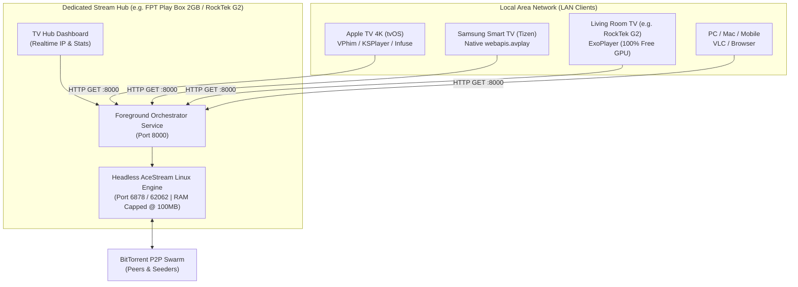

# AceStream Solver (`acestream-solver`)

> **Clean-Room Open Source Dedicated AceStream Hub & Universal Stream Proxy for Android TV (Headless Server)**

[](LICENSE)
[](https://developer.android.com)
[](https://acestream.media)
[]()
[]()

---

## 1. Overview

**AceStream Solver (Hub Only)** is an open-source Android orchestrator and universal streaming proxy server. It is purpose-built to convert any Android TV / TV Box (especially budget or low-spec devices with only **2GB RAM** such as the **FPT Play Box**, Mi Box, or RockTek G2) into an always-on, high-performance **LAN Stream Hub**.

### Why "Hub Only"?
When a TV box attempts to download high-speed BitTorrent P2P streams and simultaneously decode 4K 50fps HEVC video on screen, memory contention and GPU exhaustion inevitably cause frame drops and overheating.

**AceStream Solver** eliminates all video playback overhead:
* **0 Video Decoding Overhead**: Stripped of ExoPlayer and WebViews. CPU usage stays at **2% - 5%**, and total RAM footprint is **under 150 MB** (leaving 85%+ of system RAM completely free).
* **Universal MPEG-TS Gateway (Port 8000)**: Serves raw MPEG-TS (`video/mp2t`) streams with permissive CORS (`*`) headers to all client devices on your home network.
* **Auto-Start on Boot**: Runs as an Android Foreground Service with `BOOT_COMPLETED` receiver, making it a true plug-and-forget headless appliance.

---

## 2. Multi-Screen Network Architecture



---

## 3. Legal Architecture & Clean-Room Compliance

To ensure **100% open-source compliance** for hosting on GitHub:

1. **Zero Binary Blobs**: The repository contains **0 proprietary binary files** (no `.so` libraries, no `.zip` engine archives, and no pre-packaged binary blobs).
2. **On-Demand Engine Bootstrapping**: Upon first launch, `AceEngineDownloader` retrieves the official Linux console runtime directly from the official Ace Stream distribution servers (`download.acestream.media`) or an existing local engine instance.
3. **Open Architecture**: All source code is distributed under the permissive **MIT License**.

---

## 4. API Endpoints (Port 8000)

| Endpoint | Method | Description | Output Format |
|---|---|---|---|
| `/?infohash=<hash>` | GET | Primary live stream endpoint (canonical infohash) | `video/mp2t` (MPEG-TS) |
| `/?pid=<content_id>` | GET | Fallback stream endpoint (AceStream Content ID) | `video/mp2t` (MPEG-TS) |
| `/status` | GET | Local proxy diagnostic, peer count, and bitrate JSON | `application/json` |
| `/dashboard` or `/` | GET | Web status dashboard accessible from any browser | `text/html` |
| `/prewarm?id=<hash>` | GET | Pre-buffers and primes the P2P swarm in advance | `application/json` |
| `/config` | GET | Adjusts default channel and always-hot settings | `application/json` |
| `/stop` | GET | Stops all active streams and dummy readers | `application/json` |

---

## 5. Client Connection Syntax

Replace `<HUB_IP>` with the local IP displayed on your Hub Dashboard (e.g. `192.168.1.180`):

* **Samsung Smart TV (Tizen Native AVPlay)**:
  ```text
  http://<HUB_IP>:8000/?infohash=73d24aeff6515abb236ea8a3e77d89fe0b04b665
  ```
* **Apple TV (tvOS VFilm / VPhim / KSPlayer)**:
  ```text
  http://<HUB_IP>:8000/?infohash=73d24aeff6515abb236ea8a3e77d89fe0b04b665
  ```
* **VLC / PotPlayer (PC / Mac)**:
  ```bash
  vlc "http://<HUB_IP>:8000/?infohash=73d24aeff6515abb236ea8a3e77d89fe0b04b665"
  ```

---

## 6. Building from Source

### Prerequisites
* JDK 17
* Android SDK (API 35, Build Tools 34.0.0+)
* Gradle 8.9+

### Build Steps
```bash
# Clone the repository
git clone https://github.com/<your-username>/acestream-solver.git
cd acestream-solver

# Build Hub-Only Debug APK
./gradlew assembleDebug

# Output APK:
# app/build/outputs/apk/debug/app-debug.apk
```

---

## 7. License

Distributed under the **MIT License**. See `LICENSE` for more information.  
Ace Stream™ is a registered trademark of its respective owners. This project is an independent open-source proxy and orchestrator.
