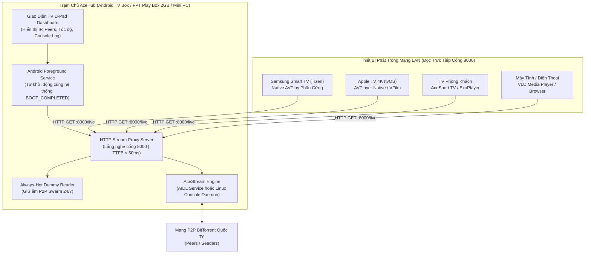

# AceHub (`aceHub.apk`)

> **High-Performance Headless AceStream Hub & Universal LAN Stream Proxy for Android TV / TV Box**

[]()
[](https://github.com)
[](https://developer.android.com)
[-informational.svg)](https://developer.android.com)
[]()
[]()
[](LICENSE)

<p align="center">
  
</p>

---

## 1. Tổng Quan Dự Án (Overview)

**AceHub** là giải pháp trạm phát trực tiếp mã nguồn mở (Headless Stream Hub & Universal Proxy), biến các thiết bị Android TV Box phổ thông (đặc biệt là các dòng Box chỉ có **2GB RAM** như **FPT Play Box**, Mi Box, Tanix, RockTek G2...) thành một **Trạm chủ phát luồng AceStream 24/7** mạnh mẽ cho toàn bộ mạng nội bộ (LAN).

### Điểm Vượt Trội Của Kiến Trúc "Hub Only":
* **0 Video Decoding (Giải Phóng 100% GPU/RAM):** Hoàn toàn lược bỏ trình phát video (ExoPlayer/WebView) khỏi Box chạy Hub. Box đóng vai trò thuần túy là Proxy nạp và cấp luồng, giữ mức chiếm RAM dưới **150MB** và CPU chỉ **2% – 5%**, giúp thiết bị hoạt động mát mẻ, ổn định liên tục.
* **0 Transcode & 0 Redirects (Pass-Through Nguyên Bản):** Luồng video và âm thanh từ mạng P2P BitTorrent được truyền thẳng (Direct Pass-Through) tới các thiết bị đầu cuối với **độ trễ phản hồi ban đầu (TTFB) siêu tốc dưới 50ms**.
* **Đồng Bộ Chuẩn Cổng 8000 Duy Nhất:** Thống nhất cổng phát sóng `8000` trên toàn bộ hệ thống (Samsung Smart TV, Apple TV, Android TV, VLC).
* **Bảo Lưu Trạng Thái Khi Khởi Động Lại (Reboot Persistence):** Tự động ghi nhớ kênh vừa xem và luồng phát mặc định vào bộ nhớ. Mỗi khi máy Box hoặc hệ thống khởi động lại, dịch vụ nền tự động khởi động và bơm sẵn luồng cũ mà không làm thay đổi đường dẫn phát.
* **Cơ Chế Giữ Nóng Swarm 24/7 (Always-Hot Dummy Reader):** Tự động duy trì nạp dữ liệu nền tốc độ thấp để giữ kết nối với các Peer/Seed trong Swarm, giúp mọi thiết bị bật TV lên là xem ngay lập tức không cần chờ đợi nạp P2P.

---

## 2. Mô Hình Mạng & Kiến Trúc Đa Thiết Bị



---

## 3. Hệ Thống API & Danh Mục Đường Dẫn (Port 8000)

| Đường Dẫn (Endpoint) | Giao Thức | Mô Tả Chức Năng | Định Dạng Trả Về |
| :--- | :---: | :--- | :--- |
| `/live` | `GET` | **Đường dẫn phát trực tiếp chuẩn duy nhất** (Tự động phát kênh đang được kích hoạt/bảo lưu) | `video/mp2t` (MPEG-TS nguyên bản) |
| `/ace/getstream?infohash=<hash>` | `GET` | Phát luồng theo mã băm infohash (Tương thích chuẩn VLC và Player) | `video/mp2t` (MPEG-TS nguyên bản) |
| `/status` | `GET` | Báo cáo chẩn đoán trạng thái trạm: kênh hiện tại, số peers, tốc độ KB/s, dung lượng đã tải, số client đang xem | `application/json` |
| `/` hoặc `/dashboard` | `GET` | Bảng điều khiển Web Dashboard trực quan, xem được từ bất kỳ máy tính/điện thoại nào | `text/html; charset=utf-8` |
| `/log` hoặc `/log.txt` | `GET` | Nhật ký thời gian thực (Real-time Diagnostic Log) chuẩn đoán sự cố | `text/plain; charset=utf-8` |
| `/prewarm?id=<hash>` | `GET` | Kích hoạt nạp trước luồng P2P và lưu làm kênh mặc định khi khởi động lại | `application/json` |
| `/config` | `GET` | Cập nhật tham số cấu hình trạm (`default_channel`, `always_hot`) | `application/json` |

---

## 4. Hướng Dẫn Sử Dụng Đường Dẫn Cho Các Client

Giả sử IP của Box chạy AceHub là `192.168.1.173` (hoặc laptop `192.168.1.59`):

### 1. Dành Cho Samsung Smart TV (Tizen Native AVPlay)
Cài đặt đường dẫn luồng phát:
```text
http://192.168.1.173:8000/live
```
Hoặc chỉ định infohash cụ thể:
```text
http://192.168.1.173:8000/ace/getstream?infohash=73d24aeff6515abb236ea8a3e77d89fe0b04b665
```

### 2. Dành Cho Apple TV (tvOS VFilm / AVPlayer)
```text
http://192.168.1.173:8000/live
```

### 3. Dành Cho VLC Media Player (PC / Mac / Mobile)
Mở VLC → **Media** → **Open Network Stream** (Ctrl + N):
```text
http://192.168.1.173:8000/live
```

---

## 5. Tải Về & Cài Đặt (Deployment Options)

### Phương Án A: Cài đặt trực tiếp file APK (Android TV Box / Phone)
Tải bản phát hành chính thức **`aceHub.apk`** từ mục [Releases](https://github.com/hongson117/aceHub/releases) của repository, sau đó cài đặt qua USB hoặc ADB:
```bash
adb connect <IP_ANDROID_BOX>
adb install -r aceHub.apk
```

> **Đặc quyền kiến trúc Clean Core 100% (Từ phiên bản v1.0.3):**
> * **Bản cài siêu nhẹ (~5.5 MB):** 100% mã nguồn mở (MIT), cài đặt ban đầu là vỏ rỗng hoàn toàn, không nhúng sẵn bất kỳ luồng phát hay kênh truyền hình nào.
> * **Tự động chuẩn bị Engine Linux Headless:** Khi khởi chạy lần đầu trên máy mới, ứng dụng tự động tải gói Engine Linux ARM nguyên bản (`ace-engine-armv7.zip`) từ Release Asset chính thức với xác thực mã băm SHA-256 toàn vẹn trước khi giải nén.
> * **Tiến trình ngầm không chứa AdMob SDK:** Sử dụng daemon điều phối ngầm (Console Daemon), hoàn toàn không chứa các thành phần giao diện đồ họa Android GUI hay Google AdMob SDK.
> * **Bảo vệ mạng LAN cấp ứng dụng:** Toàn bộ API điều khiển trạm (`/config`, `/stop`, `/prewarm`) được kiểm tra và giới hạn nghiêm ngặt chỉ cho phép các máy trong mạng cục bộ (LAN / RFC1918) và Loopback truy cập (tự động từ chối HTTP 403 đối với các kết nối từ Internet WAN).
> * **Bộ đệm 100MB RAM thống nhất:** Đồng bộ cấu hình bộ nhớ đệm 100MB trong RAM (`--live-cache-type memory`), không ghi đĩa flash gây hao mòn bộ nhớ TV Box.

Sau khi cài đặt:
1. Mở ứng dụng **AceHub** trên màn hình Android TV.
2. Thiết bị sẽ tự động chuẩn bị Engine (lần đầu mất ~10 giây tải qua mạng; các lần sau bật lên là chạy ngay).
3. Nhập mã Infohash / Content ID cần phát hoặc gửi lệnh phát từ bất kỳ thiết bị nào trong mạng LAN.
4. Khi màn hình báo `🟢 ĐANG HOẠT ĐỘNG`, bấm nút **Ẩn chạy ngầm (Home)** trên remote để trạm tiếp tục phát sóng 24/7 mà không làm phiền màn hình tivi.

---

### Phương Án B: Triển Khai Docker Trên Home Server & NAS (Ubuntu / Synology / Proxmox / Unraid)

Dành cho người dùng có sẵn **Home Server, Mini PC (Intel N100/i3/i5), NAS hoặc VPS**:
* **Tích Hợp API Chuẩn (Standard API Engine):** Giao tiếp trực tiếp với AceStream Engine qua cổng API nội bộ để khởi tạo và truyền dẫn luồng HTTP nguyên bản (0-transcode).
* **Đổi kênh siêu mượt (Instant Channel Switch):** Tự động thu hồi session cũ sạch sẽ khi chuyển kênh, kết hợp bộ đếm đệm 5 giây chống rớt luồng khi TV đổi audio track hoặc seek.
* **Tải kép thông minh (Multiplexing):** Nhiều TV cùng xem một trận đấu chỉ tốn đúng 1 luồng P2P duy nhất.

#### 1. Chạy nhanh bằng Docker Compose:
Tạo file `docker-compose.yml`:
```yaml
version: '3.8'

services:
  acehub:
    image: ghcr.io/hongson117/acehub:latest
    container_name: acehub
    restart: unless-stopped
    network_mode: host
    environment:
      - ACE_PROXY_PORT=8000
    logging:
      driver: json-file
      options:
        max-size: "10m"
        max-file: "3"
```
Khởi chạy dịch vụ:
```bash
docker compose up -d
```

#### 2. Hoặc chạy nhanh bằng lệnh Docker Run:
```bash
docker run -d \
  --name acehub \
  --restart unless-stopped \
  --net=host \
  ghcr.io/hongson117/acehub:latest
```

Sau khi chạy xong, máy chủ của bạn ngay lập tức mở cổng `8000`:
* **Bảng điều khiển (Web Dashboard):** `http://<IP_HOME_SERVER>:8000/`
* **Xem luồng trực tiếp:** `http://<IP_HOME_SERVER>:8000/live?id=<CONTENT_ID>`
* **Kiểm tra trạng thái JSON:** `http://<IP_HOME_SERVER>:8000/stat`

---


## 6. Biên Dịch Từ Mã Nguồn (Build from Source)

### Yêu Cầu Môi Trường
* **JDK:** OpenJDK 17 trở lên
* **Android SDK:** Compile SDK 35, Build-Tools 34.0.0+
* **Gradle:** 8.9+ (Đã tích hợp sẵn `gradlew`)

### Lệnh Biên Dịch
```bash
# Clone repository
git clone https://github.com/hongson117/aceHub.git
cd aceHub

# Cấp quyền chạy cho gradlew (Linux / macOS)
chmod +x gradlew

# Biên dịch bản Release APK chính thức
./gradlew assembleRelease
# Hoặc trên Windows:
.\gradlew.bat assembleRelease
```
Tệp APK kết quả sẽ được tạo tại:
`app/build/outputs/apk/release/aceHub.apk`

---

## 7. Tuân Thủ Quy Chuẩn Mã Nguồn Mở (Clean-Room Standard)

Dự án này được xây dựng với mục tiêu tuân thủ 100% tiêu chuẩn phân phối mã nguồn mở trên GitHub:
1. **0 Proprietary Blob:** Không chứa mã nguồn vi phạm bản quyền hay các tệp nhị phân đóng kín trong cây thư mục mã nguồn Git.
2. **Standard Android CI/CD:** Tích hợp sẵn kịch bản GitHub Actions (`.github/workflows/build-apk.yml`) tự động kiểm tra cú pháp và build `aceHub.apk` trực tiếp trên đám mây khi gắn thẻ phiên bản.
3. **Giấy phép MIT:** Tự do sử dụng, chỉnh sửa và triển khai cho các dự án cá nhân hoặc cộng đồng.

### 7.1 Thành Phần Bên Thứ Ba & Tương Thích Sandbox (Third-Party & Sandbox Shims)
* **`libacepython.so`:** Trình chạy JNI nhúng mã nguồn mở cho Python trên Android, tuân theo giấy phép Python Software Foundation License / Apache 2.0.
* **Android Compatibility Shims (`main_android.py`):** Cung cấp các cấu trúc tương thích chuẩn với cơ chế bảo mật SELinux của Android (như `/proc/cpuinfo` và `/proc/meminfo` giả lập cho sandbox không có quyền root) để Python tiêu chuẩn có thể khởi động bình thường. Hoàn toàn không can thiệp DRM, không can thiệp cơ chế kiểm tra bản quyền và không thay đổi logic cấp phép của Engine.

### 7.2 Thăm Dò Tín Hiệu Trực Tiếp & Luồng Chẩn Đoán Chuẩn Mở (Live Downlink Probe)
* **Thăm dò luồng thực tế (Real Bytes Read):** Nút kiểm tra tín hiệu trên TV Remote không chỉ bắt tay API lý thuyết mà mở trực tiếp kết nối HTTP tới Engine, đọc dòng byte video (`bytesRead >= 64KB`) và đo lường tốc độ tức thời (`speedKbps`) nhằm xác nhận luồng đang tải về thành công trước khi lưu cấu hình.
* **Luồng chẩn đoán chuẩn mở (Open Diagnostic Stream CC-BY 3.0):** Để tối ưu trải nghiệm người dùng trên Android TV D-Pad remote mà không yêu cầu gõ thủ công 40 ký tự hex, khi ô nhập để trống trên thiết bị mới cài đặt, hệ thống tự động sử dụng luồng chẩn đoán mở chuẩn quốc tế (*Big Buck Bunny 1080p*, Blender Foundation, Creative Commons CC-BY 3.0) để đo lường băng thông mạng, tuyệt đối không nhúng hay liên kết với bất kỳ đài truyền hình thương mại nào.

---

## 8. Giấy Phép (License)

Dự án được phân phối dưới giấy phép **[MIT License](LICENSE)**. Xem tệp `LICENSE` để biết thêm chi tiết.

---

> **Important Legal Disclaimer / Tuyên Bố Pháp Lý:**  
> 
> **English:**  
> AceHub is an open-source, neutral network stream proxy and gateway utility designed for local area networks (LAN). **AceHub does not provide, curate, scrape, host, or operate any catalogue of broadcasts or copyrighted channels.** The software functions solely as a standard local HTTP socket relay that transfers stream data actively configured and supplied by the user. Users are solely responsible for obtaining and verifying the legality, distribution rights, and origin of any stream identifiers (infohashes / content IDs) they choose to process with this software. Third-party protocol engines are governed by their respective licenses and terms of service; AceHub does not emulate unauthorized access levels or circumvent any technological protection measures (TPM).
> 
> **Tiếng Việt:**  
> AceHub là công cụ quản lý và chuyển tiếp luồng mạng nội bộ (LAN Stream Proxy & Gateway) mã nguồn mở. **AceHub không cung cấp sẵn, tuyển chọn, thu thập (scrape) hoặc vận hành bất kỳ danh mục nguồn phát hay kênh truyền hình có bản quyền nào.** Phần mềm hoạt động như một cầu nối socket HTTP nội bộ chuyển tiếp dữ liệu luồng do người dùng chủ động cấu hình. Người dùng chịu hoàn toàn trách nhiệm về tính hợp pháp và quyền sử dụng đối với các định danh luồng (infohash / content ID) được nạp vào phần mềm. Việc kết nối tới engine giao thức tuân thủ các giấy phép dịch vụ tương ứng; AceHub không can thiệp, không giả lập quyền truy cập trái phép và không vô hiệu hóa bất kỳ biện pháp công nghệ bảo vệ quyền nào.
