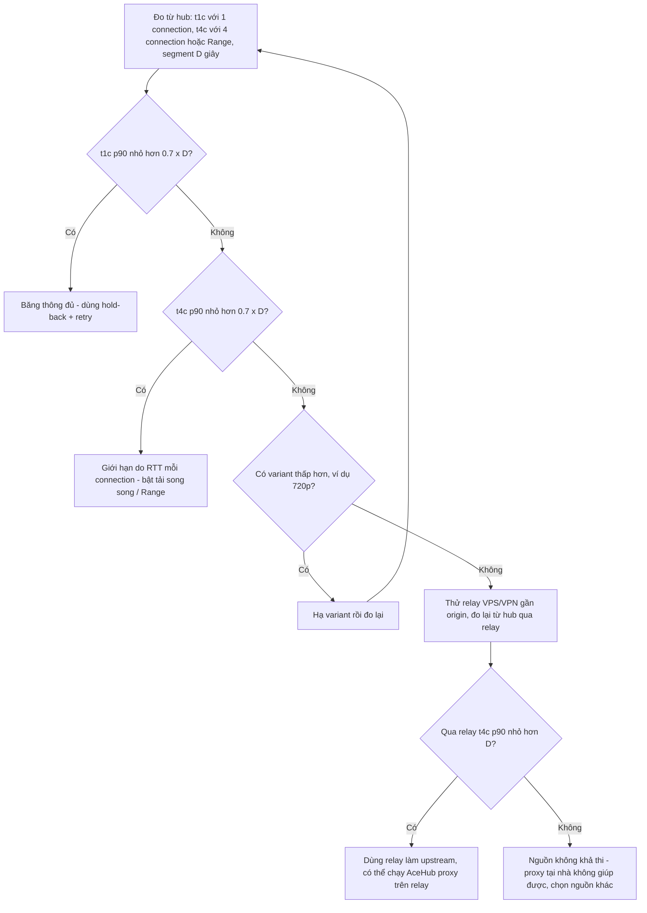
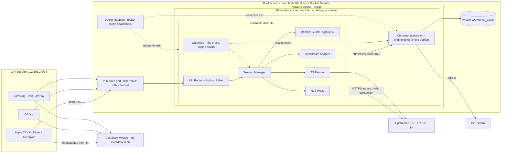
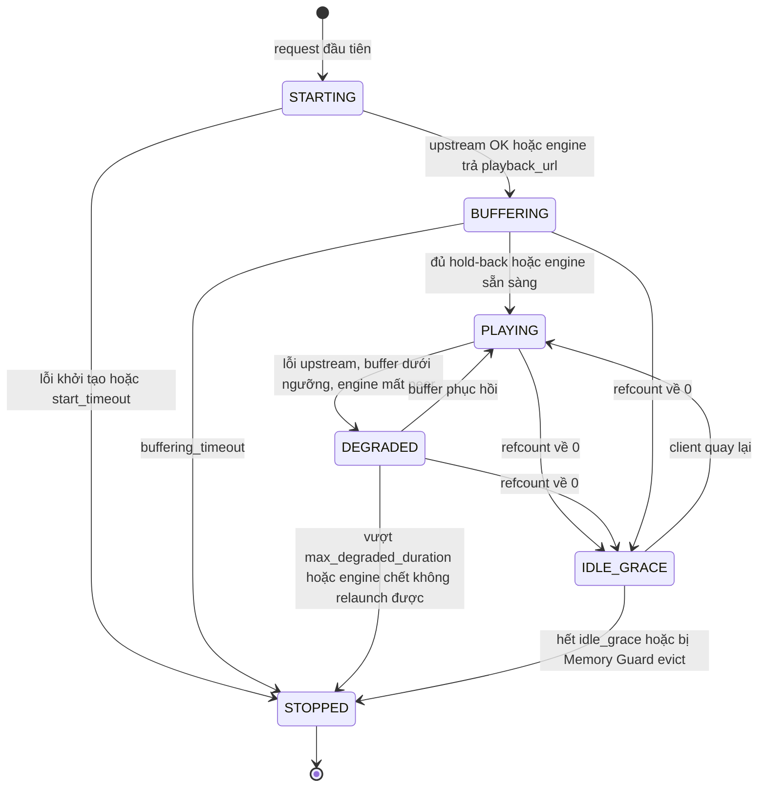
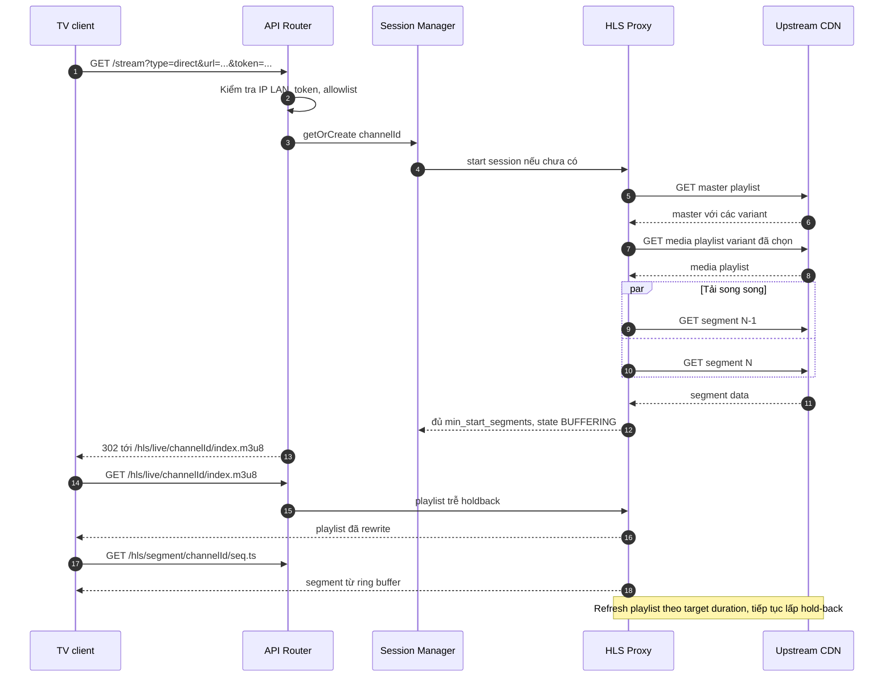
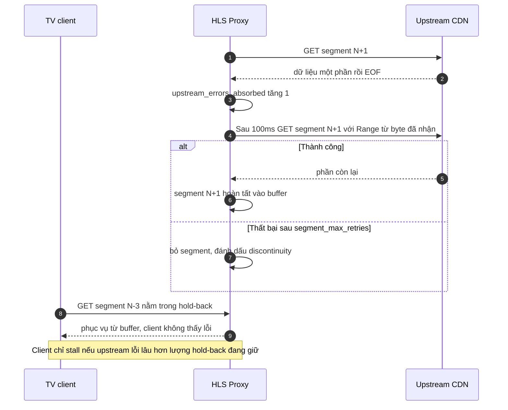
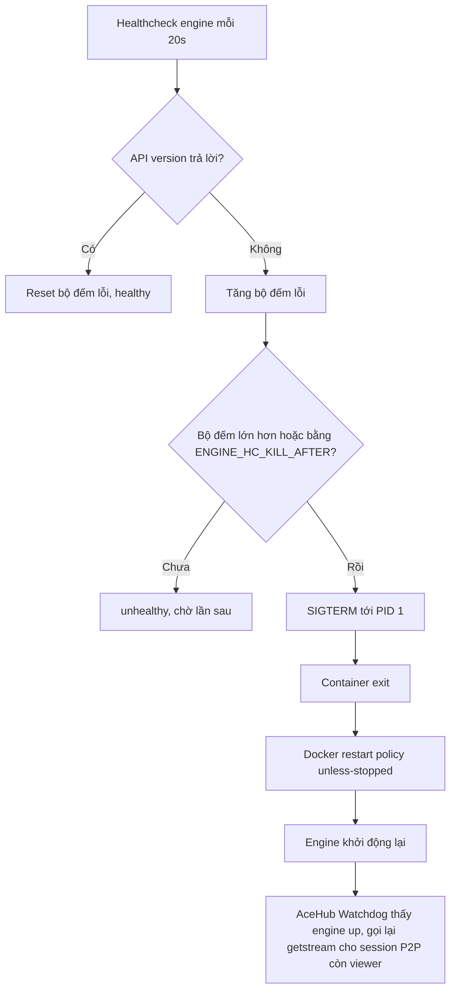

# AceHub Hybrid Gateway — Đặc tả kỹ thuật v1.2 (Docker edition)

| Thuộc tính | Giá trị |
|---|---|
| Dự án | AceHub Hybrid Gateway (home project) |
| Phiên bản | 1.2 — Docker edition (dựa trên v1.1 ngày 03/10/2026) |
| Ngày | 10/10/2026 |
| Nền tảng đích | Docker trên Linux host (khuyến nghị) hoặc laptop TUF chạy Windows + Docker Desktop / WSL2 |
| Đối tượng đọc | Developer / AI coding agent (Codex) triển khai |
| Trạng thái | Draft để implement — số liệu chưa đo đánh dấu **(ước tính)** / **(mục tiêu cần đo)**; tên image, flag CLI, endpoint của engine đánh dấu **(cần xác minh)** |
| File kèm theo (reference) | `docker/docker-compose.yml`, `docker/.env.example`, `docker/engine/healthcheck.sh`, `docker/gateway/Dockerfile`, `docker/config/profiles.json` |

> Quy ước: "PHẢI" = bắt buộc; "NÊN" = khuyến nghị mạnh; "CÓ THỂ" = tùy chọn. Mọi số liệu hiệu năng/tài nguyên là **mục tiêu hoặc ước tính**, không phải kết quả đo. Bản v1.1 (Android FPT Box) vẫn là tài liệu tham chiếu cho triển khai Android; bản này thay thế các phần đặc thù Android bằng tương đương container, phần lõi (session model, HLS proxy, bảo mật, API) giữ nguyên ngữ nghĩa.

---

## 0. Change log v1.1 → v1.2 (Docker edition)

| # | Hạng mục | v1.1 | v1.2 Docker | Lý do |
|---|---|---|---|---|
| 1 | Nền tảng | FPT Box Android (chính), laptop (thay thế) | Docker trên Linux host (chính cho chạy 24/7) hoặc laptop TUF Windows + Docker Desktop/WSL2. FPT Box **không** thuộc phạm vi bản này | Yêu cầu chạy bằng Docker; Android TV box không chạy Docker thông thường |
| 2 | Vòng đời process | Foreground service + `BOOT_COMPLETED` | `restart: unless-stopped`, Docker daemon bật khi boot (Linux) / Docker Desktop tự chạy khi đăng nhập (Windows — **cần user login**) | Tương đương container của "luôn chạy" |
| 3 | AceStream Engine | App Android riêng, relaunch bằng Intent | Container `acestream` riêng từ community image (**cần xác minh**, pin tag/digest). Restart bằng healthcheck tự kill PID 1 → restart policy; tùy chọn autoheal | Docker không tự restart container *unhealthy*, chỉ restart khi container exit |
| 4 | Địa chỉ engine API | `127.0.0.1:6878` | `http://acestream:6878` qua mạng nội bộ `ace_internal`; cổng 6878 **không publish**; AceHub rewrite host trong URL engine trả về | Cô lập engine khỏi LAN; engine có thể trả URL chứa host khác (cần xác minh) |
| 5 | Bộ nhớ | Budget 2GB, `dumpsys meminfo`, LMK/oom_adj | `mem_limit`/`memswap_limit`/`cpus` từng container; Memory Guard đọc cgroup v2 (`memory.current`, `memory.max`); đo bằng `docker stats`; default cho laptop (ước tính) | Trong container, giới hạn là cgroup; vượt giới hạn → kernel OOM-kill trong cgroup |
| 6 | Cache engine | Setting trong app | Named volume (mặc định) hoặc `tmpfs` có `size=`; lưu ý tmpfs **tính vào mem_limit** | Kiểm soát dung lượng cache |
| 7 | Cấu hình | File JSON | Biến môi trường `ACEHUB_*` (`.env`) + `profiles.json` mount read-only | Chuẩn 12-factor cho container |
| 8 | Mạng & bảo mật | Bind LAN, lọc IP nguồn | Thêm: publish chỉ trên IP LAN; Docker trên Linux **bỏ qua ufw**; Docker Desktop NAT có thể che IP client thật → token là lớp bảo vệ chính; hardening container (read-only, cap_drop, non-root) | Khác biệt mạng của Docker |
| 9 | mDNS | AceHub tự quảng bá | Multicast không qua bridge Docker → mặc định tắt trong container; Linux dùng avahi trên host; Windows khuyến nghị cấu hình tay/QR | Hạn chế mạng container |
| 10 | Vận hành | Log file xoay vòng, logcat | Log JSON ra stdout, driver `json-file` có `max-size`/`max-file`; quy trình upgrade/rollback bằng tag | Vận hành container |
| 11 | Nghiệm thu | T1–T14 | T1–T13 giữ (điều chỉnh T2, T7, T14), thêm T15–T20 cho Docker (upgrade, exposure, IP client, OOM, đổi mạng, restart engine) | Rủi ro mới của Docker |
| 12 | Không đổi | — | Session model, HLS proxy, mục "Khi băng thông không đủ", API (version `1.2.0`, `/status` thêm trường container), tích hợp client | Logic lõi độc lập nền tảng |

---

## 1. Bối cảnh & vấn đề

AceHub là gateway chạy trong LAN gia đình, phục vụ luồng TV thể thao cho mọi TV trong nhà qua **một cổng duy nhất (8000)**.

**Máy chạy hub (Docker host):**
- **Linux host** (mini PC / laptop cài Linux / server trong nhà) — khuyến nghị cho chạy 24/7: Docker Engine native, mạng bridge giữ IP client thật, ít lớp ảo hóa.
- **Laptop TUF** `192.168.1.59` chạy Windows + Docker Desktop (backend WSL2) — chấp nhận được nhưng có khác biệt mạng (NAT qua VM, host networking hạn chế, mDNS không ra LAN, cần login để Docker Desktop chạy). Xem mục 7.4.
- Kiến trúc CPU: **amd64**. Image engine community hầu hết chỉ có amd64 (**cần xác minh**); ARM (Raspberry Pi…) ngoài phạm vi.

**Client:** Apple TV (AVPlayer / KSPlayer), iOS, Samsung Tizen TV (AVPlay).

**Hệ sinh thái hiện có:** Cloudflare Worker cung cấp danh sách kênh / link cho app.

### 1.1 Hai loại nguồn

| Tiêu chí | AceStream P2P | Direct (HLS m3u8 / MPEG-TS) |
|---|---|---|
| Định danh nguồn | content id / infohash | URL upstream (CDN Pháp, Tây Ban Nha như rtve, Thổ Nhĩ Kỳ…) |
| Thành phần xử lý | AceStream Engine trong container riêng `acestream`, API `http://acestream:6878` trên mạng nội bộ Docker (không publish) | Module HLS Proxy hoặc TS Fan-out trong AceHub |
| Giao thức ra client | HTTP (HLS hoặc TS từ engine, AceHub proxy lại) | HLS (playlist đã rewrite) hoặc TS pass-through |
| Thời gian khởi động | 5–30s tùy swarm **(ước tính, cần đo)** | ~ thời gian tải playlist + đủ segment cho hold-back; với hold-back đã đầy là gần tức thời, với kênh mới mở là vài giây tới vài chục giây **(cần đo)** |
| Nguyên nhân giật chính | Swarm ít peer, container engine bị OOM-kill (vượt `mem_limit`) hoặc treo | RTT liên lục địa >250ms; upstream đóng socket ("Error reading HTTP response: End of file"); segment 6s tải mất ~5s nên player cạn buffer ngay sau khi bắt đầu |
| Bộ nhớ | Engine dùng cache RAM/disk riêng, bị chặn bởi `mem_limit` container — **chưa đo** (v1.0 ước 150–300MB, chưa xác minh) | Buffer segment trong AceHub: ~5–6MB/segment 6s @ 1080p50 6–8Mbps **(ước tính)** × số segment |
| AceHub kiểm soát được | Start/stop session qua API engine, health-check; restart container engine do Docker đảm nhiệm (mục 5.4) | Toàn bộ logic tải, buffer, retry, rewrite |
| Fan-out nhiều TV | Engine đã phục vụ nhiều client trên cùng content id; AceHub dùng chung 1 session engine | AceHub dùng chung 1 upstream session cho các client cùng channelId |

### 1.2 Phân tích nguyên nhân giật của Direct (đã sửa)

- Segment 6s tải mất ~5s nghĩa là tỉ lệ throughput/bitrate chỉ ~1,2×. Bất kỳ dao động nào (TCP slow start sau reconnect, EOF giữa chừng) làm tỉ lệ <1 và player cạn buffer.
- **Prefetch không giải quyết thiếu băng thông**: nếu proxy chỉ có 1 connection, nó tải chậm y như TV. Với live HLS, proxy cũng chỉ tải được segment đã xuất hiện trong playlist, nên không thể "tải trước tương lai".
- Giải pháp đúng gồm hai phần:
  1. **Đổi độ trễ lấy độ an toàn**: giữ lại 3–5 segment gần live edge, chỉ cho client thấy playlist trễ đó, nên client bắt đầu với một buffer đã đầy sẵn trên hub.
  2. **Tăng throughput hiệu dụng**: tải nhiều segment song song, chia Range nếu origin hỗ trợ, tái sử dụng connection (keep-alive / HTTP/2 nếu có), hạ variant khi throughput không đủ.
- **Giới hạn trung thực:** nếu upstream mất kết nối lâu hơn lượng buffer đang giữ (ví dụ >24s với hold-back 4×6s), client vẫn sẽ giật. Nếu throughput duy trì < bitrate thì buffer sẽ cạn dần — proxy LAN không khắc phục được, xem mục 1.3.


### 1.3 Khi băng thông không đủ

**Nguyên tắc:** cần phân biệt hai loại vấn đề:
- **Gián đoạn (interruption):** throughput trung bình ≥ bitrate nhưng có lúc EOF, reset, chậm đột ngột. Hold-back buffer + retry **giải quyết được** trong phạm vi độ dài buffer.
- **Thiếu dữ liệu kéo dài (sustained deficit):** throughput duy trì của tuyến quốc tế (từ hub tới origin) **< bitrate** của luồng. Khi đó mỗi giây phát tiêu thụ nhiều dữ liệu hơn mỗi giây tải được, buffer **chắc chắn sẽ cạn** sau `buffer / (bitrate - throughput)` giây, bất kể hold-back lớn đến đâu. Proxy LAN **không thể** khắc phục trường hợp này — nó chỉ dời thời điểm giật về sau.

**(1) Test khả thi — PHẢI làm trước khi triển khai HLS Proxy cho một nguồn** (chi tiết ở 11.0):
- Từ **bên trong container acehub** trên Docker host (cùng đường mạng thật mà proxy sẽ dùng — quan trọng với Docker Desktop vì egress đi qua VM/NAT), chọn 1 segment gần live edge (thời lượng `D` giây, thường 6s), ở variant mong muốn.
- Ký hiệu `t1c`/`t4c` (khác với mã kịch bản nghiệm thu T1…T20). Đo `t1c` = thời gian tải segment bằng **1 connection**.
- Đo `t4c` = thời gian tải cùng segment (hoặc 4 segment liên tiếp) bằng **4 connection song song** — dùng HTTP Range chia 4 phần nếu origin hỗ trợ `Accept-Ranges: bytes`, nếu không thì tải 4 segment khác nhau song song và lấy thời gian trung bình trên mỗi segment (`t4c = tổng thời gian / 4`).
- Lặp ≥ 10 lần ở các giờ khác nhau (đặc biệt giờ cao điểm tối VN, trùng giờ trận đấu châu Âu), lấy p50 và p90.
- Diễn giải:
  - `t1c p90 < 0,7 × D`: băng thông đủ; vấn đề chủ yếu là gián đoạn → hold-back + retry là đủ.
  - `t1c ≥ 0,7 × D` nhưng `t4c p90 < 0,7 × D`: giới hạn nằm ở throughput mỗi TCP connection (RTT cao, packet loss) → **tải song song** sẽ giúp; bật `parallel_segments` / `range_split_parts`.
  - `t4c p90` trong khoảng `0,7 × D` đến `D`: biên quá mỏng → cần hạ variant hoặc relay.
  - **`t4c p90 ≥ D`: ngay cả tải song song cũng không theo kịp → proxy tại nhà không hữu ích cho variant này.** Phải hạ variant hoặc đổi đường đi (relay).
  - Ngưỡng 0,7 là **đề xuất** (chừa ~30% biên cho dao động), có thể chỉnh sau khi đo.

**(2) Biện pháp giảm thiểu (theo thứ tự ưu tiên):**
1. **Tải song song nhiều connection / HTTP Range** (mục 4.3): hữu ích khi throughput mỗi TCP connection bị giới hạn bởi RTT cao (cửa sổ TCP / RTT) hoặc packet loss, trong khi tổng băng thông đường truyền còn dư. Không giúp nếu chính đường truyền quốc tế đã bão hòa. Có thể bị origin giới hạn số kết nối (theo dõi 429/403).
2. **Hạ variant tự động** (mục 4.4), ví dụ từ 1080p xuống 720p: giảm bitrate xuống dưới throughput khả dụng. Chỉ khả thi nếu nguồn có master playlist nhiều variant.
3. **Relay qua VPS/VPN** ở gần origin (châu Âu) hoặc có tuyến tốt về Việt Nam: relay kéo luồng từ origin bằng đường quốc tế ổn định hơn, hub tại nhà kéo từ relay. Relay CÓ THỂ chạy chính logic HLS Proxy của AceHub (hold-back, retry, tải song song) — khi đó hub tại nhà coi relay là upstream (thêm relay vào `upstream_allowlist`, profile riêng). Lưu ý: tốn chi phí VPS và băng thông egress; đường relay→VN vẫn phải được đo bằng chính test (1); có thể vi phạm điều khoản nguồn hoặc bị chặn geo (nguồn chỉ cho IP quốc gia đó — khi ấy relay đặt tại đúng quốc gia lại là lợi thế); relay public phải có auth (xem rủi ro ở 9.1b).
4. **Hold-back delay:** chỉ **hấp thụ dao động** (gián đoạn ngắn, throughput lên xuống quanh mức đủ). **Không** bù được thiếu hụt kéo dài; tăng hold-back trong trường hợp thiếu băng thông chỉ làm chậm thời điểm giật và tăng độ trễ.

Nếu sau cả các biện pháp trên vẫn không đạt `t4c p90 < D` ở variant thấp nhất chấp nhận được → ghi nhận nguồn đó **không khả thi** và cân nhắc nguồn khác (ví dụ P2P cho cùng nội dung).



---

## 2. Kiến trúc tổng thể (Docker)



**Container:**

| Container | Image | Mạng | Cổng publish | Ghi chú |
|---|---|---|---|---|
| `acehub` | Build từ repo gateway (`docker/gateway/Dockerfile`, reference) | `ace_internal`, `egress` | `${ACEHUB_BIND_IP}:8000` | Read-only rootfs, non-root, cap_drop ALL |
| `acestream` | Community image AceStream Engine (**cần xác minh**) | `ace_internal`, `egress` | Không (tùy chọn cổng P2P) | Cache trên volume/tmpfs có giới hạn |
| `autoheal` (tùy chọn) | Ví dụ `willfarrell/autoheal` (**cần xác minh**, pin tag) | `none` | Không | Cần `docker.sock` — rủi ro (mục 8.6) |

**Mạng:**
- `ace_internal` (`internal: true`): chỉ để acehub gọi engine API qua DNS nội bộ `acestream`. Không có route ra Internet.
- `egress` (bridge riêng của stack): cả hai container cần Internet (CDN, swarm). Cổng 6878 **không publish** nên thiết bị LAN không truy cập được engine; container khác **cùng network `egress`** vẫn có thể — vì vậy `egress` chỉ dùng riêng cho stack này.
- Phương án dự phòng nếu engine chỉ nhận API từ localhost (**cần xác minh**): chạy acehub với `network_mode: "service:acestream"` (chung network namespace, gọi `http://127.0.0.1:6878`); khi đó cổng 8000 phải publish trên service `acestream` và engine API vẫn không publish. Bất lợi: restart engine làm mất network namespace của acehub → acehub cũng phải restart.

**Stack gateway:** gợi ý Go (binary tĩnh, image distroless nhỏ, `GOMEMLIMIT` kiểm soát heap). Yêu cầu không đổi: streaming response, keep-alive, timeout từng giai đoạn, Range request.

---

## 3. Session model & state machine

### 3.1 Định nghĩa session

| Trường | Mô tả |
|---|---|
| `sessionKey` | P2P: `ace:` + content id hoặc `ace:ih:` + infohash (lowercase). Direct: `channelId` (mục 3.2) |
| `type` | `p2p` \| `hls` \| `ts` |
| `refcount` | Số viewer đang hoạt động (mục 3.4) |
| `state` | Xem 3.3 |
| `createdAt`, `lastClientActivityAt` | Timestamp |
| `bufferBytes` | Bộ nhớ buffer session đang giữ |
| `stats` | upstream errors, retries, throughput, segment count, variant hiện tại |

### 3.2 channelId (Direct)

```
channelId = hex(sha256(normalizedUrl + "\n" + profileId))[0:16]
```

Chuẩn hóa URL (`normalizedUrl`):
1. Parse URL; scheme và host chuyển lowercase; bỏ port mặc định (80/443); bỏ fragment.
2. Giữ nguyên path (không decode `%2F`).
3. Query: loại các tham số nằm trong `ignore_query_params` của profile (ví dụ token, expires, signature) rồi sắp xếp theo tên.
4. Nếu profile có `channel_key` cố định (dùng cho nguồn token hết hạn, mục 4.8) thì dùng `channel_key` thay cho `normalizedUrl`.

`profileId` = id header profile được áp dụng (mặc định `default`). Hai request cùng URL chuẩn hóa + cùng profile → cùng channelId → dùng chung một upstream session.

### 3.3 State machine từng session



| State | Ý nghĩa | Hành vi |
|---|---|---|
| STARTING | Đang resolve nguồn (tải master playlist / gọi getstream) | Request client chờ tối đa `start_timeout` |
| BUFFERING | Đang lấp hold-back buffer / chờ engine | Playlist cho client chỉ được trả khi có ≥ `min_start_segments` segment |
| PLAYING | Bình thường | Refresh playlist, tải segment, phục vụ client |
| DEGRADED | Upstream lỗi liên tục hoặc buffer < `degraded_threshold_segments` | Tiếp tục retry, có thể hạ variant; vẫn phục vụ segment còn trong buffer |
| IDLE_GRACE | refcount = 0, đang chờ grace | **Vẫn** giữ upstream (để zap lại nhanh) nhưng NÊN giảm nhịp tải: chỉ refresh playlist, tối đa giữ hold-back hiện có |
| STOPPED | Đã giải phóng | Giải phóng buffer, đóng connection, P2P: gọi stop qua `command_url` |

### 3.4 Refcount & phát hiện hoạt động

- **Chỉ request của client tính là hoạt động** (GET playlist, GET segment, GET key, đang giữ kết nối TS/P2P stream). Request nội bộ của proxy (refresh playlist, prefetch segment) **không bao giờ** cập nhật `lastClientActivityAt`.
- Viewer được nhận diện bằng `clientId = IP client + User-Agent` (hoặc tham số `cid` nếu app gửi). Với HLS (client poll), viewer coi là còn hoạt động nếu có request trong `viewer_timeout` (mặc định 3 × target duration, tối thiểu 20s). Với TS/P2P stream (kết nối dài), viewer hoạt động khi kết nối HTTP còn mở.
- `refcount` = số viewer còn hoạt động. Khi refcount về 0 → `IDLE_GRACE`.
- `idle_grace` mặc định **60s** cho cả Direct và P2P. Lý do: người dùng pause ngắn, hoặc zap sang kênh khác rồi quay lại trong vòng 1 phút là thói quen phổ biến khi xem thể thao; giữ session giúp quay lại tức thời (Direct: hold-back đã đầy; P2P: tránh phải join swarm lại 5–30s). Đổi lại tốn RAM/băng thông thêm tối đa 60s, có thể chỉnh.
- `POST /stop` có thể ép dừng ngay một session (bỏ qua grace).

### 3.5 Đồng thời & memory budget

- Nhiều session thuộc các loại khác nhau **được phép chạy đồng thời** (ví dụ 1 P2P + 2 Direct).
- Giới hạn (default Docker trên laptop/Linux host — **ước tính, phải điều chỉnh sau khi đo**):
  - `max_sessions` = 6.
  - `max_p2p_sessions` = 2 (engine tốn RAM/CPU nhất; giới hạn thật nằm ở `ACESTREAM_MEM_LIMIT`).
  - `memory_budget_mb` = 384: tổng buffer của mọi session Direct trong container acehub.
  - `session_buffer_budget_mb` = 96: trần buffer mỗi session.
  - `rss_soft_limit_mb` = 0 (tự động = 80% `memory.max` của cgroup container acehub).
- Memory Guard đọc cgroup v2 của chính container: `/sys/fs/cgroup/memory.current` và `/sys/fs/cgroup/memory.max` (giá trị `max` = không giới hạn → dùng `memory_budget_mb` + RSS process). Nếu host dùng cgroup v1 (hiếm trên bản mới) → đọc `/sys/fs/cgroup/memory/memory.usage_in_bytes` / `memory.limit_in_bytes`, nếu không đọc được thì chỉ dùng RSS của process (`/proc/self/status` VmRSS).
- Lưu ý `memory.current` bao gồm page cache và tmpfs của container; Memory Guard NÊN dùng `memory.current - inactive_file` (từ `memory.stat`) làm "working set" (giống cách `docker stats` tính).
- Khi request mới vượt giới hạn:
  1. Nếu có session ở `IDLE_GRACE` → evict session idle **lâu nhất** (`STOPPED`), rồi tạo session mới.
  2. Nếu không → từ chối với HTTP `503`, mã lỗi `CAPACITY_EXCEEDED`, body liệt kê session đang chạy. **Không bao giờ** dừng session đang có viewer để nhường chỗ.
- Mục tiêu: Memory Guard từ chối **trước** khi kernel OOM-kill container (vượt `mem_limit` → OOM killer giết process trong cgroup → container exit → restart → mất mọi session). Kiểm chứng bằng T18.
- AceHub không đọc được cgroup của container engine từ bên trong (không mount docker.sock). Giới hạn P2P dựa vào `max_p2p_sessions` + `mem_limit` của engine; RAM engine theo dõi bằng `docker stats` khi đo (mục 11.1).

---

## 4. Thiết kế HLS Proxy

### 4.1 Luồng tổng quát

1. Nhận URL upstream (đã validate, mục 8).
2. Tải playlist. Nếu là **master playlist** (`#EXT-X-STREAM-INF`) → chọn variant theo `variant_policy` (mặc định: variant cao nhất có `BANDWIDTH` ≤ `max_bandwidth_bps`, hoặc cao nhất nếu không đặt). Lưu danh sách variant để hạ cấp.
3. Với media playlist: theo dõi `#EXT-X-MEDIA-SEQUENCE`, `#EXT-X-TARGETDURATION`, `#EXT-X-DISCONTINUITY-SEQUENCE`.
4. Refresh playlist mỗi `target_duration` giây khi playlist thay đổi; nếu playlist không đổi thì lần refresh tiếp theo sau `target_duration / 2` (theo khuyến nghị RFC 8216). Timeout refresh: `playlist_timeout`.
5. Mỗi segment mới xuất hiện được đưa vào hàng đợi tải; tối đa `parallel_segments` segment tải đồng thời.
6. Segment tải xong → vào ring buffer. Client nhận **playlist trễ** (mục 4.2).

### 4.2 Live-edge hold-back buffer

- Gọi `N` = sequence của segment liên tiếp mới nhất đã tải **xong hoàn toàn** (mọi segment trước nó cũng đã xong hoặc đã bị bỏ). Playlist client kết thúc tại segment `E = N - holdback_segments`, gồm `playlist_window_segments` segment cuối tính đến `E`.
  - Ví dụ `holdback_segments = 4`, segment 6s → client chạy sau live ~24s + độ trễ upstream; trên hub luôn có ~24s nội dung "dự trữ" chưa công bố.
- Thực tế triển khai: buffer giữ segment từ `E - playlist_window_segments + 1` đến `N`. Kích thước ring buffer mặc định = `playlist_window_segments + holdback_segments`, mặc định 3 + 3 = **6 segment**, tối đa `max_ring_segments` (12).
- `holdback_segments` cấu hình được, mặc định 3 (≈18s với segment 6s), khoảng khuyến nghị 3–5 (18–30s). Có thể đặt theo profile kênh.
- Khi bắt đầu kênh mới: playlist client trả về khi có ≥ `min_start_segments` (mặc định 2) segment đã tải xong; hold-back được lấp dần. Do đó những giây đầu tiên của kênh mới mở **chưa** có đầy đủ bảo vệ — phải ghi rõ trong KPI.
- Playlist client giữ nguyên `#EXT-X-TARGETDURATION`, `#EXT-X-VERSION`; `#EXT-X-MEDIA-SEQUENCE` = sequence của segment đầu tiên trong playlist client (giữ đúng số sequence upstream để không gây nhảy). Không thêm `#EXT-X-ENDLIST`.
- **Giới hạn:** khi upstream đứt lâu hơn lượng hold-back đang có, playlist client ngừng tăng và client sẽ stall. Proxy KHÔNG được bịa segment.

### 4.3 Tải song song & tăng throughput

- `parallel_segments` (mặc định 2): số segment khác nhau tải đồng thời. Giúp khi upstream phát nhiều segment cùng lúc (sau khi buffer cạn) hoặc khi latency chiếm phần lớn thời gian tải.
- **Range splitting** (tùy chọn, `range_split_parts`, mặc định 1 = tắt; khuyến nghị thử 2–4): nếu upstream trả `Accept-Ranges: bytes` và `Content-Length` (dò ở lần tải đầu bằng HEAD hoặc GET `Range: bytes=0-0`), chia segment thành K phần tải song song rồi ghép. Nếu origin trả 200 thay vì 206 → tắt range cho session đó.
- Tái sử dụng connection: HTTP keep-alive, connection pool theo host (`max_conns_per_host`, mặc định 6). Dùng HTTP/2 nếu origin hỗ trợ.
- Phép đo throughput: với mỗi segment, `ratio = segment_duration / download_time`. Lưu EWMA (α = 0,3).

### 4.4 Hạ variant tự động (tùy chọn)

- Bật bằng `auto_downgrade = true` (mặc định `true` nếu có master playlist).
- Nếu EWMA `ratio < downgrade_ratio` (mặc định 1,3) trong `downgrade_window` segment liên tiếp (mặc định 3) **hoặc** buffer < `degraded_threshold_segments` → chuyển sang variant thấp hơn kế tiếp.
- Nâng lại variant khi `ratio > upgrade_ratio` (mặc định 2,0) trong 10 segment liên tiếp và buffer đầy.
- Khi đổi variant: segment đầu tiên từ variant mới trong playlist client PHẢI có `#EXT-X-DISCONTINUITY` đứng trước (các variant có thể khác encoder/timestamp). Giữ sequence tăng liên tục ở phía client (proxy tự đánh số lại segment client: `clientSeq` độc lập với sequence upstream sau lần đổi variant đầu tiên). Ghi log + tăng `variant_switches`.

### 4.5 Retry, backoff, timeout

| Loại lỗi | Hành vi |
|---|---|
| EOF / connection reset / timeout khi tải segment | Retry lần 1 sau 100ms, sau đó backoff lũy thừa ×2 có jitter ±20%: 100ms, 200ms, 400ms, 800ms, 1600ms; tối đa `segment_max_retries` (mặc định 5). Nếu đang tải dở và origin hỗ trợ Range → tiếp tục từ byte đã nhận (`Range: bytes=<received>-`) |
| HTTP 5xx, 429 | Như trên; với 429 tôn trọng `Retry-After` nếu ≤ 5s |
| HTTP 403/401/410 trên segment hoặc playlist | Coi là token hết hạn → re-resolve nguồn (mục 4.8); không retry mù |
| HTTP 404 trên segment | Retry tối đa 2 lần (CDN chưa đồng bộ), sau đó bỏ segment |
| Segment hết hạn retry | Bỏ segment, đánh dấu gap; ở playlist client segment tiếp theo được chèn `#EXT-X-DISCONTINUITY`; tăng `segments_dropped` |
| Playlist refresh lỗi | Retry theo backoff; nếu lỗi liên tục > `playlist_fail_degraded_s` (mặc định 10s) → `DEGRADED`; > `max_degraded_duration` (mặc định 120s) và refcount = 0 → `STOPPED`; nếu còn viewer thì tiếp tục thử tới `max_degraded_duration_with_viewers` (mặc định 300s) |

Timeout (mặc định): `connect_timeout` 3s, `first_byte_timeout` 5s, `read_idle_timeout` 5s (không nhận byte nào trong 5s → coi là lỗi), `segment_total_timeout` = 2 × target duration.

Tổng thời gian retry của một segment PHẢI có giới hạn để không chặn hàng đợi; segment đang retry không chặn segment sau (tải song song).

### 4.6 Rewrite playlist & URI

- Mọi URI trong playlist (segment, `#EXT-X-KEY URI`, `#EXT-X-MAP URI`, variant, `#EXT-X-MEDIA URI`) được resolve thành URL tuyệt đối theo RFC 3986 dựa trên URL playlist **cuối cùng sau redirect**.
- URI gửi cho client là đường dẫn tương đối tới AceHub:
  - Segment: `/hls/segment/{channelId}/{seq}.{ext}` (ext lấy từ URL gốc: `ts`, `m4s`, `aac`, `mp4`…; mặc định `ts`).
  - Init segment `#EXT-X-MAP`: `/hls/init/{channelId}/{mapId}`.
  - Key: `/hls/key/{channelId}/{keyId}`.
  - Kèm `?token=` nếu auth bật và client truy cập bằng token query (mục 8.2).
- Proxy giữ map `seq → upstreamUrl` và `keyId → keyUrl` trong session; client không bao giờ thấy URL upstream.
- **`#EXT-X-KEY` AES-128 / SAMPLE-AES:** giữ nguyên `METHOD`, `IV`, `KEYFORMAT`; chỉ thay `URI`. Proxy tải key với header profile, cache trong session (key nhỏ, giữ đến khi không còn segment tham chiếu). Proxy KHÔNG giải mã segment. DRM (`KEYFORMAT` FairPlay/Widevine, `skd://`) → không hỗ trợ, trả lỗi `UNSUPPORTED_DRM` khi tạo session.
- `#EXT-X-DISCONTINUITY`, `#EXT-X-PROGRAM-DATE-TIME`, `#EXT-X-BYTERANGE` (nếu có: proxy tải đúng byterange, coi mỗi byterange là một segment client) được giữ đồng bộ với segment tương ứng.
- Tag không biết → giữ nguyên nếu không chứa URI; nếu chứa `URI=` không xử lý được → log cảnh báo và bỏ tag.
- Low-Latency HLS (`#EXT-X-PART`, `#EXT-X-PRELOAD-HINT`): bỏ các tag part, chỉ dùng segment đầy đủ (hold-back làm LL-HLS vô nghĩa).

### 4.7 Header profile theo kênh

Profile (file `profiles.json` hoặc config) định nghĩa:

```json
{
  "id": "rtve",
  "match_hosts": ["*.rtve.es", "*.rtve.stream"],
  "headers": {
    "User-Agent": "Mozilla/5.0 ...",
    "Referer": "https://www.rtve.es/",
    "Origin": "https://www.rtve.es"
  },
  "cookies": "",
  "ignore_query_params": ["token", "expires", "hdnts"],
  "channel_key": null,
  "resolver": null,
  "holdback_segments": 4
}
```

- Profile được chọn: tham số `profile` trong request (nếu được cho phép) hoặc khớp `match_hosts`; nếu không khớp dùng `default`.
- Header áp dụng cho mọi request upstream của session (playlist, segment, key). Client **không** được tự truyền header tùy ý qua query (tránh lạm dụng).
- `Set-Cookie` từ upstream được lưu vào cookie jar theo session.

### 4.8 URL token hết hạn

- Nếu playlist/segment trả 401/403/410, hoặc URL có tham số hết hạn đã quá thời gian (nếu profile khai báo `expires_param`), proxy **re-resolve**:
  1. Nếu profile có `resolver` (URL HTTP tới Cloudflare Worker hoặc endpoint metadata trả URL mới cho `channel_key`) → gọi resolver, lấy URL mới.
  2. Nếu không có resolver → thử tải lại master playlist gốc (một số CDN cấp token mới tại master).
  3. Thất bại → `DEGRADED`, rồi theo quy tắc 4.5.
- Vì token thay đổi, kênh có token PHẢI dùng `channel_key` hoặc `ignore_query_params` để channelId ổn định.
- Sau re-resolve, segment mới có thể khác sequence/timestamp → chèn `#EXT-X-DISCONTINUITY` nếu sequence không liên tục.

### 4.9 Ring buffer & eviction

- Đơn vị: segment. Kích thước mặc định 6 (`playlist_window_segments + holdback_segments`), trần `max_ring_segments`.
- Ước tính RAM **(ước tính)**: 1080p50 ở 6–8 Mbps → segment 6s ≈ 4,5–6MB → 6 segment ≈ 27–36MB/session. Tổng phải nằm trong `session_buffer_budget_mb` và `memory_budget_mb`. Nếu vượt → giảm số segment hold-back của session đó (không dưới `min_start_segments`) và ghi cảnh báo.
- **Quy tắc evict:**
  1. Chỉ evict segment đã rơi khỏi cửa sổ playlist client (sequence < đầu playlist client).
  2. **Không bao giờ** evict segment đang có client đọc (giữ `readers` counter trên mỗi segment; giải phóng khi counter = 0).
  3. Segment đang có reader nhưng đã ra khỏi cửa sổ được đánh dấu `pendingEvict`, tính vào budget cho tới khi giải phóng.
  4. Tùy chọn `disk_spill_dir` (`ACEHUB_DISK_SPILL_DIR`): ghi segment ra volume thay vì RAM. Nếu trỏ vào tmpfs thì vẫn tính vào `mem_limit` của container.
- Phục vụ segment: nếu client yêu cầu segment đang tải dở (chưa xong) → stream phần đã có và tiếp tục khi có thêm dữ liệu (chunked); thông thường không xảy ra nhờ hold-back. Segment không còn trong buffer → `404` mã `SEGMENT_EXPIRED` (client sẽ reload playlist).
- Response segment: `Content-Type` theo upstream (mặc định `video/mp2t`), `Content-Length` khi đã biết, `Cache-Control: no-cache`. Playlist: `application/vnd.apple.mpegurl`, `Cache-Control: no-cache`.

### 4.10 Nguồn MPEG-TS liên tục (TS Fan-out)

- Phát hiện: `type=direct` với URL trả `Content-Type: video/mp2t` / `application/octet-stream` và byte đầu tiên là `0x47` (sync byte) — hoặc client chỉ định `format=ts`.
- Không áp dụng logic HLS. Một kết nối upstream duy nhất cho mỗi channelId, ghi vào **ring buffer theo byte** (`ts_buffer_bytes`, mặc định 4MB ≈ 4–5s @ 6–8Mbps **(ước tính)**), căn theo bội số 188 byte.
- Client mới: bắt đầu từ vị trí gần nhất có PAT/PMT nếu dò được (CÓ THỂ chỉ bắt đầu ở biên 188 byte; player thường tự đồng bộ).
- Client chậm: nếu tụt quá buffer → ngắt kết nối client đó (không làm chậm upstream và client khác).
- Upstream EOF: reconnect theo backoff 4.5; trong lúc reconnect client giữ kết nối mở tới `ts_reconnect_hold_s` (mặc định 10s), sau đó đóng. Dữ liệu sau reconnect có thể gián đoạn timestamp — player tự xử lý hoặc giật; đây là giới hạn đã biết.
- Refcount = số kết nối client đang mở.

### 4.11 Sequence: client bắt đầu xem kênh Direct



### 4.12 Sequence: upstream EOF giữa chừng



---

## 5. AceStream Adapter

### 5.1 Khởi tạo session P2P

1. `GET {ACE_BASE_URL}/ace/getstream?id={contentId}&format=json` (hoặc `infohash={infohash}`). Thêm `pid={sessionUuid}` để engine phân biệt người dùng nếu phiên bản engine hỗ trợ (**cần xác minh**).
2. Response mong đợi (cần xác minh với phiên bản engine đã cài):
   ```json
   {
     "response": {
       "playback_url": "http://127.0.0.1:6878/ace/r/<...>",
       "stat_url": "http://127.0.0.1:6878/ace/stat/<...>",
       "command_url": "http://127.0.0.1:6878/ace/cmd/<...>",
       "infohash": "...",
       "playback_session_id": "...",
       "is_live": 1
     },
     "error": null
   }
   ```
      `ACE_BASE_URL` = `ACEHUB_ACE_BASE_URL` (mặc định `http://acestream:6878`). Host trong các URL engine trả về có thể là `127.0.0.1`, `acestream` hoặc IP container (**cần xác minh**) → AceHub PHẢI thay scheme/host/port của `playback_url`, `stat_url`, `command_url` bằng `ACE_BASE_URL` trước khi dùng, và không bao giờ trả các URL này cho client.
   Nếu `error` khác null → session `STOPPED`, trả lỗi `P2P_START_FAILED` kèm message engine.
3. Lưu `playback_url`, `stat_url`, `command_url` trong session.
4. Client nhận `302` tới `/ace/live/{sessionKeyHash}` (TS) — AceHub proxy luồng từ `playback_url` (stream pass-through, dùng cơ chế TS Fan-out nếu nhiều client). Phương án HLS: dùng `/ace/manifest.m3u8?id=...&format=json` của engine nếu cần cho Apple TV; khi đó AceHub rewrite playlist như mục 4.6 (không áp hold-back mặc định vì engine đã buffer; `holdback_segments` cho P2P mặc định 0, cấu hình được).
   - Lựa chọn TS hay HLS cho P2P: tham số `output=ts|hls`, mặc định `hls` cho Apple TV/iOS (AVPlayer không phát được TS thô qua HTTP), `ts` cho Tizen nếu ổn định. **Cần thử nghiệm.**

### 5.2 Poll trạng thái

- Poll `stat_url` mỗi `ace_stat_interval` (mặc định 2s) khi session ở STARTING/BUFFERING, 5s khi PLAYING.
- Trường quan tâm (tên cần xác minh): `status` (`prebuf`, `dl`, …), `peers`, `speed_down`, `downloaded`, `progress`.
- Chuyển state: `prebuf` → BUFFERING; `dl` và có dữ liệu qua playback_url → PLAYING; `peers = 0` hoặc `speed_down` ≈ 0 trong `ace_degraded_after_s` (mặc định 15s) → DEGRADED.
- `start_timeout` cho P2P mặc định **45s** (startup 5–30s là mục tiêu cần đo, cộng biên).

### 5.3 Dừng session

- Gọi `GET {command_url}?method=stop` khi session vào STOPPED. Timeout 3s; lỗi chỉ log (engine có thể đã chết).
- **Không** dùng endpoint `/ace/stop` toàn cục (chưa xác minh tồn tại). Nếu phiên bản engine cài đặt có endpoint khác, cập nhật adapter sau khi kiểm tra (mục 12).
- AceHub **không** kiểm soát RAM của engine sau khi stop. Việc engine giải phóng cache về mức nào là hành vi của engine — phải đo, không được giả định "~15MB".

### 5.4 Health-check & restart engine (Docker)

Có **hai lớp** độc lập:

**Lớp 1 — AceHub Watchdog (logic session):**
- Gọi `GET {ACE_BASE_URL}/webui/api/service?method=get_version&format=json` (hoặc endpoint version tương đương — **cần xác minh**) mỗi `engine_health_interval` (mặc định 10s; 3s khi có session P2P). Timeout 2s.
- 3 lần lỗi liên tiếp → `engine.status = "down"`: mọi session P2P → DEGRADED, đóng kết nối playback cũ, không dùng lại `command_url` cũ. Session Direct **không bị ảnh hưởng**.
- Khi engine trả lời lại: phát hiện restart (version/uptime đổi hoặc trước đó down) → `engine.restarts += 1`; với session P2P còn viewer → gọi lại getstream (tối đa `ace_restart_retries` = 3), session về BUFFERING.
- AceHub **không** tự restart container engine (không có docker.sock — quyết định bảo mật). Thay vào đó dựa vào lớp 2.

**Lớp 2 — Docker (vòng đời container):**
- `restart: unless-stopped`: Docker restart container khi **process chính exit** (crash, OOM-kill trong cgroup). Docker Engine (không Swarm) **không** restart container chỉ vì trạng thái `unhealthy`.
- Vì vậy healthcheck của engine dùng script `docker/engine/healthcheck.sh` (reference): sau `ENGINE_HC_KILL_AFTER` lần lỗi liên tiếp (mặc định 4 × interval 20s ≈ 80s, **ước tính** đủ cho engine khởi động — chỉnh sau khi đo), script gửi `SIGTERM` tới PID 1 (`docker-init` do `init: true`) → container exit → restart policy khởi động lại. Script cần `sh` và một trong `curl`/`wget`/`python3` trong image (**cần xác minh**).
- Phương án thay thế: container `autoheal` (profile tùy chọn) restart container có label `autoheal=true` khi `unhealthy`. Đánh đổi: phải mount `docker.sock` (tương đương root trên host).
- Trường hợp treo (process sống nhưng API không trả lời) được lớp 2 xử lý; trường hợp process chết → Docker restart ngay; trường hợp OOM → `docker inspect` có `State.OOMKilled=true`.



- `/status` báo: `engine.status` (`up` | `down` | `starting`), `consecutive_failures`, `restarts` (AceHub quan sát được), `last_check`.

### 5.5 Cấu hình cache engine (container)

- Cache engine đặt trong thư mục mount riêng `/acestream-cache` (named volume `acestream_cache` mặc định). Đường dẫn cache được chỉ định qua flag CLI của engine (ví dụ `--cache-dir`) — **tên flag cần xác minh** với image đã chọn; nếu image dùng đường dẫn cố định thì mount volume vào đúng đường dẫn đó.
- Live cache: NÊN dùng **disk** thay vì memory (ví dụ `--live-cache-type disk`, `--live-cache-size <bytes>` — **cần xác minh**) để RAM engine ổn định dưới `mem_limit`.
- Phương án `tmpfs` (nhanh, tự xóa khi restart): `tmpfs: /acestream-cache:size=512m`. **tmpfs tính vào memory cgroup của container** → `ACESTREAM_MEM_LIMIT` phải ≥ RAM engine + size tmpfs, nếu không engine sẽ bị OOM-kill.
- Named volume không có giới hạn dung lượng ở driver `local` mặc định → giới hạn bằng setting cache của engine; theo dõi bằng `docker system df -v`. Có thể xóa cache khi cần: `docker compose down && docker volume rm acehub_acestream_cache`.
- Giảm số kết nối peer tối đa nếu CPU host quá tải (flag **cần xác minh**).
- Ghi các flag đã chọn vào README triển khai và vào `command:` trong compose.

---

## 6. API v1.2 (không đổi ngữ nghĩa so với v1.1)

Base: `http://<docker-host-lan-ip>:8000`. Mọi response lỗi dạng JSON.

### 6.1 Xác thực

- Token chia sẻ (`auth_token` trong config). Gửi qua header `Authorization: Bearer <token>` hoặc query `token=<token>` (bắt buộc hỗ trợ query vì player HLS không gửi header tùy ý).
- Endpoint yêu cầu token: `/stream`, `/stop`, `/admin/*`, `/status` (chi tiết). Endpoint `/hls/*`, `/ace/live/*` kiểm tra token qua query hoặc qua channelId đã được tạo bởi request có token + IP LAN (cấu hình `media_requires_token`, mặc định `true`, token được tự gắn vào URI rewrite).
- `GET /health` không cần token (chỉ trả `{"ok":true}`).

### 6.2 Endpoint

| Method | Path | Mô tả |
|---|---|---|
| GET | `/stream` | Tạo/tham gia session, trả redirect tới URL phát (tương thích v1.0) |
| GET | `/hls/live/{channelId}/index.m3u8` | Playlist client (đã trễ hold-back, đã rewrite) |
| GET | `/hls/segment/{channelId}/{seq}.{ext}` | Segment từ ring buffer |
| GET | `/hls/init/{channelId}/{mapId}` | Init segment fMP4 |
| GET | `/hls/key/{channelId}/{keyId}` | Key AES-128 proxy |
| GET | `/ts/live/{channelId}` | Luồng MPEG-TS fan-out |
| GET | `/ace/live/{sessionId}` | Luồng P2P (TS hoặc playlist HLS tùy `output`) |
| GET | `/status` | Trạng thái gateway, session, engine |
| POST | `/stop` | Dừng một session hoặc tất cả |
| GET | `/health` | Liveness |
| GET | `/admin/profiles` | Danh sách header profile (không trả cookie/secret) |
| POST | `/admin/reload` | Reload config/profile |

### 6.3 `GET /stream`

| Param | Bắt buộc | Mô tả |
|---|---|---|
| `type` | có | `id` \| `infohash` \| `direct` (giữ ngữ nghĩa v1.0) |
| `id` | khi `type=id` | AceStream content id (40 hex) |
| `infohash` | khi `type=infohash` | 40 hex |
| `url` | khi `type=direct` | URL upstream, **phải** percent-encode toàn bộ (`encodeURIComponent`) |
| `format` | không | `auto` (mặc định) \| `hls` \| `ts` cho Direct |
| `output` | không | `hls` \| `ts` cho P2P (mặc định theo config `ace_default_output`) |
| `profile` | không | id header profile (chỉ chấp nhận profile đã định nghĩa) |
| `cid` | không | client id ổn định do app sinh (để đếm viewer chính xác) |
| `token` | có (nếu không dùng header) | shared token |
| `mode` | không | `redirect` (mặc định, 302) \| `json` |

Response:
- `302 Location: /hls/live/{channelId}/index.m3u8?token=...` (hoặc `/ts/live/...`, `/ace/live/...`).
- `mode=json`:
  ```json
  { "session_id": "a1b2c3d4e5f60718", "type": "hls", "state": "BUFFERING",
    "play_url": "/hls/live/a1b2c3d4e5f60718/index.m3u8?token=..." }
  ```
- Request `/stream` chờ tối đa `start_timeout` để session đạt BUFFERING đủ `min_start_segments`; nếu quá → `504 START_TIMEOUT`.

### 6.4 `POST /stop`

Body JSON: `{"session_id": "a1b2c3d4e5f60718"}` hoặc `{"all": true}`. Không có body → lỗi `400` (v1.0 dừng toàn bộ — v1.1 yêu cầu chỉ định rõ để tránh dừng nhầm luồng TV khác).
Response: `{"stopped": ["a1b2c3d4e5f60718"]}`.

### 6.5 `GET /status` (ví dụ)

```json
{
  "status": "ok",
  "gateway_version": "1.2.0",
  "host": { "platform": "docker", "docker_runtime": "linux-native", "container": "acehub", "uptime_s": 86400, "client_ip_trusted": true },
  "memory": {
    "process_rss_mb": 74.2,
    "buffers_total_mb": 41.8,
    "memory_budget_mb": 384,
    "cgroup_working_set_mb": 96.5,
    "cgroup_limit_mb": 768,
    "rss_soft_limit_mb": 614
  },
  "limits": { "max_sessions": 6, "max_p2p_sessions": 2, "active_sessions": 2 },
  "engine": {
    "status": "up",
    "base_url": "http://acestream:6878",
    "version": "3.x.x",
    "last_check": "2026-10-10T19:20:00+07:00",
    "consecutive_failures": 0,
    "restarts": 1
  },
  "sessions": [
    {
      "session_id": "a1b2c3d4e5f60718",
      "type": "hls",
      "state": "PLAYING",
      "source": "https://rtvelivestream.example/.../main.m3u8",
      "profile": "rtve",
      "refcount": 2,
      "viewers": [
        { "client": "192.168.1.30", "last_seen_s": 2 },
        { "client": "192.168.1.31", "last_seen_s": 4 }
      ],
      "created_at": "2026-10-10T19:02:11+07:00",
      "idle_since": null,
      "hls": {
        "variant": "1920x1080@6000000",
        "variants_available": 4,
        "target_duration_s": 6,
        "holdback_segments": 3,
        "buffered_segments": 6,
        "buffer_mb": 31.4,
        "live_edge_seq": 182344,
        "client_edge_seq": 182341,
        "throughput_ratio_ewma": 1.8,
        "upstream_errors_absorbed": 14,
        "segments_dropped": 0,
        "retries": 21,
        "variant_switches": 0,
        "token_refreshes": 1
      }
    },
    {
      "session_id": "ace-9f0e1d2c3b4a5968",
      "type": "p2p",
      "state": "PLAYING",
      "source": "acestream://<content-id>",
      "refcount": 1,
      "idle_since": null,
      "p2p": { "engine_state": "dl", "peers": 37, "speed_down_kbps": 7800, "startup_ms": 14200 }
    }
  ]
}
```

- Lưu ý: số liệu trong ví dụ là minh họa, không phải kết quả đo.
- `source` PHẢI che token/query nhạy cảm (thay giá trị bằng `***`).
- Không token → chỉ trả `{"status":"ok","gateway_version":"1.2.0"}`.

### 6.6 Mã lỗi

| HTTP | `error.code` | Khi nào |
|---|---|---|
| 400 | `INVALID_PARAM` | Thiếu/sai tham số, id không đúng định dạng, URL không parse được |
| 401 | `UNAUTHORIZED` | Thiếu/sai token |
| 403 | `FORBIDDEN_SOURCE_IP` | IP client không thuộc dải private cho phép |
| 403 | `UPSTREAM_NOT_ALLOWED` | Domain không trong allowlist, hoặc trỏ tới IP private/loopback |
| 404 | `SESSION_NOT_FOUND` | channelId/session không tồn tại (đã STOPPED) |
| 404 | `SEGMENT_EXPIRED` | Segment không còn trong buffer |
| 415 | `UNSUPPORTED_DRM` | Playlist dùng DRM không hỗ trợ |
| 502 | `UPSTREAM_ERROR` | Upstream lỗi khi tạo session |
| 502 | `P2P_START_FAILED` | Engine trả lỗi |
| 503 | `CAPACITY_EXCEEDED` | Vượt `max_sessions` / budget, không có session idle để evict |
| 503 | `ENGINE_DOWN` | Engine không phản hồi |
| 504 | `START_TIMEOUT` | Không đạt BUFFERING trong `start_timeout` |

Dạng body:
```json
{ "error": { "code": "CAPACITY_EXCEEDED", "message": "Đã đạt max_sessions=3", "active_sessions": ["a1b2...", "ace-9f0e..."] } }
```

---

## 7. Triển khai Docker

### 7.1 Cấu trúc thư mục triển khai (reference)

```
acehub/docker/
├── docker-compose.yml        # 2 service + autoheal tùy chọn
├── .env.example              # copy thành .env (không commit .env)
├── config/
│   └── profiles.json         # header profile theo kênh (mục 4.7), mount read-only
├── engine/
│   └── healthcheck.sh        # healthcheck engine tự kill PID 1 (mục 5.4)
└── gateway/
    └── Dockerfile            # skeleton build gateway (Go)
```

Khởi chạy:
```bash
cd acehub/docker
cp .env.example .env            # sửa ACESTREAM_IMAGE, ACEHUB_AUTH_TOKEN, ACEHUB_BIND_IP, allowlist
docker compose config -q        # kiểm tra cú pháp + biến
docker compose up -d
docker compose ps               # cả hai service phải "healthy" sau start_period
curl -s http://192.168.1.59:8000/health
```

### 7.2 Image AceStream Engine

- AceStream không phát hành image Docker chính thức được xác nhận trong tài liệu này. Dùng **community image** hoặc tự build từ bản engine Linux chính thức.
- Ứng viên để đánh giá (**chưa xác minh** tên, tag, trạng thái bảo trì, kiến trúc, phiên bản engine bên trong): các project trên GitHub/Docker Hub có tên dạng `acestream-engine` / `acestream-server` (ví dụ repo `magnetikonline/docker-acestream-server` — kiểm tra lại có còn tồn tại và cập nhật). Không được coi tên nào là chắc chắn cho tới khi kiểm tra.
- Tiêu chí chọn image (PHẢI ghi kết quả vào `MEASUREMENTS.md`/README):
  1. Phiên bản engine bên trong và có API `/ace/getstream?format=json`, `stat_url`, `command_url`.
  2. Engine nghe trên `0.0.0.0` (ví dụ flag `--bind-all` — **cần xác minh**) để acehub gọi qua `acestream:6878`; nếu không, dùng phương án `network_mode: "service:acestream"` (mục 2).
  3. Có `sh` + `curl`/`wget`/`python3` cho healthcheck; nếu không, viết healthcheck khác hoặc dùng autoheal + healthcheck của image.
  4. Chạy được non-root hoặc ít nhất `no-new-privileges`; dung lượng image; amd64.
  5. Pin bằng **digest** (`image@sha256:...`) sau khi chọn.
- Tùy chọn tự build: Dockerfile riêng dựa trên Ubuntu/Debian + bản engine Linux tải từ trang AceStream (giấy phép phân phối **cần xác minh**; chỉ dùng nội bộ, không push image public).
- Cổng P2P inbound (ví dụ 8621 TCP/UDP — **cần xác minh**): mặc định **không publish**. Publish + port-forward trên router có thể tăng số peer kết nối được nhưng mở thêm bề mặt tấn công; quyết định sau khi đo T2 với và không có cổng inbound.

### 7.3 Linux host (khuyến nghị)

- Docker Engine + compose plugin; `systemctl enable --now docker` để container tự chạy sau reboot (`restart: unless-stopped`).
- IP tĩnh / DHCP reservation cho host. Đặt `ACEHUB_BIND_IP` = IP LAN để Docker chỉ publish 8000 trên interface LAN.
- **Firewall: Docker bỏ qua ufw/firewalld rules thông thường** cho cổng publish (Docker chèn rule iptables/nftables riêng, chain `DOCKER`). Muốn lọc phải:
  - bind publish vào IP LAN (đã làm), **và/hoặc**
  - thêm rule vào chain `DOCKER-USER`, ví dụ chỉ cho `192.168.1.0/24` tới cổng 8000:
    ```bash
    iptables -I DOCKER-USER -p tcp --dport 8000 ! -s 192.168.1.0/24 -j DROP
    ```
    (lưu rule bền vững theo distro; với nftables dùng cú pháp tương ứng).
- IP client: với bridge network, traffic từ máy LAN đi qua DNAT nên container thấy **IP client thật** (cần xác nhận bằng T17). Request từ chính host qua `localhost` có thể hiện IP gateway của bridge do userland-proxy.
- Phương án `network_mode: host` cho acehub (chỉ Linux): giữ IP thật, cho phép mDNS trực tiếp; nhưng mất cô lập mạng và engine phải publish `127.0.0.1:6878:6878` để acehub gọi qua loopback. Không phải mặc định.
- Tắt suspend nếu host là laptop Linux.

### 7.4 Laptop TUF — Windows + Docker Desktop (WSL2)

Khác biệt PHẢI biết:
- **Container chạy trong VM Linux của WSL2**, không trực tiếp trên mạng LAN. Cổng publish được Docker Desktop forward từ Windows host vào VM.
- **IP client có thể không phải IP thật**: tùy phiên bản/cấu hình, container có thể thấy IP nội bộ của Docker Desktop thay vì `192.168.1.x` (**cần xác minh bằng T17**). Hệ quả:
  - Lọc IP nguồn (mục 8.1) không còn đáng tin → **token là lớp bảo vệ chính**, và Windows Firewall phải giới hạn cổng 8000 cho profile **Private** / subnet LAN.
  - Đếm viewer theo IP sai → app NÊN gửi tham số `cid` (mục 3.4); AceHub dùng `cid` khi có, và cấu hình `ACEHUB_CLIENT_IP_TRUSTED=false` để không dựa vào IP cho định danh.
- **Host networking** (`network_mode: host`) trên Docker Desktop: trước đây không hỗ trợ; các phiên bản gần đây có tính năng host networking (beta/giới hạn) và "host" khi đó là VM chứ không phải đầy đủ mạng Windows — **không dựa vào**, cần xác minh nếu muốn dùng.
- **WSL2 mirrored networking** (`networkingMode=mirrored` trong `.wslconfig`, Windows 11 22H2+) giúp Docker Engine cài *trong* distro WSL thấy mạng LAN gần như native; mức hỗ trợ với Docker Desktop **cần xác minh**. Có thể cần cấu hình Hyper-V firewall cho WSL.
- **mDNS** từ container không ra được LAN. Dùng cấu hình tay/QR (mục 9.1); nếu cần mDNS, chạy quảng bá trên chính Windows (ví dụ Bonjour `dns-sd -R`) — tùy chọn.
- **Khởi động**: Docker Desktop chỉ chạy sau khi user **đăng nhập Windows** (bật "Start Docker Desktop when you sign in"). Reboot mà không login → AceHub không chạy. Cân nhắc auto-login hoặc dùng Linux host cho 24/7.
- **Tài nguyên**: RAM/CPU tổng của VM WSL2 bị giới hạn bởi `.wslconfig` (`memory=`, `processors=`); `mem_limit` của container phải nằm trong giới hạn này. Theo dõi tiến trình `vmmemWSL`/`vmmem` trong Task Manager.
- **Hiệu năng mạng**: egress đi qua lớp networking của Docker Desktop/WSL2 (NAT, có thể thêm overhead) → test khả thi 11.0 PHẢI chạy **từ bên trong container** (`docker compose exec acehub acehub probe <url>`), không chỉ từ Windows.
- Windows Firewall: cho phép inbound TCP 8000 chỉ trên profile Private; mạng Wi-Fi/Ethernet của laptop phải đặt là Private. Laptop đổi mạng (Wi-Fi ↔ Ethernet) có thể đổi IP → nếu dùng `ACEHUB_BIND_IP` cụ thể, publish sẽ lỗi; khi đó dùng `0.0.0.0` + firewall (T19).
- Tắt sleep/hibernate khi cắm điện; tắt "Resource Saver" của Docker Desktop nếu nó tạm dừng VM khi không có container hoạt động (**cần xác minh** hành vi với container đang chạy).

### 7.5 mDNS / discovery

- Mặc định `ACEHUB_MDNS_ENABLED=false` trong Docker (multicast không đi qua bridge).
- Linux host: quảng bá từ host bằng avahi, ví dụ file `/etc/avahi/services/acehub.service`:
  ```xml
  <?xml version="1.0" standalone="no"?>
  <!DOCTYPE service-group SYSTEM "avahi-service.dtd">
  <service-group>
    <name>AceHub</name>
    <service>
      <type>_acehub._tcp</type>
      <port>8000</port>
      <txt-record>version=1.2</txt-record>
    </service>
  </service-group>
  ```
- Hoặc `ACEHUB_MDNS_ENABLED=true` chỉ khi acehub chạy `network_mode: host` trên Linux.
- Windows: cấu hình tay/QR là phương án chính.

### 7.6 Giới hạn tài nguyên

| Container | `mem_limit` mặc định | `cpus` | Ghi chú |
|---|---|---|---|
| `acehub` | 768m **(ước tính)** | 2.0 | `GOMEMLIMIT` ≈ 80% mem_limit (600MiB); `memory_budget_mb` 384 nằm trong đó |
| `acestream` | 1536m **(ước tính)** | 2.0 | Cộng thêm size tmpfs nếu dùng tmpfs cho cache |
| `autoheal` | 64m | 0.25 | Chỉ khi bật profile |

- `memswap_limit` = `mem_limit` để tránh swap làm chậm streaming.
- `pids_limit`, `ulimits.nofile` = 65536 (nhiều connection song song + nhiều client).
- Vượt `mem_limit` → kernel OOM-kill trong cgroup → container exit → restart. Đây là trạng thái lỗi, Memory Guard phải ngăn trước (mục 3.5).

### 7.7 Healthcheck & restart

| Service | Healthcheck | Khi lỗi |
|---|---|---|
| `acehub` | `acehub healthcheck` (subcommand gọi `GET http://127.0.0.1:8000/health`, distroless không có curl), interval 15s, retries 3 | Chỉ báo `unhealthy`. Crash → restart policy. Có thể gắn label `autoheal=true` nếu bật autoheal |
| `acestream` | `healthcheck.sh` (mục 5.4), interval 20s, start_period 90s | Sau N lỗi → self-kill → restart policy |

- `depends_on: condition: service_started` (không phải `service_healthy`): acehub PHẢI khởi động và phục vụ Direct ngay cả khi engine chưa lên hoặc đang lỗi.
- `stop_grace_period`: acehub xử lý `SIGTERM` — ngừng nhận session mới, gọi `command_url?method=stop` cho các session P2P (timeout 3s), đóng kết nối client, exit trong ≤ 10s.

### 7.8 Logging

- AceHub log JSON line ra **stdout/stderr** (không ghi file trong container). Driver `json-file` với `max-size: 10m`, `max-file: 3` mỗi service.
- Xem log: `docker compose logs -f acehub`, `docker compose logs --since 30m acestream`.
- Token và query nhạy cảm PHẢI được che (`***`) trước khi log (mục 8.2).
- Tùy chọn: driver `local` hoặc đẩy sang Loki/Promtail; `/metrics` Prometheus (mục 11.4).

### 7.9 Upgrade & rollback

1. Ghi lại tag/digest đang chạy: `docker compose images`.
2. Chọn thời điểm không có trận đang xem (restart làm **mất mọi session**, client phải mở lại kênh).
3. Cập nhật tag trong `.env` (`ACEHUB_IMAGE`, `ACESTREAM_IMAGE`) — luôn pin tag/digest, không dùng `latest` cho production.
4. `docker compose pull` (hoặc `docker build -t acehub/gateway:<new> .` cho gateway).
5. `docker compose up -d` (chỉ recreate service đổi image). Upgrade riêng engine: `docker compose up -d acestream`.
6. Kiểm tra: `docker compose ps` healthy, `curl /health`, `/status` có `gateway_version` mới và `engine.status=up`, chạy nhanh T1 với một kênh Direct và một kênh P2P.
7. Rollback: đổi tag về giá trị cũ ở bước 1, `docker compose up -d`.
8. Volume `acestream_cache` giữ qua upgrade; nếu engine mới lỗi với cache cũ → xóa volume (mục 5.5).
9. Dọn image cũ sau khi ổn định: `docker image prune`.

### 7.10 Mẫu file (reference)

Các file dưới đây là **reference** (cũng có trong `acehub/docker/`). Tên image engine là placeholder bắt buộc thay thế; flag CLI engine để ở dạng comment vì **cần xác minh**.

#### 7.10.1 `docker-compose.yml`

```yaml
# AceHub Hybrid Gateway - Docker edition v1.2 (REFERENCE)
# - Tên image AceStream Engine và các flag CLI của engine là CẦN XÁC MINH (xem spec mục 7.2, 12).
# - Mọi giới hạn tài nguyên là ƯỚC TÍNH ban đầu, chỉnh sau khi đo (spec mục 11.1).
# Dùng: cp .env.example .env && sửa .env && docker compose up -d

name: acehub

services:
  acehub:
    # Image build từ repo gateway (xem gateway/Dockerfile). Pin tag cụ thể, không dùng latest.
    image: ${ACEHUB_IMAGE:-acehub/gateway:1.2.0}
    # build:
    #   context: ../../gateway-src
    #   dockerfile: Dockerfile
    container_name: acehub
    restart: unless-stopped
    init: true
    env_file:
      - .env
    environment:
      # Cố định trong compose, không lấy từ input client (spec mục 8.3).
      ACEHUB_ACE_BASE_URL: "http://acestream:6878"
      ACEHUB_LISTEN_ADDR: "0.0.0.0:8000"
      TZ: "${TZ:-Asia/Bangkok}"
    ports:
      # Bind vào IP LAN của host thay vì 0.0.0.0 khi có thể (spec mục 7.3, 8.1).
      - "${ACEHUB_BIND_IP:-0.0.0.0}:${ACEHUB_PORT:-8000}:8000/tcp"
    networks:
      - ace_internal
      - egress
    depends_on:
      acestream:
        # Không chờ healthy: AceHub phải tự chịu được engine down (Direct vẫn chạy).
        condition: service_started
    mem_limit: ${ACEHUB_MEM_LIMIT:-768m}
    memswap_limit: ${ACEHUB_MEM_LIMIT:-768m}
    cpus: ${ACEHUB_CPUS:-2.0}
    pids_limit: 512
    ulimits:
      nofile:
        soft: 65536
        hard: 65536
    read_only: true
    tmpfs:
      - /tmp:size=64m,mode=1777
    volumes:
      - ./config:/etc/acehub:ro
      - acehub_data:/var/lib/acehub
    cap_drop:
      - ALL
    security_opt:
      - no-new-privileges:true
    healthcheck:
      test: ["CMD", "/usr/local/bin/acehub", "healthcheck"]
      interval: 15s
      timeout: 3s
      retries: 3
      start_period: 20s
    stop_grace_period: 15s
    logging:
      driver: json-file
      options:
        max-size: "10m"
        max-file: "3"

  acestream:
    # BẮT BUỘC đặt trong .env. Ví dụ community image ở spec mục 7.2 - CẦN XÁC MINH, pin tag/digest.
    image: ${ACESTREAM_IMAGE:?Set ACESTREAM_IMAGE in .env - see spec 7.2}
    container_name: acehub-acestream
    restart: unless-stopped
    init: true
    # Flag CLI của engine - CẦN XÁC MINH với image/phiên bản đã chọn (spec mục 5.5):
    # command:
    #   - "--client-console"
    #   - "--bind-all"
    #   - "--cache-dir"
    #   - "/acestream-cache"
    #   - "--live-cache-type"
    #   - "disk"
    #   - "--live-cache-size"
    #   - "268435456"
    environment:
      TZ: "${TZ:-Asia/Bangkok}"
      ENGINE_HC_URL: "${ENGINE_HC_URL:-http://127.0.0.1:6878/webui/api/service?method=get_version&format=json}"
      ENGINE_HC_KILL_AFTER: "${ENGINE_HC_KILL_AFTER:-4}"
    # KHÔNG publish 6878. Chỉ acehub truy cập qua mạng ace_internal.
    # Cổng P2P (tùy chọn, mặc định tắt; số cổng CẦN XÁC MINH, spec mục 7.2):
    # ports:
    #   - "8621:8621/tcp"
    #   - "8621:8621/udp"
    networks:
      - ace_internal
      - egress
    mem_limit: ${ACESTREAM_MEM_LIMIT:-1536m}
    memswap_limit: ${ACESTREAM_MEM_LIMIT:-1536m}
    cpus: ${ACESTREAM_CPUS:-2.0}
    pids_limit: 1024
    ulimits:
      nofile:
        soft: 65536
        hard: 65536
    volumes:
      - acestream_cache:/acestream-cache
      - ./engine/healthcheck.sh:/usr/local/bin/acehub-engine-healthcheck.sh:ro
    # Phương án tmpfs thay cho volume (tính vào mem_limit của container, spec mục 7.6):
    # tmpfs:
    #   - /acestream-cache:size=512m
    security_opt:
      - no-new-privileges:true
    labels:
      autoheal: "true"
    healthcheck:
      # Script tự kill PID 1 sau N lần lỗi liên tiếp -> container exit -> restart policy (spec mục 5.4).
      test: ["CMD", "sh", "/usr/local/bin/acehub-engine-healthcheck.sh"]
      interval: 20s
      timeout: 8s
      retries: 3
      start_period: 90s
    stop_grace_period: 20s
    logging:
      driver: json-file
      options:
        max-size: "10m"
        max-file: "3"

  # Tùy chọn: chỉ bật khi cần (docker compose --profile autoheal up -d).
  # RỦI RO: mount docker.sock = quyền tương đương root trên host (spec mục 8.6).
  autoheal:
    profiles: ["autoheal"]
    # Image CẦN XÁC MINH và pin tag/digest trong .env (AUTOHEAL_IMAGE).
    image: ${AUTOHEAL_IMAGE:-willfarrell/autoheal:latest}
    container_name: acehub-autoheal
    restart: unless-stopped
    environment:
      AUTOHEAL_CONTAINER_LABEL: "autoheal"
      AUTOHEAL_INTERVAL: "15"
      AUTOHEAL_START_PERIOD: "120"
    volumes:
      - /var/run/docker.sock:/var/run/docker.sock
    network_mode: none
    mem_limit: 64m
    cpus: 0.25
    logging:
      driver: json-file
      options:
        max-size: "5m"
        max-file: "2"

networks:
  # Mạng nội bộ không có đường ra Internet: dùng cho API acehub <-> engine.
  ace_internal:
    internal: true
  # Mạng bridge riêng của stack, cho egress Internet (CDN, P2P swarm) và publish cổng 8000.
  egress:
    driver: bridge

volumes:
  acehub_data:
  acestream_cache:
```

#### 7.10.2 `.env.example`

```bash
# AceHub Docker edition v1.2 - file mẫu (REFERENCE). Copy thành .env và sửa.
# Mọi giá trị tài nguyên là ƯỚC TÍNH ban đầu, chỉnh sau khi đo.

# ---- Compose-level ----
ACEHUB_IMAGE=acehub/gateway:1.2.0
# Image AceStream Engine: CẦN XÁC MINH và pin tag/digest. Ví dụ (chưa xác minh): xem spec mục 7.2
ACESTREAM_IMAGE=REPLACE_ME_with_verified_acestream_image:tag
# IP LAN của host để chỉ publish 8000 trên interface LAN (để 0.0.0.0 nếu IP hay đổi)
ACEHUB_BIND_IP=192.168.1.59
ACEHUB_PORT=8000
ACEHUB_MEM_LIMIT=768m
ACEHUB_CPUS=2.0
ACESTREAM_MEM_LIMIT=1536m
ACESTREAM_CPUS=2.0
TZ=Asia/Bangkok

# ---- Gateway runtime (đọc bởi acehub) ----
# Sinh bằng: openssl rand -hex 24
ACEHUB_AUTH_TOKEN=REPLACE_ME_random_hex_48
ACEHUB_MEDIA_REQUIRES_TOKEN=true
ACEHUB_ALLOWED_CLIENT_CIDRS=10.0.0.0/8,172.16.0.0/12,192.168.0.0/16,127.0.0.0/8,fe80::/10,fc00::/7
ACEHUB_UPSTREAM_ALLOWLIST=*.rtve.es
ACEHUB_ALLOWLIST_MODE=on
ACEHUB_PROFILES_FILE=/etc/acehub/profiles.json
ACEHUB_MAX_SESSIONS=6
ACEHUB_MAX_P2P_SESSIONS=2
ACEHUB_MEMORY_BUDGET_MB=384
ACEHUB_SESSION_BUFFER_BUDGET_MB=96
# 0 = tự động 80% của cgroup memory.max
ACEHUB_RSS_SOFT_LIMIT_MB=0
ACEHUB_IDLE_GRACE_S=60
ACEHUB_HOLDBACK_SEGMENTS=4
ACEHUB_PLAYLIST_WINDOW_SEGMENTS=3
ACEHUB_MIN_START_SEGMENTS=2
ACEHUB_PARALLEL_SEGMENTS=3
ACEHUB_RANGE_SPLIT_PARTS=1
ACEHUB_AUTO_DOWNGRADE=true
ACEHUB_ACE_DEFAULT_OUTPUT=hls
ACEHUB_ENGINE_HEALTH_INTERVAL_S=10
ACEHUB_MDNS_ENABLED=false
ACEHUB_LOG_LEVEL=info
ACEHUB_LOG_FORMAT=json
# Go runtime: giữ heap dưới mem_limit (khoảng 80% của ACEHUB_MEM_LIMIT)
GOMEMLIMIT=600MiB

# ---- Engine healthcheck script ----
ENGINE_HC_URL=http://127.0.0.1:6878/webui/api/service?method=get_version&format=json
ENGINE_HC_KILL_AFTER=4
```

#### 7.10.3 `gateway/Dockerfile` (skeleton, Go)

```dockerfile
# syntax=docker/dockerfile:1
# AceHub gateway - Dockerfile skeleton (REFERENCE, giả định implement bằng Go).
# Pin phiên bản base image theo digest khi build thật.

FROM golang:1.23-bookworm AS build
WORKDIR /src
COPY go.mod go.sum ./
RUN go mod download
COPY . .
ARG VERSION=1.2.0
RUN CGO_ENABLED=0 GOOS=linux go build -trimpath \
    -ldflags="-s -w -X main.version=${VERSION}" \
    -o /out/acehub ./cmd/acehub

# distroless static: có ca-certificates + tzdata, không có shell.
FROM gcr.io/distroless/static-debian12:nonroot
COPY --from=build /out/acehub /usr/local/bin/acehub
USER nonroot:nonroot
EXPOSE 8000
ENV ACEHUB_LISTEN_ADDR=0.0.0.0:8000
# Không có curl trong distroless: binary tự có subcommand healthcheck (GET http://127.0.0.1:8000/health).
HEALTHCHECK --interval=15s --timeout=3s --start-period=20s --retries=3 \
  CMD ["/usr/local/bin/acehub", "healthcheck"]
ENTRYPOINT ["/usr/local/bin/acehub"]
CMD ["serve"]
```

#### 7.10.4 `engine/healthcheck.sh`

```sh
#!/bin/sh
# AceStream engine healthcheck (REFERENCE). Chạy bên trong container acestream.
# - URL health CẦN XÁC MINH với phiên bản engine (spec mục 5.4, 12).
# - Sau ENGINE_HC_KILL_AFTER lần lỗi liên tiếp: gửi SIGTERM tới PID 1 (docker-init/tini do init: true)
#   -> container exit -> restart policy unless-stopped khởi động lại container.
URL="${ENGINE_HC_URL:-http://127.0.0.1:6878/webui/api/service?method=get_version&format=json}"
KILL_AFTER="${ENGINE_HC_KILL_AFTER:-4}"
STATE=/tmp/acehub_hc_fail

check() {
  if command -v curl >/dev/null 2>&1; then
    curl -fsS -m 5 -o /dev/null "$URL"
  elif command -v wget >/dev/null 2>&1; then
    wget -q -T 5 -O /dev/null "$URL"
  elif command -v python3 >/dev/null 2>&1; then
    python3 -c "import sys,urllib.request;urllib.request.urlopen(sys.argv[1],timeout=5)" "$URL"
  else
    echo "no http client in image" >&2
    return 1
  fi
}

if check; then
  rm -f "$STATE"
  exit 0
fi

n=$(cat "$STATE" 2>/dev/null || echo 0)
n=$((n + 1))
echo "$n" > "$STATE"
echo "engine health failed ($n/$KILL_AFTER)" >&2
if [ "$n" -ge "$KILL_AFTER" ]; then
  rm -f "$STATE"
  kill -TERM 1
fi
exit 1
```

---

## 8. Bảo mật

### 8.1 Giới hạn mạng
- Chỉ chấp nhận IP nguồn thuộc `10.0.0.0/8`, `172.16.0.0/12`, `192.168.0.0/16`, `127.0.0.0/8`, `fe80::/10`, `fc00::/7` (cấu hình `allowed_client_cidrs`). Khác → `403 FORBIDDEN_SOURCE_IP`.
- Trong Docker Desktop, IP nguồn container thấy có thể là IP nội bộ của Docker (thuộc dải private) → bộ lọc này luôn "đạt" và **không có giá trị bảo vệ**; dựa vào token + firewall host (mục 8.6, T17).
- Không bật UPnP / port forwarding. Router không được NAT cổng 8000 ra Internet.

### 8.2 Token
- `auth_token` ngẫu nhiên ≥ 128 bit, sinh lần đầu khởi động, đọc từ `ACEHUB_AUTH_TOKEN`/`ACEHUB_AUTH_TOKEN_FILE`; nếu thiếu thì acehub từ chối khởi động (không tự sinh token ngẫu nhiên mỗi lần restart vì sẽ làm app mất kết nối). Có thể đổi.
- So sánh constant-time. Token xuất hiện trong URL playlist → coi là secret mức LAN (chấp nhận được trong gia đình), không log token (che bằng `***` trong log).

### 8.3 Chống open proxy / SSRF
- `upstream_allowlist`: danh sách domain/wildcard được phép (ví dụ `*.rtve.es`, các CDN Pháp/Thổ Nhĩ Kỳ đang dùng). Mặc định **bật** và rỗng = không cho Direct nào cho tới khi cấu hình. Chế độ `allowlist_mode = off` chỉ dùng khi debug.
- Chỉ cho scheme `http`/`https`; port 80/443 hoặc nằm trong `allowed_upstream_ports`.
- Resolve DNS và **chặn** nếu IP đích là private, loopback, link-local, multicast, `0.0.0.0`, metadata (`169.254.169.254`) — kiểm tra lại sau mỗi redirect và khi kết nối (chống DNS rebinding: kết nối tới chính IP đã kiểm tra).
- Redirect tối đa 5; mỗi bước kiểm tra lại allowlist.
- URI trong playlist (segment/key/variant) cũng phải qua allowlist (CDN thường dùng host khác → allowlist cần bao gồm host CDN; có tùy chọn `allow_playlist_hosts_from_same_profile`).
- Ngoại lệ duy nhất: AceStream Adapter gọi `ACEHUB_ACE_BASE_URL` (cố định trong compose, không lấy từ input). Dải mạng Docker và hostname nội bộ cũng bị chặn (mục 8.6).

### 8.4 Quy tắc URL-encoding
- Client PHẢI percent-encode toàn bộ giá trị `url` (`encodeURIComponent` / `addingPercentEncoding(withAllowedCharacters: .alphanumerics)`), để `&`, `?`, `#`, `=` của URL upstream không bị hiểu là tham số của AceHub.
- Server decode **đúng một lần**, sau đó parse bằng URL parser chuẩn; từ chối URL có ký tự điều khiển, khoảng trắng chưa encode, hoặc dài > 4096 ký tự.
- Không bao giờ ghép header từ input client.

### 8.5 Khác
- Giới hạn tốc độ request `/stream` (ví dụ 10/phút/IP) để tránh vòng lặp app tạo session.
- Timeout đọc request client, giới hạn số kết nối đồng thời (`max_client_connections`, mặc định 128 trong Docker edition).

### 8.6 Hardening container & Docker
- Publish 8000 chỉ trên IP LAN của host (`ACEHUB_BIND_IP`) và/hoặc firewall: Linux dùng chain `DOCKER-USER` (Docker bỏ qua ufw), Windows dùng Windows Firewall profile Private (mục 7.3, 7.4).
- **Không publish 6878** và không publish cổng engine nào khác trừ cổng P2P tùy chọn sau khi đánh giá.
- Khi chạy Docker Desktop: IP nguồn có thể bị NAT → coi `allowed_client_cidrs` là lớp phụ; **token bắt buộc** (`ACEHUB_MEDIA_REQUIRES_TOKEN=true`).
- Kiểm tra SSRF PHẢI chặn cả dải mạng Docker (thuộc `172.16.0.0/12` / `192.168.0.0/16` hoặc dải tùy chỉnh — đọc subnet thực tế bằng `docker network inspect`) và hostname nội bộ (`acestream`, `host.docker.internal`, `gateway.docker.internal`). Ngoại lệ duy nhất: AceStream Adapter gọi `ACEHUB_ACE_BASE_URL` (cố định trong compose, không lấy từ input client).
- Container acehub: rootfs `read_only`, `tmpfs /tmp` có size, user non-root (distroless `nonroot`), `cap_drop: ALL`, `no-new-privileges`, không mount docker.sock.
- Container engine: `no-new-privileges`; chạy non-root nếu image cho phép (**cần xác minh**).
- `autoheal` cần `docker.sock` = quyền root trên host. Chỉ bật khi lớp self-kill (mục 5.4) không đủ; pin image theo digest; `network_mode: none`.
- Secrets: `ACEHUB_AUTH_TOKEN` nằm trong `.env` — `chmod 600 .env`, không commit. CÓ THỂ dùng Docker secrets (`secrets:` + file) và biến `ACEHUB_AUTH_TOKEN_FILE`.
- Pin image theo digest; kiểm tra image engine community trước khi dùng (nguồn, Dockerfile, quyền) vì nó chạy code bên thứ ba có truy cập mạng.

---

## 9. Ghi chú tích hợp client

### 9.1 Vai trò Cloudflare Worker
- Worker chạy trên hạ tầng Cloudflare ngoài Internet, **không thể** kết nối tới IP private `192.168.x.x`. Do đó "Worker trỏ về IP AceHub" chỉ có thể hoạt động nếu **app** (đang ở trong LAN) là bên gọi IP đó.
- **Phương án (a) — khuyến nghị:** Worker chỉ trả metadata kênh (tên, logo, loại nguồn, content id hoặc URL upstream, profile id). App tự ghép URL AceHub:
  `http://{hubHost}:8000/stream?type=direct&url={encoded}&profile=rtve&token={token}`.
  - `hubHost` + token lấy từ setting trong app (nhập tay / quét QR hiển thị trên AceHub) hoặc discovery mDNS/Bonjour: quảng bá `_acehub._tcp` port 8000 (TXT: `version=1.2`) — trong Docker do avahi trên Linux host đảm nhiệm, Docker Desktop không hỗ trợ mặc định (mục 7.5). Khi không tìm thấy hub → app fallback phát trực tiếp URL gốc.
  - **App phải sửa** (thêm setting hub, ghép URL, fallback). Claim v1.0 "app không cần sửa" bị loại bỏ.
- Trên Docker Desktop, app NÊN gửi `cid` (UUID sinh 1 lần/thiết bị) trong `/stream` vì IP client có thể không phân biệt được các TV (mục 7.4).
- **Phương án (b):** expose AceHub qua tunnel (Cloudflare Tunnel/Tailscale Funnel…) để Worker hoặc app ngoài nhà truy cập. Rủi ro: lộ proxy ra Internet (lạm dụng làm open proxy, lộ token, tốn băng thông upload nhà), độ trễ tăng vì luồng đi vòng qua Internet, vi phạm điều khoản nguồn. Nếu dùng: bắt buộc Cloudflare Access/mTLS hoặc auth mạnh, allowlist chặt, rate limit. **Không khuyến nghị** cho mục tiêu xem trong nhà.

### 9.2 Apple TV / iOS
- AVPlayer áp dụng App Transport Security: HTTP cleartext bị chặn. Phải chọn một:
  - Thêm `NSAppTransportSecurity` → `NSAllowsLocalNetworking = YES` trong Info.plist (cho phép HTTP tới địa chỉ local/`.local`) — **khuyến nghị**. Cần kiểm tra trên phiên bản tvOS/iOS đang dùng rằng IP literal `192.168.x.x` được tính là local network; nếu không, dùng `NSExceptionDomains` hoặc hostname `.local`.
  - Hoặc AceHub cung cấp HTTPS (cert tự ký sẽ bị AVPlayer từ chối nếu không cài profile; cần cert hợp lệ cho domain trỏ về IP LAN — phức tạp, để làm sau).
- iOS 14+: truy cập LAN cần `NSLocalNetworkUsageDescription`; dùng Bonjour cần khai báo `NSBonjourServices` = `_acehub._tcp`.
- Host cho ATS: dùng IP LAN của Docker host (`192.168.1.59` hoặc IP Linux host), không dùng IP nội bộ Docker.
- AVPlayer với HLS: playlist trễ hold-back hoạt động bình thường. Không đặt `#EXT-X-START` mặc định; nếu player nhảy về live edge của playlist client thì vẫn được bảo vệ vì edge đó đã là edge trễ.
- KSPlayer (FFmpeg): phát được cả TS và HLS; nên dùng HLS để thống nhất.

### 9.3 Samsung Tizen
- AVPlay hỗ trợ HLS và HTTP TS. Web app Tizen cần khai báo `<access origin="*" subdomains="true"/>` hoặc origin cụ thể và privilege `http://tizen.org/privilege/internet` trong `config.xml`; với web app gọi `fetch` tới `/status`, AceHub NÊN trả header CORS (`Access-Control-Allow-Origin` giới hạn hoặc `*` trong LAN). Kiểm tra trên model TV thực tế.

### 9.4 Apps gọi `/stream` bằng redirect
- AVPlayer/AVPlay theo redirect 302 bình thường. Nếu một player không theo redirect, dùng `mode=json` rồi phát `play_url`.

---

## 10. Tham số cấu hình (biến môi trường)

**Quy tắc ánh xạ:** mọi khóa cấu hình `snake_case` dùng trong mục 3–6 (ví dụ `holdback_segments`) tương ứng biến môi trường `ACEHUB_` + chữ hoa (ví dụ `ACEHUB_HOLDBACK_SEGMENTS`). Danh sách dạng CSV dùng dấu phẩy. Thứ tự ưu tiên: biến môi trường > file `ACEHUB_CONFIG_FILE` (tùy chọn) > default trong code. Default dưới đây cho **Docker trên laptop/Linux host** — giá trị tài nguyên là **ước tính**.

### 10.1 Biến mức compose (đọc bởi `docker compose`)

| Biến | Default | Mô tả |
|---|---|---|
| `ACEHUB_IMAGE` | `acehub/gateway:1.2.0` | Image gateway (pin tag/digest) |
| `ACESTREAM_IMAGE` | *(bắt buộc)* | Image engine — **cần xác minh**, pin digest |
| `AUTOHEAL_IMAGE` | `willfarrell/autoheal:latest` | Chỉ cho profile autoheal — **cần xác minh**, nên pin |
| `ACEHUB_BIND_IP` | `0.0.0.0` | IP host để publish 8000 (khuyến nghị IP LAN) |
| `ACEHUB_PORT` | `8000` | Cổng publish trên host |
| `ACEHUB_MEM_LIMIT` | `768m` | mem_limit + memswap_limit container acehub |
| `ACEHUB_CPUS` | `2.0` | |
| `ACESTREAM_MEM_LIMIT` | `1536m` | mem_limit + memswap_limit engine (cộng size tmpfs nếu dùng) |
| `ACESTREAM_CPUS` | `2.0` | |
| `TZ` | `Asia/Bangkok` | Múi giờ log (UTC+7) |
| `ENGINE_HC_URL` | `http://127.0.0.1:6878/webui/api/service?method=get_version&format=json` | URL healthcheck engine — **cần xác minh** |
| `ENGINE_HC_KILL_AFTER` | `4` | Số lần lỗi liên tiếp trước khi self-kill |

### 10.2 Biến runtime gateway

| Biến | Default | Mô tả |
|---|---|---|
| `ACEHUB_LISTEN_ADDR` | `0.0.0.0:8000` | Trong container (cố định trong compose) |
| `ACEHUB_ACE_BASE_URL` | `http://acestream:6878` | Cố định trong compose; không lấy từ input |
| `ACEHUB_AUTH_TOKEN` / `ACEHUB_AUTH_TOKEN_FILE` | *(bắt buộc)* | Shared token ≥128 bit |
| `ACEHUB_MEDIA_REQUIRES_TOKEN` | `true` | Token trên `/hls/*`, `/ts/*`, `/ace/live/*` |
| `ACEHUB_ALLOWED_CLIENT_CIDRS` | dải private | Mục 8.1 |
| `ACEHUB_CLIENT_IP_TRUSTED` | `true` (Linux) / `false` (Docker Desktop) | Có dùng IP nguồn để định danh viewer không |
| `ACEHUB_UPSTREAM_ALLOWLIST` | *(rỗng = chặn hết Direct)* | Domain/wildcard |
| `ACEHUB_ALLOWLIST_MODE` | `on` | `off` chỉ khi debug |
| `ACEHUB_ALLOWED_UPSTREAM_PORTS` | `80,443` | |
| `ACEHUB_PROFILES_FILE` | `/etc/acehub/profiles.json` | Header profile (mount ro) |
| `ACEHUB_MAX_SESSIONS` | `6` | |
| `ACEHUB_MAX_P2P_SESSIONS` | `2` | |
| `ACEHUB_MEMORY_BUDGET_MB` | `384` | Tổng buffer Direct |
| `ACEHUB_SESSION_BUFFER_BUDGET_MB` | `96` | |
| `ACEHUB_RSS_SOFT_LIMIT_MB` | `0` (= 80% cgroup memory.max) | |
| `GOMEMLIMIT` | `600MiB` | Nếu implement bằng Go |
| `ACEHUB_IDLE_GRACE_S` | `60` | |
| `ACEHUB_VIEWER_TIMEOUT_S` | `0` (= max(20, 3×TD)) | |
| `ACEHUB_START_TIMEOUT_DIRECT_S` | `20` | |
| `ACEHUB_START_TIMEOUT_P2P_S` | `45` | |
| `ACEHUB_HOLDBACK_SEGMENTS` | `4` | 3–5 khuyến nghị |
| `ACEHUB_PLAYLIST_WINDOW_SEGMENTS` | `3` | |
| `ACEHUB_MIN_START_SEGMENTS` | `2` | |
| `ACEHUB_MAX_RING_SEGMENTS` | `16` | |
| `ACEHUB_DEGRADED_THRESHOLD_SEGMENTS` | `1` | |
| `ACEHUB_PARALLEL_SEGMENTS` | `3` | |
| `ACEHUB_RANGE_SPLIT_PARTS` | `1` | >1 bật chia Range |
| `ACEHUB_MAX_CONNS_PER_HOST` | `8` | |
| `ACEHUB_CONNECT_TIMEOUT_MS` | `3000` | |
| `ACEHUB_FIRST_BYTE_TIMEOUT_MS` | `5000` | |
| `ACEHUB_READ_IDLE_TIMEOUT_MS` | `5000` | |
| `ACEHUB_SEGMENT_MAX_RETRIES` | `5` | |
| `ACEHUB_RETRY_INITIAL_DELAY_MS` | `100` | Backoff ×2, jitter ±20% |
| `ACEHUB_RETRY_MAX_DELAY_MS` | `2000` | |
| `ACEHUB_PLAYLIST_FAIL_DEGRADED_S` | `10` | |
| `ACEHUB_MAX_DEGRADED_DURATION_S` | `120` | Khi refcount = 0 |
| `ACEHUB_MAX_DEGRADED_DURATION_WITH_VIEWERS_S` | `300` | |
| `ACEHUB_AUTO_DOWNGRADE` | `true` | |
| `ACEHUB_DOWNGRADE_RATIO` | `1.3` | |
| `ACEHUB_UPGRADE_RATIO` | `2.0` | |
| `ACEHUB_MAX_BANDWIDTH_BPS` | `0` | 0 = không giới hạn |
| `ACEHUB_TS_BUFFER_BYTES` | `8388608` | |
| `ACEHUB_TS_RECONNECT_HOLD_S` | `10` | |
| `ACEHUB_ACE_DEFAULT_OUTPUT` | `hls` | |
| `ACEHUB_ACE_STAT_INTERVAL_S` | `2` / `5` | Khởi động / phát (`ACEHUB_ACE_STAT_INTERVAL_PLAYING_S`) |
| `ACEHUB_ACE_DEGRADED_AFTER_S` | `15` | |
| `ACEHUB_ENGINE_HEALTH_INTERVAL_S` | `10` (3 khi có P2P) | |
| `ACEHUB_ACE_RESTART_RETRIES` | `3` | |
| `ACEHUB_MAX_REDIRECTS` | `5` | |
| `ACEHUB_DISK_SPILL_DIR` | *(rỗng)* | Ghi segment ra volume thay vì RAM (tmpfs vẫn tính vào mem_limit) |
| `ACEHUB_MDNS_ENABLED` | `false` | Chỉ `true` với `network_mode: host` trên Linux |
| `ACEHUB_MAX_CLIENT_CONNECTIONS` | `128` | |
| `ACEHUB_LOG_LEVEL` | `info` | |
| `ACEHUB_LOG_FORMAT` | `json` | |
| `ACEHUB_METRICS_ENABLED` | `false` | `/metrics` Prometheus |

Các biến bị loại so với v1.1: `engine_package` (Android), `engine_restart_cmd` (thay bằng Docker restart).

---

## 11. Kế hoạch đo, KPI & kịch bản nghiệm thu

### 11.0 Bước quyết định đầu tiên — Khi băng thông không đủ

Thực hiện **trước mọi đo đạc khác** và trước khi đầu tư triển khai HLS Proxy cho một nguồn Direct:
1. Với mỗi nguồn Direct ưu tiên (ví dụ rtve, kênh Pháp, kênh Thổ Nhĩ Kỳ), từ **bên trong container acehub** (và từ host để so sánh overhead), đo `t1c` (1 connection) và `t4c` (4 connection song song / HTTP Range) theo quy trình ở mục 1.3. Có thể dùng script `curl` (`curl -o /dev/null -w '%{time_total} %{speed_download}'`, kèm `-r` cho Range — image acehub là distroless nên không có curl; chạy curl trong container tạm cùng network, ví dụ `docker run --rm --network acehub_egress curlimages/curl ...`) hoặc lệnh debug `docker compose exec acehub acehub probe <url>` (NÊN implement: in t1c, t4c, hỗ trợ Range, bitrate variant, RTT ước lượng).
2. Ghi kết quả p50/p90 theo giờ vào `MEASUREMENTS.md`.
3. Áp dụng flowchart ở mục 1.3. Nguồn có `t4c p90 ≥ D` ở mọi variant chấp nhận được và không có relay khả thi → **loại khỏi phạm vi** KPI stall của Direct (không được kỳ vọng AceHub làm mượt nguồn đó).
4. Kết quả quyết định giá trị mặc định theo profile: `parallel_segments`, `range_split_parts`, `max_bandwidth_bps`, upstream qua relay hay trực tiếp.

### 11.1 Đo tài nguyên thực tế trong Docker (làm trước khi chốt limit)

1. **Baseline host**: Linux `free -m`, `nproc`; Windows: Task Manager (RAM tổng, `vmmemWSL`), giới hạn trong `.wslconfig`.
2. **Engine idle** (container chạy, không session): `docker stats --no-stream acehub-acestream` (MEM USAGE / LIMIT, CPU %); `docker compose exec acestream cat /sys/fs/cgroup/memory.current` và `memory.peak` (nếu kernel hỗ trợ).
3. **Engine phát 1 kênh P2P 1080p 15 phút**: lấy mẫu mỗi 10s, ví dụ:
   ```bash
   while true; do docker stats --no-stream --format '{{.Name}},{{.MemUsage}},{{.CPUPerc}}' >> stats.csv; sleep 10; done
   ```
   Ghi peak/trung bình; so sánh cache disk vs tmpfs.
4. **Sau khi stop qua `command_url`**: đo lại sau 10s, 60s, 5 phút.
5. **acehub với 1, 2, 3, 6 session Direct**: `docker stats`, và `buffers_total_mb` / `memory.cgroup_working_set_mb` từ `/status`.
6. **1 P2P + 2 Direct**: kiểm tra `docker inspect -f '{{.State.OOMKilled}} {{.RestartCount}}' acehub acehub-acestream`, `dmesg | grep -i oom` (Linux).
7. **CPU**: `docker stats` trong toàn bộ kịch bản; với Docker Desktop đo thêm CPU của VM.
8. **Mạng**: chạy test 11.0 cả từ host và từ trong container acehub để đo overhead NAT/VM (đặc biệt trên Docker Desktop).
Kết quả ghi vào `MEASUREMENTS.md`, dùng để đặt `ACEHUB_MEM_LIMIT`, `ACESTREAM_MEM_LIMIT`, `ACEHUB_MEMORY_BUDGET_MB`, `ACEHUB_MAX_SESSIONS`, `ACEHUB_MAX_P2P_SESSIONS`.

### 11.2 KPI

Mọi giá trị đích là **mục tiêu đề xuất**, hiệu chỉnh sau đợt đo đầu tiên. Đo trên Docker host thực tế (ghi rõ Linux hay Docker Desktop) với nguồn thật.

| KPI | Định nghĩa | Mục tiêu Direct | Mục tiêu P2P |
|---|---|---|---|
| TTFF — kênh mới | Từ lúc app gọi `/stream` đến frame đầu tiên | ≤ 8s (p50), ≤ 15s (p95) | ≤ 30s (p95), ghi nhận phân phối |
| TTFF — session đã ấm | Session đang PLAYING/IDLE_GRACE | ≤ 3s (p50) | ≤ 5s (p50) |
| Stalls/giờ | Số lần player rebuffer | ≤ 1 khi upstream không mất kết nối > hold-back, **chỉ áp dụng cho nguồn đã qua test khả thi 11.0** | ghi nhận |
| Tổng thời gian stall/giờ | | ≤ 10s | ghi nhận |
| Upstream errors absorbed | Lỗi upstream được retry thành công mà client không stall | báo cáo | — |
| Segments dropped/giờ | | ≤ 1 | — |
| Working set acehub | cgroup working set, peak | ≤ 80% `ACEHUB_MEM_LIMIT` | — |
| Working set engine | peak khi phát | — | ≤ 85% `ACESTREAM_MEM_LIMIT` |
| OOM-kill / restart ngoài ý muốn | `State.OOMKilled`, `RestartCount` trong 24h chạy thử | 0 | 0 |
| CPU acehub | Trung bình 2 session Direct | ≤ 0,5 core **(ước tính, cần đo)** | — |
| Độ trễ so với live | Hold-back thực tế | ≈ holdback × TD ± 1 TD | — |
| Engine recovery | Từ lúc engine chết/treo đến khi session P2P phát lại | — | ≤ 120s **(ước tính: N × interval healthcheck + thời gian khởi động engine + join swarm)** |
| Thời gian lên sau reboot | Từ khi host boot xong (Linux) / user login (Windows) tới `/health` OK | ≤ 90s | — |

### 11.3 Kịch bản nghiệm thu

| # | Kịch bản | Cách thực hiện | Tiêu chí đạt |
|---|---|---|---|
| T1 | 2 TV xem cùng kênh Direct | TV A mở kênh rtve, 30s sau TV B mở cùng kênh | `/status` chỉ có 1 session, `refcount=2` (hoặc 2 `cid` khác nhau trên Docker Desktop); mỗi segment chỉ tải 1 lần; TTFF TV B đạt mục tiêu "đã ấm" |
| T2 | 1 P2P + 1 Direct đồng thời | 30 phút | Cả hai PLAYING; `OOMKilled=false`, `RestartCount` không tăng; ghi `docker stats` |
| T3 | Upstream mất 5s | Chặn host upstream 5s (firewall host hoặc `iptables` trong network namespace; hold-back ≥ 18s) | 0 stall phía client; `upstream_errors_absorbed` tăng |
| T4 | Upstream mất 30s | Chặn 30s với hold-back 24s | Client stall (mong đợi); sau khôi phục tự phát lại trong ≤ 2 × TD; session không STOPPED |
| T5 | EOF giữa segment | Proxy lỗi (toxiproxy chạy như container trung gian) cắt 10% request | Stalls/giờ đạt KPI; retry dùng Range nếu có |
| T6 | Băng thông thấp | Giới hạn ~1,1× bitrate variant cao (`tc` trên Linux host hoặc toxiproxy bandwidth) | `auto_downgrade` chuyển variant, chèn DISCONTINUITY, client tiếp tục phát |
| T7 | Engine chết khi đang phát | `docker compose exec acestream pkill -9 -f <tên process engine>` (tên **cần xác minh**) | Container engine exit và được restart; `/status` báo `engine.status=down` rồi `up`, `restarts` tăng; session P2P tự phát lại trong mục tiêu recovery; session Direct không bị ảnh hưởng |
| T8 | Token hết hạn | Nguồn token ngắn hạn hoặc mô phỏng 403 | Re-resolve thành công, `token_refreshes` tăng, stall ≤ 1 lần |
| T9 | Idle grace | Quay lại sau 40s; lần khác sau 90s | 40s: dùng lại session; 90s: tạo mới; P2P: `command_url?method=stop` được gọi |
| T10 | Vượt capacity | Mở `max_sessions + 1` kênh khác nhau | Evict idle lâu nhất hoặc `503 CAPACITY_EXCEEDED`; không dừng session có viewer |
| T11 | Bảo mật | Thiếu token; URL tới `http://192.168.1.1/`, `http://acestream:6878/`, `http://host.docker.internal/`, `http://127.0.0.1:6878/`; domain ngoài allowlist | 401 / 403 / 403 / 403 / 403 / 403 |
| T12 | Pause dài | Pause AVPlayer 2 phút rồi play | Player reload playlist, phát tiếp; acehub không crash |
| T13 | Chạy dài | 8 giờ 1 session Direct | Working set không tăng liên tục (> 10% so với giờ đầu) |
| T14 | Reboot host | Linux: reboot; Windows: reboot + login | Cả hai container tự lên, `/health` OK trong mục tiêu; ghi lại hành vi khi Windows chưa login (mong đợi: không chạy) |
| T15 | Upgrade & rollback | Theo 7.9 sang tag mới rồi rollback | Cả hai lần `healthy`, T1 nhanh pass; volume cache còn nguyên |
| T16 | Exposure | Từ thiết bị LAN khác: `nmap -p 1-65535 <host>` / `curl http://<host>:6878/` | Chỉ 8000 mở (và cổng P2P nếu đã chủ động publish); 6878 không truy cập được |
| T17 | IP client | Từ TV `192.168.1.x` gọi `/status` (có token) | Linux: viewer hiển thị IP thật. Docker Desktop: ghi nhận IP container thấy; nếu không phải IP thật → xác nhận `ACEHUB_CLIENT_IP_TRUSTED=false` + `cid` đếm viewer đúng |
| T18 | Áp lực bộ nhớ | Giảm `ACEHUB_MEM_LIMIT` (ví dụ 256m) rồi mở nhiều session Direct | Memory Guard trả `503 CAPACITY_EXCEEDED` **trước** khi `OOMKilled=true` |
| T19 | Đổi mạng laptop | Chuyển Wi-Fi ↔ Ethernet / IP đổi | Ghi nhận: với `ACEHUB_BIND_IP` cụ thể → mong đợi lỗi publish; với `0.0.0.0` + firewall → client truy cập lại được qua IP mới |
| T20 | Engine treo | `docker compose exec acestream pkill -STOP -f <tên process engine>` | Healthcheck lỗi N lần → self-kill → restart; recovery trong mục tiêu |

### 11.4 Instrumentation bắt buộc
- Log có cấu trúc (JSON line) cho: tạo/dừng session, đổi state, mỗi retry (lý do, lần thử, độ trễ), đổi variant, re-resolve, evict, từ chối capacity, engine health.
- Counter trong `/status` như mục 6.5; tùy chọn endpoint `/metrics` dạng Prometheus text (`ACEHUB_METRICS_ENABLED`).
- Log ra stdout (mục 7.8) để `docker compose logs` thu được; mỗi dòng có `session_id`, `state`, `event`.

---

## 12. Câu hỏi mở & rủi ro

| # | Vấn đề | Cần làm |
|---|---|---|
| Q1 | Image AceStream Engine nào dùng được: tên, còn bảo trì, phiên bản engine, amd64, giấy phép phân phối | Đánh giá theo tiêu chí 7.2, pin digest, ghi vào README |
| Q2 | Flag CLI engine: bind tất cả interface (`--bind-all`?), cache dir, live cache type/size, giới hạn peer | Chạy `--help` trong image, thử từng flag |
| Q3 | Engine có nhận API từ IP không phải localhost không; host nào xuất hiện trong `playback_url`/`stat_url`/`command_url` khi gọi qua `acestream:6878` | Gọi thử; AceHub PHẢI rewrite scheme/host/port về `ACEHUB_ACE_BASE_URL`; nếu engine chặn → dùng `network_mode: "service:acestream"` |
| Q4 | API stop (`command_url?method=stop`), JSON `getstream`/`stat_url`, endpoint version/health | Như v1.1: kiểm tra bằng curl, lưu fixture test |
| Q5 | Cổng P2P inbound và ảnh hưởng tới số peer / startup | Đo T2 có và không publish cổng |
| Q6 | Docker Desktop: container thấy IP client thật hay IP nội bộ; bind publish vào IP LAN cụ thể có hoạt động | T17, T19 |
| Q7 | Docker Desktop host networking / WSL2 mirrored mode có dùng được cho mDNS và IP thật không | Thử nếu cần; mặc định không dựa vào |
| Q8 | Overhead mạng egress của Docker Desktop/WSL2 so với native (ảnh hưởng test 11.0) | Đo 11.0 từ host và từ container |
| Q9 | Healthcheck self-kill: image có `sh`/`curl`/`wget`; `kill -TERM 1` với `init: true` có làm container exit như mong đợi | T7, T20 |
| Q10 | `restart: unless-stopped` có restart container sau `docker kill` thủ công không (có thể bị coi là dừng thủ công) | Không dùng `docker kill` cho test T7; dùng pkill trong container như mô tả |
| Q11 | cgroup v2 có sẵn trong container (`memory.current`, `memory.max`, `memory.stat`, `memory.peak`) trên Linux host và Docker Desktop | Kiểm tra; fallback RSS process |
| Q12 | RAM thực tế engine + acehub để chốt `mem_limit` | Thực hiện 11.1 |
| Q13 | Relay VPS/VPN cho nguồn băng thông không đủ (mục 1.3) — relay có thể chạy chính stack Docker này (chỉ service acehub, allowlist chặt, auth bắt buộc) | Đo t1c/t4c (mục 1.3) qua relay |
| Q14 | `NSAllowsLocalNetworking` với IP literal trên tvOS; AVPlayer với HLS từ engine; Tizen với TS | Như v1.1 |
| R1 | Hold-back làm trễ 18–30s so với live | Chấp nhận, cấu hình theo kênh |
| R2 | Throughput duy trì < bitrate thấp nhất: gateway tại nhà không khắc phục được | Test 11.0, hạ variant, relay; nếu không đạt → đổi nguồn |
| R3 | Windows: Docker Desktop cần user login; laptop sleep; đổi mạng → hub không sẵn sàng | Ưu tiên Linux host cho 24/7 |
| R4 | Image engine community là code bên thứ ba có quyền mạng | Review Dockerfile/nguồn, pin digest, không cấp quyền thừa, cô lập network |
| R5 | Autoheal cần docker.sock (root-equivalent) | Mặc định tắt; dùng self-kill healthcheck |
| R6 | Docker bỏ qua ufw → cổng 8000 có thể lộ ngoài ý muốn nếu host có IP public / nhiều interface | Bind IP LAN + `DOCKER-USER` rule + T16 |
