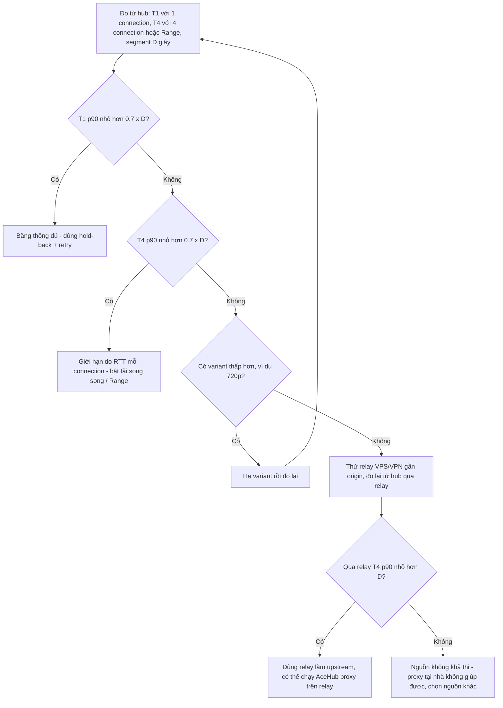
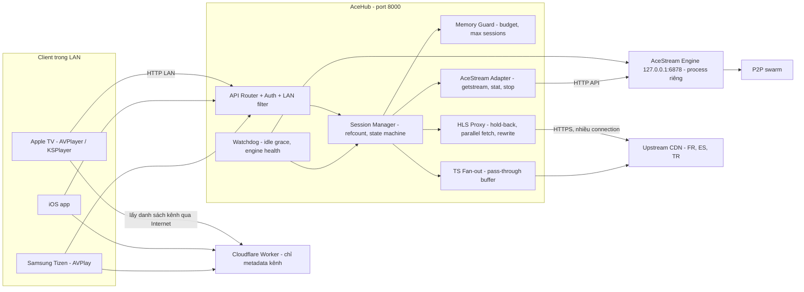
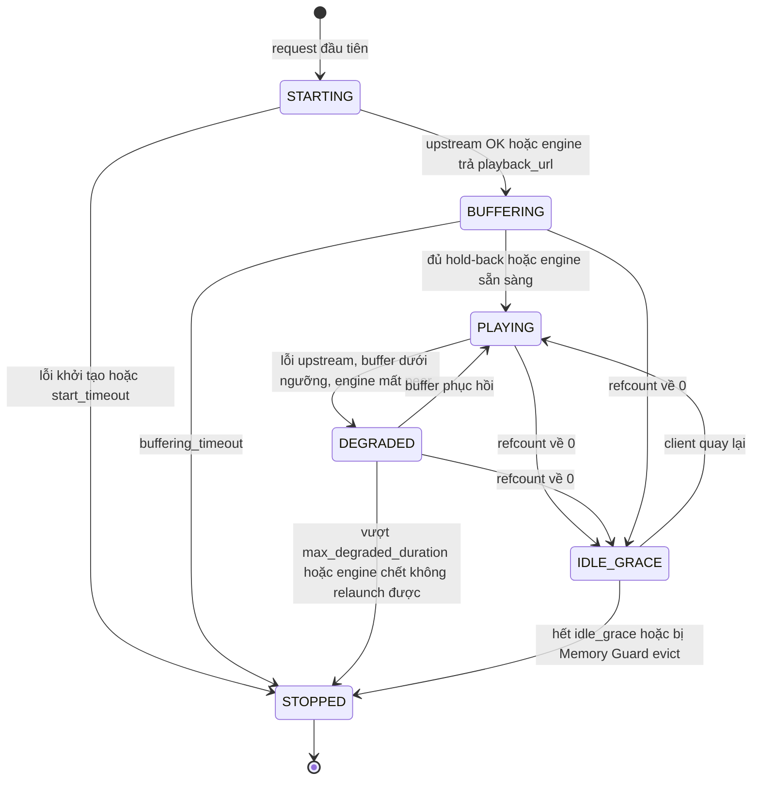
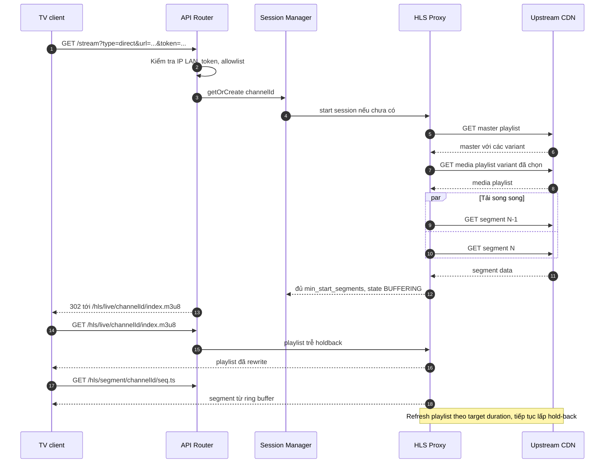
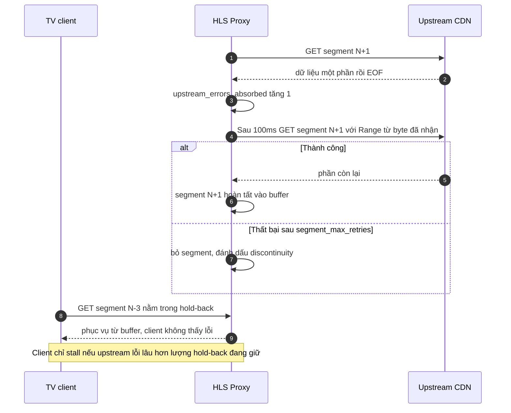

# AceHub Hybrid Gateway — Đặc tả kỹ thuật v1.1

| Thuộc tính | Giá trị |
|---|---|
| Dự án | AceHub Hybrid Gateway (home project) |
| Phiên bản | 1.1 (thay thế v1.0) |
| Ngày | 03/10/2026 |
| Đối tượng đọc | Developer / AI coding agent (Codex) triển khai |
| Trạng thái | Draft để implement — các con số chưa đo được đánh dấu **(ước tính)** hoặc **(mục tiêu cần đo)** |

> Quy ước: "PHẢI" = bắt buộc; "NÊN" = khuyến nghị mạnh; "CÓ THỂ" = tùy chọn. Mọi số liệu hiệu năng trong tài liệu này là **mục tiêu hoặc ước tính**, không phải kết quả đo. Không được viết lại chúng thành cam kết trong code comment, README hay UI.

---

## 0. Change log v1.0 → v1.1

| # | Hạng mục | v1.0 | v1.1 | Lý do |
|---|---|---|---|---|
| 1 | Chống giật Direct | Prefetch 1–2 segment + reconnect 100ms | **Live-edge hold-back buffer**: phát playlist trễ 3–5 segment (18–30s, cấu hình được); tải segment song song (nhiều connection / HTTP Range); hạ variant tự động (tùy chọn); retry có backoff, giới hạn số lần và timeout | Prefetch không tạo thêm băng thông: proxy tải chậm y như TV, và live HLS chỉ tải được segment đã có trong playlist. Chỉ có buffer (đổi lấy độ trễ) + tăng throughput mới giúp được. Mất kết nối lâu hơn buffer vẫn giật. |
| 2 | Mô hình điều khiển | FSM toàn cục, P2P và Direct loại trừ nhau | **Quản lý theo session**: mỗi session có refcount người xem; nhiều session khác loại chạy đồng thời; giới hạn bằng memory budget + max sessions; state machine riêng cho từng session | FSM loại trừ khiến TV A xem Direct thì TV B không xem được P2P, và chuyển mode làm đứt luồng của người khác. |
| 3 | Cloudflare Worker | Worker trỏ về IP AceHub, app không cần sửa | Worker **không thể** truy cập IP LAN private. Phương án (a) app gọi thẳng AceHub trong LAN, Worker chỉ trả metadata — **khuyến nghị**; (b) expose qua tunnel có auth — có rủi ro | Worker chạy trên edge Cloudflare, không route được tới 192.168.x.x. Claim "app không cần sửa" bị loại bỏ. |
| 4 | Bộ nhớ | Số liệu 1.2GB dùng / 700–800MB trống / ngưỡng 85% gây OOM; engine "ngủ ~15MB" | Số liệu cũ không nhất quán và chưa đo → thay bằng **kế hoạch đo** + budget cấu hình được. Android LMK kill theo oom_adj, không theo ngưỡng 85% → AceHub chạy **foreground service**. AceStream Engine là process riêng, AceHub chỉ stop session, health-check và xử lý khi engine bị kill | 700–800MB trống trừ 340MB vẫn còn xa ngưỡng 85%, nên lập luận OOM cũ tự mâu thuẫn. AceHub không kiểm soát được RAM của app khác. |
| 5 | Khởi động P2P | Warm start 1,5–3s | 5–30s tùy swarm, là **mục tiêu cần đo** | Thời gian phụ thuộc số peer, không phụ thuộc gateway. |
| 6 | Ring buffer | Tối đa 3 segment, evict >20s, cố định 35MB | Kích thước theo **số segment** suy ra từ hold-back (mặc định 6); budget theo session; **không evict segment đang được client đọc** | 3 segment nhỏ hơn hold-back cần thiết; evict theo thời gian có thể cắt ngang client đang đọc. |
| 7 | Độ phủ HLS | Không đề cập | Master playlist/variant, resolve URI tương đối/tuyệt đối, `#EXT-X-KEY` AES-128, `#EXT-X-DISCONTINUITY`, media sequence, chu kỳ refresh, header profile theo kênh, URL token hết hạn, nguồn MPEG-TS liên tục (fan-out pass-through) | Nguồn thực tế (rtve, kênh Thổ Nhĩ Kỳ, Pháp) dùng đủ các biến thể này. |
| 8 | channelId | Không định nghĩa | Hash xác định từ URL đã chuẩn hóa + header profile | Để URL giống nhau dùng chung 1 upstream (fan-out). |
| 9 | Phát hiện idle | Watchdog 15–30s không client | Chỉ **request của client** tính là hoạt động (không tính prefetch nội bộ); grace mặc định 60s cho cả Direct và P2P | Tránh session tự giữ sống chính nó; 60s đủ cho pause ngắn / chuyển kênh qua lại. |
| 10 | Bảo mật | Không có | Chỉ bind/nhận IP LAN, shared token, allowlist domain upstream, chặn SSRF, quy tắc URL-encoding | Proxy nhận URL tùy ý = open proxy / SSRF. |
| 11 | Client | Không đề cập | Apple ATS (`NSAllowsLocalNetworking`) hoặc HTTPS; ghi chú Samsung Tizen | AVPlayer chặn HTTP cleartext mặc định. |
| 12 | Tiêu chí | "Loại bỏ giật hoàn toàn", "100% mượt", "không bao giờ crash", "1–2ms" | **KPI đo được** + kịch bản nghiệm thu | Claim tuyệt đối không kiểm chứng được. |
| 13 | Mục 2 | Trống | Có sơ đồ kiến trúc Mermaid | Bổ sung. |
| 14 | Băng thông quốc tế không đủ | Ngầm giả định proxy LAN giải quyết được mọi trường hợp giật | Mục mới **1.3 "Khi băng thông không đủ"**: nếu throughput duy trì của tuyến quốc tế < bitrate thì proxy LAN **không thể** khắc phục, buffer sẽ cạn. Bắt buộc test khả thi trước (1 connection vs 4 connection song song / Range); giảm thiểu bằng tải song song, hạ variant, relay VPS/VPN gần origin; flowchart quyết định; bước 11.0 trong kế hoạch đo | Hold-back chỉ hấp thụ dao động, không bù được thiếu hụt kéo dài. Cần biết sớm để không tốn công triển khai vô ích. |

---

## 1. Bối cảnh & vấn đề

AceHub là gateway chạy trong LAN gia đình, phục vụ luồng TV thể thao cho mọi TV trong nhà qua **một cổng duy nhất (8000)**.

**Phần cứng hub:**
- **Mục tiêu chính:** FPT Box Android TV, 2GB RAM, IP `192.168.1.174`.
- **Phương án thay thế:** Laptop TUF, IP `192.168.1.59` (RAM dư dả, ràng buộc bộ nhớ gần như không còn; dùng khi FPT Box không đáp ứng KPI).

**Client:** Apple TV (AVPlayer / KSPlayer), iOS, Samsung Tizen TV (AVPlay).

**Hệ sinh thái hiện có:** Cloudflare Worker cung cấp danh sách kênh / link cho app.

### 1.1 Hai loại nguồn

| Tiêu chí | AceStream P2P | Direct (HLS m3u8 / MPEG-TS) |
|---|---|---|
| Định danh nguồn | content id / infohash | URL upstream (CDN Pháp, Tây Ban Nha như rtve, Thổ Nhĩ Kỳ…) |
| Thành phần xử lý | AceStream Engine (app/process riêng) tại `http://127.0.0.1:6878` | Module HLS Proxy hoặc TS Fan-out trong AceHub |
| Giao thức ra client | HTTP (HLS hoặc TS từ engine, AceHub proxy lại) | HLS (playlist đã rewrite) hoặc TS pass-through |
| Thời gian khởi động | 5–30s tùy swarm **(ước tính, cần đo)** | ~ thời gian tải playlist + đủ segment cho hold-back; với hold-back đã đầy là gần tức thời, với kênh mới mở là vài giây tới vài chục giây **(cần đo)** |
| Nguyên nhân giật chính | Swarm ít peer, engine bị LMK kill | RTT liên lục địa >250ms; upstream đóng socket ("Error reading HTTP response: End of file"); segment 6s tải mất ~5s nên player cạn buffer ngay sau khi bắt đầu |
| Bộ nhớ | Engine dùng cache RAM/disk riêng — **chưa đo** trên FPT Box (v1.0 ước 150–300MB, chưa xác minh) | Buffer segment trong AceHub: ~5–6MB/segment 6s @ 1080p50 6–8Mbps **(ước tính)** × số segment |
| AceHub kiểm soát được | Start/stop session qua API engine, health-check, relaunch engine (nếu Android cho phép) | Toàn bộ logic tải, buffer, retry, rewrite |
| Fan-out nhiều TV | Engine đã phục vụ nhiều client trên cùng content id; AceHub dùng chung 1 session engine | AceHub dùng chung 1 upstream session cho các client cùng channelId |

### 1.2 Phân tích nguyên nhân giật của Direct (đã sửa)

- Segment 6s tải mất ~5s nghĩa là tỉ lệ throughput/bitrate chỉ ~1,2×. Bất kỳ dao động nào (TCP slow start sau reconnect, EOF giữa chừng) làm tỉ lệ <1 và player cạn buffer.
- **Prefetch không giải quyết thiếu băng thông**: nếu proxy chỉ có 1 connection, nó tải chậm y như TV. Với live HLS, proxy cũng chỉ tải được segment đã xuất hiện trong playlist, nên không thể "tải trước tương lai".
- Giải pháp đúng gồm hai phần:
  1. **Đổi độ trễ lấy độ an toàn**: giữ lại 3–5 segment gần live edge, chỉ cho client thấy playlist trễ đó, nên client bắt đầu với một buffer đã đầy sẵn trên hub.
  2. **Tăng throughput hiệu dụng**: tải nhiều segment song song, chia Range nếu origin hỗ trợ, tái sử dụng connection (keep-alive / HTTP/2 nếu có), hạ variant khi throughput không đủ.
- **Giới hạn trung thực:** nếu upstream mất kết nối lâu hơn lượng buffer đang giữ (ví dụ >24s với hold-back 4×6s), client vẫn sẽ giật. Nếu throughput duy trì < bitrate thì buffer sẽ cạn dần — proxy LAN không khắc phục được, xem mục 1.3.


### 1.3 Khi băng thông không đủ

**Nguyên tắc:** cần phân biệt hai loại vấn đề:
- **Gián đoạn (interruption):** throughput trung bình ≥ bitrate nhưng có lúc EOF, reset, chậm đột ngột. Hold-back buffer + retry **giải quyết được** trong phạm vi độ dài buffer.
- **Thiếu dữ liệu kéo dài (sustained deficit):** throughput duy trì của tuyến quốc tế (từ hub tới origin) **< bitrate** của luồng. Khi đó mỗi giây phát tiêu thụ nhiều dữ liệu hơn mỗi giây tải được, buffer **chắc chắn sẽ cạn** sau `buffer / (bitrate - throughput)` giây, bất kể hold-back lớn đến đâu. Proxy LAN **không thể** khắc phục trường hợp này — nó chỉ dời thời điểm giật về sau.

**(1) Test khả thi — PHẢI làm trước khi triển khai HLS Proxy cho một nguồn** (chi tiết ở 11.0):
- Từ chính máy hub (FPT Box hoặc laptop), chọn 1 segment gần live edge (thời lượng `D` giây, thường 6s), ở variant mong muốn.
- Đo `T1` = thời gian tải segment bằng **1 connection**.
- Đo `T4` = thời gian tải cùng segment (hoặc 4 segment liên tiếp) bằng **4 connection song song** — dùng HTTP Range chia 4 phần nếu origin hỗ trợ `Accept-Ranges: bytes`, nếu không thì tải 4 segment khác nhau song song và lấy thời gian trung bình trên mỗi segment (`T4 = tổng thời gian / 4`).
- Lặp ≥ 10 lần ở các giờ khác nhau (đặc biệt giờ cao điểm tối VN, trùng giờ trận đấu châu Âu), lấy p50 và p90.
- Diễn giải:
  - `T1 p90 < 0,7 × D`: băng thông đủ; vấn đề chủ yếu là gián đoạn → hold-back + retry là đủ.
  - `T1 ≥ 0,7 × D` nhưng `T4 p90 < 0,7 × D`: giới hạn nằm ở throughput mỗi TCP connection (RTT cao, packet loss) → **tải song song** sẽ giúp; bật `parallel_segments` / `range_split_parts`.
  - `T4 p90` trong khoảng `0,7 × D` đến `D`: biên quá mỏng → cần hạ variant hoặc relay.
  - **`T4 p90 ≥ D`: ngay cả tải song song cũng không theo kịp → proxy tại nhà không hữu ích cho variant này.** Phải hạ variant hoặc đổi đường đi (relay).
  - Ngưỡng 0,7 là **đề xuất** (chừa ~30% biên cho dao động), có thể chỉnh sau khi đo.

**(2) Biện pháp giảm thiểu (theo thứ tự ưu tiên):**
1. **Tải song song nhiều connection / HTTP Range** (mục 4.3): hữu ích khi throughput mỗi TCP connection bị giới hạn bởi RTT cao (cửa sổ TCP / RTT) hoặc packet loss, trong khi tổng băng thông đường truyền còn dư. Không giúp nếu chính đường truyền quốc tế đã bão hòa. Có thể bị origin giới hạn số kết nối (theo dõi 429/403).
2. **Hạ variant tự động** (mục 4.4), ví dụ từ 1080p xuống 720p: giảm bitrate xuống dưới throughput khả dụng. Chỉ khả thi nếu nguồn có master playlist nhiều variant.
3. **Relay qua VPS/VPN** ở gần origin (châu Âu) hoặc có tuyến tốt về Việt Nam: relay kéo luồng từ origin bằng đường quốc tế ổn định hơn, hub tại nhà kéo từ relay. Relay CÓ THỂ chạy chính logic HLS Proxy của AceHub (hold-back, retry, tải song song) — khi đó hub tại nhà coi relay là upstream (thêm relay vào `upstream_allowlist`, profile riêng). Lưu ý: tốn chi phí VPS và băng thông egress; đường relay→VN vẫn phải được đo bằng chính test (1); có thể vi phạm điều khoản nguồn hoặc bị chặn geo (nguồn chỉ cho IP quốc gia đó — khi ấy relay đặt tại đúng quốc gia lại là lợi thế); relay public phải có auth (xem rủi ro ở 9.1b).
4. **Hold-back delay:** chỉ **hấp thụ dao động** (gián đoạn ngắn, throughput lên xuống quanh mức đủ). **Không** bù được thiếu hụt kéo dài; tăng hold-back trong trường hợp thiếu băng thông chỉ làm chậm thời điểm giật và tăng độ trễ.

Nếu sau cả các biện pháp trên vẫn không đạt `T4 p90 < D` ở variant thấp nhất chấp nhận được → ghi nhận nguồn đó **không khả thi** và cân nhắc nguồn khác (ví dụ P2P cho cùng nội dung).



---

## 2. Kiến trúc tổng thể



**Vai trò module:**

| Module | Trách nhiệm |
|---|---|
| API Router | Parse request, kiểm tra IP nguồn private, kiểm tra token, validate tham số, map tới session |
| Session Manager | Tạo/tìm session theo `sessionKey`, quản lý refcount viewer, state machine từng session, teardown |
| Memory Guard | Theo dõi RSS của AceHub + budget buffer từng session; từ chối hoặc evict session idle khi vượt giới hạn |
| Watchdog | Timer idle grace từng session; health-check engine định kỳ; phát hiện engine bị kill |
| HLS Proxy | Refresh playlist upstream, tải segment song song, hold-back buffer, rewrite playlist/key URI, retry/backoff, hạ variant |
| TS Fan-out | Một kết nối upstream MPEG-TS liên tục → nhiều client, buffer nhỏ theo byte |
| AceStream Adapter | Gọi `/ace/getstream?format=json`, poll `stat_url`, stop qua `command_url?method=stop`, proxy `playback_url` |

**Ngôn ngữ/stack:** không bắt buộc. Gợi ý: Go hoặc Kotlin (chạy native trên Android dạng foreground service); Node.js chỉ phù hợp cho bản laptop. Yêu cầu: HTTP server streaming (không buffer toàn bộ response), HTTP client hỗ trợ keep-alive, timeout từng giai đoạn, Range request.

---

## 3. Session model & state machine

### 3.1 Định nghĩa session

| Trường | Mô tả |
|---|---|
| `sessionKey` | P2P: `ace:` + content id hoặc `ace:ih:` + infohash (lowercase). Direct: `channelId` (mục 3.2) |
| `type` | `p2p` \| `hls` \| `ts` |
| `refcount` | Số viewer đang hoạt động (mục 3.4) |
| `state` | Xem 3.3 |
| `createdAt`, `lastClientActivityAt` | Timestamp |
| `bufferBytes` | Bộ nhớ buffer session đang giữ |
| `stats` | upstream errors, retries, throughput, segment count, variant hiện tại |

### 3.2 channelId (Direct)

```
channelId = hex(sha256(normalizedUrl + "\n" + profileId))[0:16]
```

Chuẩn hóa URL (`normalizedUrl`):
1. Parse URL; scheme và host chuyển lowercase; bỏ port mặc định (80/443); bỏ fragment.
2. Giữ nguyên path (không decode `%2F`).
3. Query: loại các tham số nằm trong `ignore_query_params` của profile (ví dụ token, expires, signature) rồi sắp xếp theo tên.
4. Nếu profile có `channel_key` cố định (dùng cho nguồn token hết hạn, mục 4.8) thì dùng `channel_key` thay cho `normalizedUrl`.

`profileId` = id header profile được áp dụng (mặc định `default`). Hai request cùng URL chuẩn hóa + cùng profile → cùng channelId → dùng chung một upstream session.

### 3.3 State machine từng session



| State | Ý nghĩa | Hành vi |
|---|---|---|
| STARTING | Đang resolve nguồn (tải master playlist / gọi getstream) | Request client chờ tối đa `start_timeout` |
| BUFFERING | Đang lấp hold-back buffer / chờ engine | Playlist cho client chỉ được trả khi có ≥ `min_start_segments` segment |
| PLAYING | Bình thường | Refresh playlist, tải segment, phục vụ client |
| DEGRADED | Upstream lỗi liên tục hoặc buffer < `degraded_threshold_segments` | Tiếp tục retry, có thể hạ variant; vẫn phục vụ segment còn trong buffer |
| IDLE_GRACE | refcount = 0, đang chờ grace | **Vẫn** giữ upstream (để zap lại nhanh) nhưng NÊN giảm nhịp tải: chỉ refresh playlist, tối đa giữ hold-back hiện có |
| STOPPED | Đã giải phóng | Giải phóng buffer, đóng connection, P2P: gọi stop qua `command_url` |

### 3.4 Refcount & phát hiện hoạt động

- **Chỉ request của client tính là hoạt động** (GET playlist, GET segment, GET key, đang giữ kết nối TS/P2P stream). Request nội bộ của proxy (refresh playlist, prefetch segment) **không bao giờ** cập nhật `lastClientActivityAt`.
- Viewer được nhận diện bằng `clientId = IP client + User-Agent` (hoặc tham số `cid` nếu app gửi). Với HLS (client poll), viewer coi là còn hoạt động nếu có request trong `viewer_timeout` (mặc định 3 × target duration, tối thiểu 20s). Với TS/P2P stream (kết nối dài), viewer hoạt động khi kết nối HTTP còn mở.
- `refcount` = số viewer còn hoạt động. Khi refcount về 0 → `IDLE_GRACE`.
- `idle_grace` mặc định **60s** cho cả Direct và P2P. Lý do: người dùng pause ngắn, hoặc zap sang kênh khác rồi quay lại trong vòng 1 phút là thói quen phổ biến khi xem thể thao; giữ session giúp quay lại tức thời (Direct: hold-back đã đầy; P2P: tránh phải join swarm lại 5–30s). Đổi lại tốn RAM/băng thông thêm tối đa 60s, có thể chỉnh.
- `POST /stop` có thể ép dừng ngay một session (bỏ qua grace).

### 3.5 Đồng thời & memory budget

- Nhiều session thuộc các loại khác nhau **được phép chạy đồng thời** (ví dụ 1 P2P + 2 Direct).
- Giới hạn:
  - `max_sessions` (mặc định 3 trên FPT Box, 8 trên laptop).
  - `max_p2p_sessions` (mặc định 1 trên FPT Box — engine tốn nhiều RAM/CPU nhất, cần đo; 2 trên laptop).
  - `memory_budget_mb`: tổng buffer của mọi session Direct trong AceHub (mặc định 128MB FPT Box, 512MB laptop — **ước tính, phải điều chỉnh sau khi đo**).
  - `session_buffer_budget_mb`: trần buffer mỗi session (mặc định 48MB).
  - `rss_soft_limit_mb`: nếu RSS của AceHub vượt ngưỡng → coi như hết budget.
- Khi request mới vượt giới hạn:
  1. Nếu có session ở `IDLE_GRACE` → evict session idle **lâu nhất** (`STOPPED`), rồi tạo session mới.
  2. Nếu không → từ chối với HTTP `503`, mã lỗi `CAPACITY_EXCEEDED`, body liệt kê session đang chạy. **Không bao giờ** dừng session đang có viewer để nhường chỗ.
- AceHub không đo được chính xác RAM của AceStream Engine theo thời gian thực từ trong sandbox Android (xem 7.1); Memory Guard dùng `max_p2p_sessions` làm giới hạn chính cho P2P, và CÓ THỂ đọc `/proc/<pid>/status` của engine nếu quyền cho phép (thường không được trên Android 10+).

---

## 4. Thiết kế HLS Proxy

### 4.1 Luồng tổng quát

1. Nhận URL upstream (đã validate, mục 8).
2. Tải playlist. Nếu là **master playlist** (`#EXT-X-STREAM-INF`) → chọn variant theo `variant_policy` (mặc định: variant cao nhất có `BANDWIDTH` ≤ `max_bandwidth_bps`, hoặc cao nhất nếu không đặt). Lưu danh sách variant để hạ cấp.
3. Với media playlist: theo dõi `#EXT-X-MEDIA-SEQUENCE`, `#EXT-X-TARGETDURATION`, `#EXT-X-DISCONTINUITY-SEQUENCE`.
4. Refresh playlist mỗi `target_duration` giây khi playlist thay đổi; nếu playlist không đổi thì lần refresh tiếp theo sau `target_duration / 2` (theo khuyến nghị RFC 8216). Timeout refresh: `playlist_timeout`.
5. Mỗi segment mới xuất hiện được đưa vào hàng đợi tải; tối đa `parallel_segments` segment tải đồng thời.
6. Segment tải xong → vào ring buffer. Client nhận **playlist trễ** (mục 4.2).

### 4.2 Live-edge hold-back buffer

- Gọi `N` = sequence của segment liên tiếp mới nhất đã tải **xong hoàn toàn** (mọi segment trước nó cũng đã xong hoặc đã bị bỏ). Playlist client kết thúc tại segment `E = N - holdback_segments`, gồm `playlist_window_segments` segment cuối tính đến `E`.
  - Ví dụ `holdback_segments = 4`, segment 6s → client chạy sau live ~24s + độ trễ upstream; trên hub luôn có ~24s nội dung "dự trữ" chưa công bố.
- Thực tế triển khai: buffer giữ segment từ `E - playlist_window_segments + 1` đến `N`. Kích thước ring buffer mặc định = `playlist_window_segments + holdback_segments`, mặc định 3 + 3 = **6 segment**, tối đa `max_ring_segments` (12).
- `holdback_segments` cấu hình được, mặc định 3 (≈18s với segment 6s), khoảng khuyến nghị 3–5 (18–30s). Có thể đặt theo profile kênh.
- Khi bắt đầu kênh mới: playlist client trả về khi có ≥ `min_start_segments` (mặc định 2) segment đã tải xong; hold-back được lấp dần. Do đó những giây đầu tiên của kênh mới mở **chưa** có đầy đủ bảo vệ — phải ghi rõ trong KPI.
- Playlist client giữ nguyên `#EXT-X-TARGETDURATION`, `#EXT-X-VERSION`; `#EXT-X-MEDIA-SEQUENCE` = sequence của segment đầu tiên trong playlist client (giữ đúng số sequence upstream để không gây nhảy). Không thêm `#EXT-X-ENDLIST`.
- **Giới hạn:** khi upstream đứt lâu hơn lượng hold-back đang có, playlist client ngừng tăng và client sẽ stall. Proxy KHÔNG được bịa segment.

### 4.3 Tải song song & tăng throughput

- `parallel_segments` (mặc định 2): số segment khác nhau tải đồng thời. Giúp khi upstream phát nhiều segment cùng lúc (sau khi buffer cạn) hoặc khi latency chiếm phần lớn thời gian tải.
- **Range splitting** (tùy chọn, `range_split_parts`, mặc định 1 = tắt; khuyến nghị thử 2–4): nếu upstream trả `Accept-Ranges: bytes` và `Content-Length` (dò ở lần tải đầu bằng HEAD hoặc GET `Range: bytes=0-0`), chia segment thành K phần tải song song rồi ghép. Nếu origin trả 200 thay vì 206 → tắt range cho session đó.
- Tái sử dụng connection: HTTP keep-alive, connection pool theo host (`max_conns_per_host`, mặc định 6). Dùng HTTP/2 nếu origin hỗ trợ.
- Phép đo throughput: với mỗi segment, `ratio = segment_duration / download_time`. Lưu EWMA (α = 0,3).

### 4.4 Hạ variant tự động (tùy chọn)

- Bật bằng `auto_downgrade = true` (mặc định `true` nếu có master playlist).
- Nếu EWMA `ratio < downgrade_ratio` (mặc định 1,3) trong `downgrade_window` segment liên tiếp (mặc định 3) **hoặc** buffer < `degraded_threshold_segments` → chuyển sang variant thấp hơn kế tiếp.
- Nâng lại variant khi `ratio > upgrade_ratio` (mặc định 2,0) trong 10 segment liên tiếp và buffer đầy.
- Khi đổi variant: segment đầu tiên từ variant mới trong playlist client PHẢI có `#EXT-X-DISCONTINUITY` đứng trước (các variant có thể khác encoder/timestamp). Giữ sequence tăng liên tục ở phía client (proxy tự đánh số lại segment client: `clientSeq` độc lập với sequence upstream sau lần đổi variant đầu tiên). Ghi log + tăng `variant_switches`.

### 4.5 Retry, backoff, timeout

| Loại lỗi | Hành vi |
|---|---|
| EOF / connection reset / timeout khi tải segment | Retry lần 1 sau 100ms, sau đó backoff lũy thừa ×2 có jitter ±20%: 100ms, 200ms, 400ms, 800ms, 1600ms; tối đa `segment_max_retries` (mặc định 5). Nếu đang tải dở và origin hỗ trợ Range → tiếp tục từ byte đã nhận (`Range: bytes=<received>-`) |
| HTTP 5xx, 429 | Như trên; với 429 tôn trọng `Retry-After` nếu ≤ 5s |
| HTTP 403/401/410 trên segment hoặc playlist | Coi là token hết hạn → re-resolve nguồn (mục 4.8); không retry mù |
| HTTP 404 trên segment | Retry tối đa 2 lần (CDN chưa đồng bộ), sau đó bỏ segment |
| Segment hết hạn retry | Bỏ segment, đánh dấu gap; ở playlist client segment tiếp theo được chèn `#EXT-X-DISCONTINUITY`; tăng `segments_dropped` |
| Playlist refresh lỗi | Retry theo backoff; nếu lỗi liên tục > `playlist_fail_degraded_s` (mặc định 10s) → `DEGRADED`; > `max_degraded_duration` (mặc định 120s) và refcount = 0 → `STOPPED`; nếu còn viewer thì tiếp tục thử tới `max_degraded_duration_with_viewers` (mặc định 300s) |

Timeout (mặc định): `connect_timeout` 3s, `first_byte_timeout` 5s, `read_idle_timeout` 5s (không nhận byte nào trong 5s → coi là lỗi), `segment_total_timeout` = 2 × target duration.

Tổng thời gian retry của một segment PHẢI có giới hạn để không chặn hàng đợi; segment đang retry không chặn segment sau (tải song song).

### 4.6 Rewrite playlist & URI

- Mọi URI trong playlist (segment, `#EXT-X-KEY URI`, `#EXT-X-MAP URI`, variant, `#EXT-X-MEDIA URI`) được resolve thành URL tuyệt đối theo RFC 3986 dựa trên URL playlist **cuối cùng sau redirect**.
- URI gửi cho client là đường dẫn tương đối tới AceHub:
  - Segment: `/hls/segment/{channelId}/{seq}.{ext}` (ext lấy từ URL gốc: `ts`, `m4s`, `aac`, `mp4`…; mặc định `ts`).
  - Init segment `#EXT-X-MAP`: `/hls/init/{channelId}/{mapId}`.
  - Key: `/hls/key/{channelId}/{keyId}`.
  - Kèm `?token=` nếu auth bật và client truy cập bằng token query (mục 8.2).
- Proxy giữ map `seq → upstreamUrl` và `keyId → keyUrl` trong session; client không bao giờ thấy URL upstream.
- **`#EXT-X-KEY` AES-128 / SAMPLE-AES:** giữ nguyên `METHOD`, `IV`, `KEYFORMAT`; chỉ thay `URI`. Proxy tải key với header profile, cache trong session (key nhỏ, giữ đến khi không còn segment tham chiếu). Proxy KHÔNG giải mã segment. DRM (`KEYFORMAT` FairPlay/Widevine, `skd://`) → không hỗ trợ, trả lỗi `UNSUPPORTED_DRM` khi tạo session.
- `#EXT-X-DISCONTINUITY`, `#EXT-X-PROGRAM-DATE-TIME`, `#EXT-X-BYTERANGE` (nếu có: proxy tải đúng byterange, coi mỗi byterange là một segment client) được giữ đồng bộ với segment tương ứng.
- Tag không biết → giữ nguyên nếu không chứa URI; nếu chứa `URI=` không xử lý được → log cảnh báo và bỏ tag.
- Low-Latency HLS (`#EXT-X-PART`, `#EXT-X-PRELOAD-HINT`): bỏ các tag part, chỉ dùng segment đầy đủ (hold-back làm LL-HLS vô nghĩa).

### 4.7 Header profile theo kênh

Profile (file `profiles.json` hoặc config) định nghĩa:

```json
{
  "id": "rtve",
  "match_hosts": ["*.rtve.es", "*.rtve.stream"],
  "headers": {
    "User-Agent": "Mozilla/5.0 ...",
    "Referer": "https://www.rtve.es/",
    "Origin": "https://www.rtve.es"
  },
  "cookies": "",
  "ignore_query_params": ["token", "expires", "hdnts"],
  "channel_key": null,
  "resolver": null,
  "holdback_segments": 4
}
```

- Profile được chọn: tham số `profile` trong request (nếu được cho phép) hoặc khớp `match_hosts`; nếu không khớp dùng `default`.
- Header áp dụng cho mọi request upstream của session (playlist, segment, key). Client **không** được tự truyền header tùy ý qua query (tránh lạm dụng).
- `Set-Cookie` từ upstream được lưu vào cookie jar theo session.

### 4.8 URL token hết hạn

- Nếu playlist/segment trả 401/403/410, hoặc URL có tham số hết hạn đã quá thời gian (nếu profile khai báo `expires_param`), proxy **re-resolve**:
  1. Nếu profile có `resolver` (URL HTTP tới Cloudflare Worker hoặc endpoint metadata trả URL mới cho `channel_key`) → gọi resolver, lấy URL mới.
  2. Nếu không có resolver → thử tải lại master playlist gốc (một số CDN cấp token mới tại master).
  3. Thất bại → `DEGRADED`, rồi theo quy tắc 4.5.
- Vì token thay đổi, kênh có token PHẢI dùng `channel_key` hoặc `ignore_query_params` để channelId ổn định.
- Sau re-resolve, segment mới có thể khác sequence/timestamp → chèn `#EXT-X-DISCONTINUITY` nếu sequence không liên tục.

### 4.9 Ring buffer & eviction

- Đơn vị: segment. Kích thước mặc định 6 (`playlist_window_segments + holdback_segments`), trần `max_ring_segments`.
- Ước tính RAM **(ước tính)**: 1080p50 ở 6–8 Mbps → segment 6s ≈ 4,5–6MB → 6 segment ≈ 27–36MB/session. Tổng phải nằm trong `session_buffer_budget_mb` và `memory_budget_mb`. Nếu vượt → giảm số segment hold-back của session đó (không dưới `min_start_segments`) và ghi cảnh báo.
- **Quy tắc evict:**
  1. Chỉ evict segment đã rơi khỏi cửa sổ playlist client (sequence < đầu playlist client).
  2. **Không bao giờ** evict segment đang có client đọc (giữ `readers` counter trên mỗi segment; giải phóng khi counter = 0).
  3. Segment đang có reader nhưng đã ra khỏi cửa sổ được đánh dấu `pendingEvict`, tính vào budget cho tới khi giải phóng.
  4. Tùy chọn `disk_spill_dir`: trên laptop có thể ghi segment ra disk/tmpfs thay vì RAM.
- Phục vụ segment: nếu client yêu cầu segment đang tải dở (chưa xong) → stream phần đã có và tiếp tục khi có thêm dữ liệu (chunked); thông thường không xảy ra nhờ hold-back. Segment không còn trong buffer → `404` mã `SEGMENT_EXPIRED` (client sẽ reload playlist).
- Response segment: `Content-Type` theo upstream (mặc định `video/mp2t`), `Content-Length` khi đã biết, `Cache-Control: no-cache`. Playlist: `application/vnd.apple.mpegurl`, `Cache-Control: no-cache`.

### 4.10 Nguồn MPEG-TS liên tục (TS Fan-out)

- Phát hiện: `type=direct` với URL trả `Content-Type: video/mp2t` / `application/octet-stream` và byte đầu tiên là `0x47` (sync byte) — hoặc client chỉ định `format=ts`.
- Không áp dụng logic HLS. Một kết nối upstream duy nhất cho mỗi channelId, ghi vào **ring buffer theo byte** (`ts_buffer_bytes`, mặc định 4MB ≈ 4–5s @ 6–8Mbps **(ước tính)**), căn theo bội số 188 byte.
- Client mới: bắt đầu từ vị trí gần nhất có PAT/PMT nếu dò được (CÓ THỂ chỉ bắt đầu ở biên 188 byte; player thường tự đồng bộ).
- Client chậm: nếu tụt quá buffer → ngắt kết nối client đó (không làm chậm upstream và client khác).
- Upstream EOF: reconnect theo backoff 4.5; trong lúc reconnect client giữ kết nối mở tới `ts_reconnect_hold_s` (mặc định 10s), sau đó đóng. Dữ liệu sau reconnect có thể gián đoạn timestamp — player tự xử lý hoặc giật; đây là giới hạn đã biết.
- Refcount = số kết nối client đang mở.

### 4.11 Sequence: client bắt đầu xem kênh Direct



### 4.12 Sequence: upstream EOF giữa chừng



---

## 5. AceStream Adapter

### 5.1 Khởi tạo session P2P

1. `GET http://127.0.0.1:6878/ace/getstream?id={contentId}&format=json` (hoặc `infohash={infohash}`). Thêm `pid={sessionUuid}` để engine phân biệt người dùng nếu phiên bản engine hỗ trợ (**cần xác minh**).
2. Response mong đợi (cần xác minh với phiên bản engine đã cài):
   ```json
   {
     "response": {
       "playback_url": "http://127.0.0.1:6878/ace/r/<...>",
       "stat_url": "http://127.0.0.1:6878/ace/stat/<...>",
       "command_url": "http://127.0.0.1:6878/ace/cmd/<...>",
       "infohash": "...",
       "playback_session_id": "...",
       "is_live": 1
     },
     "error": null
   }
   ```
   Nếu `error` khác null → session `STOPPED`, trả lỗi `P2P_START_FAILED` kèm message engine.
3. Lưu `playback_url`, `stat_url`, `command_url` trong session.
4. Client nhận `302` tới `/ace/live/{sessionKeyHash}` (TS) — AceHub proxy luồng từ `playback_url` (stream pass-through, dùng cơ chế TS Fan-out nếu nhiều client). Phương án HLS: dùng `/ace/manifest.m3u8?id=...&format=json` của engine nếu cần cho Apple TV; khi đó AceHub rewrite playlist như mục 4.6 (không áp hold-back mặc định vì engine đã buffer; `holdback_segments` cho P2P mặc định 0, cấu hình được).
   - Lựa chọn TS hay HLS cho P2P: tham số `output=ts|hls`, mặc định `hls` cho Apple TV/iOS (AVPlayer không phát được TS thô qua HTTP), `ts` cho Tizen nếu ổn định. **Cần thử nghiệm.**

### 5.2 Poll trạng thái

- Poll `stat_url` mỗi `ace_stat_interval` (mặc định 2s) khi session ở STARTING/BUFFERING, 5s khi PLAYING.
- Trường quan tâm (tên cần xác minh): `status` (`prebuf`, `dl`, …), `peers`, `speed_down`, `downloaded`, `progress`.
- Chuyển state: `prebuf` → BUFFERING; `dl` và có dữ liệu qua playback_url → PLAYING; `peers = 0` hoặc `speed_down` ≈ 0 trong `ace_degraded_after_s` (mặc định 15s) → DEGRADED.
- `start_timeout` cho P2P mặc định **45s** (startup 5–30s là mục tiêu cần đo, cộng biên).

### 5.3 Dừng session

- Gọi `GET {command_url}?method=stop` khi session vào STOPPED. Timeout 3s; lỗi chỉ log (engine có thể đã chết).
- **Không** dùng endpoint `/ace/stop` toàn cục (chưa xác minh tồn tại). Nếu phiên bản engine cài đặt có endpoint khác, cập nhật adapter sau khi kiểm tra (mục 12).
- AceHub **không** kiểm soát RAM của engine sau khi stop. Việc engine giải phóng cache về mức nào là hành vi của engine — phải đo, không được giả định "~15MB".

### 5.4 Health-check & xử lý engine bị kill

- Watchdog gọi `GET http://127.0.0.1:6878/webui/api/service?method=get_version&format=json` (hoặc endpoint version tương đương — **cần xác minh**) mỗi `engine_health_interval` (mặc định 10s; 3s khi có session P2P đang chạy). Timeout 2s.
- 3 lần lỗi liên tiếp → `engine_status = "down"`:
  - Mọi session P2P → DEGRADED, đóng kết nối playback cũ.
  - Android: thử relaunch engine bằng Intent (ví dụ `startForegroundService`/`startService` tới service của package AceStream, hoặc launch activity) — package/class cụ thể **cần xác minh** (ví dụ `org.acestream.media` / `org.acestream.node`). Nếu Android không cho phép start background service của app khác → báo `engine_status = "down_needs_manual_start"` trong `/status`.
  - Laptop: CÓ THỂ chạy engine như child process / systemd service và restart bằng lệnh cấu hình `engine_restart_cmd`.
  - Sau khi engine lên lại: với session P2P còn viewer → gọi lại getstream (tối đa `ace_restart_retries` = 3), session về BUFFERING.
- Engine quay lại nhưng session cũ mất → không cố dùng `command_url` cũ.

### 5.5 Cấu hình cache engine (khuyến nghị)

- Đặt cache engine dùng **disk** thay vì memory nếu engine hỗ trợ (setting "cache type"/"disk cache"), giới hạn kích thước cache (ví dụ live cache vài trăm MB trên bộ nhớ trong). Giá trị cụ thể **cần đo** trên FPT Box.
- Giảm số kết nối peer tối đa nếu CPU FPT Box quá tải.
- Ghi các setting đã chọn vào README triển khai.

---

## 6. API v1.1

Base: `http://<hub-ip>:8000`. Mọi response lỗi dạng JSON.

### 6.1 Xác thực

- Token chia sẻ (`auth_token` trong config). Gửi qua header `Authorization: Bearer <token>` hoặc query `token=<token>` (bắt buộc hỗ trợ query vì player HLS không gửi header tùy ý).
- Endpoint yêu cầu token: `/stream`, `/stop`, `/admin/*`, `/status` (chi tiết). Endpoint `/hls/*`, `/ace/live/*` kiểm tra token qua query hoặc qua channelId đã được tạo bởi request có token + IP LAN (cấu hình `media_requires_token`, mặc định `true`, token được tự gắn vào URI rewrite).
- `GET /health` không cần token (chỉ trả `{"ok":true}`).

### 6.2 Endpoint

| Method | Path | Mô tả |
|---|---|---|
| GET | `/stream` | Tạo/tham gia session, trả redirect tới URL phát (tương thích v1.0) |
| GET | `/hls/live/{channelId}/index.m3u8` | Playlist client (đã trễ hold-back, đã rewrite) |
| GET | `/hls/segment/{channelId}/{seq}.{ext}` | Segment từ ring buffer |
| GET | `/hls/init/{channelId}/{mapId}` | Init segment fMP4 |
| GET | `/hls/key/{channelId}/{keyId}` | Key AES-128 proxy |
| GET | `/ts/live/{channelId}` | Luồng MPEG-TS fan-out |
| GET | `/ace/live/{sessionId}` | Luồng P2P (TS hoặc playlist HLS tùy `output`) |
| GET | `/status` | Trạng thái gateway, session, engine |
| POST | `/stop` | Dừng một session hoặc tất cả |
| GET | `/health` | Liveness |
| GET | `/admin/profiles` | Danh sách header profile (không trả cookie/secret) |
| POST | `/admin/reload` | Reload config/profile |

### 6.3 `GET /stream`

| Param | Bắt buộc | Mô tả |
|---|---|---|
| `type` | có | `id` \| `infohash` \| `direct` (giữ ngữ nghĩa v1.0) |
| `id` | khi `type=id` | AceStream content id (40 hex) |
| `infohash` | khi `type=infohash` | 40 hex |
| `url` | khi `type=direct` | URL upstream, **phải** percent-encode toàn bộ (`encodeURIComponent`) |
| `format` | không | `auto` (mặc định) \| `hls` \| `ts` cho Direct |
| `output` | không | `hls` \| `ts` cho P2P (mặc định theo config `ace_default_output`) |
| `profile` | không | id header profile (chỉ chấp nhận profile đã định nghĩa) |
| `cid` | không | client id ổn định do app sinh (để đếm viewer chính xác) |
| `token` | có (nếu không dùng header) | shared token |
| `mode` | không | `redirect` (mặc định, 302) \| `json` |

Response:
- `302 Location: /hls/live/{channelId}/index.m3u8?token=...` (hoặc `/ts/live/...`, `/ace/live/...`).
- `mode=json`:
  ```json
  { "session_id": "a1b2c3d4e5f60718", "type": "hls", "state": "BUFFERING",
    "play_url": "/hls/live/a1b2c3d4e5f60718/index.m3u8?token=..." }
  ```
- Request `/stream` chờ tối đa `start_timeout` để session đạt BUFFERING đủ `min_start_segments`; nếu quá → `504 START_TIMEOUT`.

### 6.4 `POST /stop`

Body JSON: `{"session_id": "a1b2c3d4e5f60718"}` hoặc `{"all": true}`. Không có body → lỗi `400` (v1.0 dừng toàn bộ — v1.1 yêu cầu chỉ định rõ để tránh dừng nhầm luồng TV khác).
Response: `{"stopped": ["a1b2c3d4e5f60718"]}`.

### 6.5 `GET /status` (ví dụ)

```json
{
  "status": "ok",
  "gateway_version": "1.1.0",
  "host": { "platform": "android", "device": "FPT Box", "uptime_s": 86400 },
  "memory": {
    "process_rss_mb": 74.2,
    "buffers_total_mb": 41.8,
    "memory_budget_mb": 128,
    "rss_soft_limit_mb": 220,
    "device_avail_mb": 612
  },
  "limits": { "max_sessions": 3, "max_p2p_sessions": 1, "active_sessions": 2 },
  "engine": {
    "status": "up",
    "version": "3.x.x",
    "last_check": "2026-10-03T19:20:00+07:00",
    "consecutive_failures": 0,
    "restarts": 1
  },
  "sessions": [
    {
      "session_id": "a1b2c3d4e5f60718",
      "type": "hls",
      "state": "PLAYING",
      "source": "https://rtvelivestream.example/.../main.m3u8",
      "profile": "rtve",
      "refcount": 2,
      "viewers": [
        { "client": "192.168.1.30", "last_seen_s": 2 },
        { "client": "192.168.1.31", "last_seen_s": 4 }
      ],
      "created_at": "2026-10-03T19:02:11+07:00",
      "idle_since": null,
      "hls": {
        "variant": "1920x1080@6000000",
        "variants_available": 4,
        "target_duration_s": 6,
        "holdback_segments": 3,
        "buffered_segments": 6,
        "buffer_mb": 31.4,
        "live_edge_seq": 182344,
        "client_edge_seq": 182341,
        "throughput_ratio_ewma": 1.8,
        "upstream_errors_absorbed": 14,
        "segments_dropped": 0,
        "retries": 21,
        "variant_switches": 0,
        "token_refreshes": 1
      }
    },
    {
      "session_id": "ace-9f0e1d2c3b4a5968",
      "type": "p2p",
      "state": "PLAYING",
      "source": "acestream://<content-id>",
      "refcount": 1,
      "idle_since": null,
      "p2p": { "engine_state": "dl", "peers": 37, "speed_down_kbps": 7800, "startup_ms": 14200 }
    }
  ]
}
```

- Lưu ý: số liệu trong ví dụ là minh họa, không phải kết quả đo.
- `source` PHẢI che token/query nhạy cảm (thay giá trị bằng `***`).
- Không token → chỉ trả `{"status":"ok","gateway_version":"1.1.0"}`.

### 6.6 Mã lỗi

| HTTP | `error.code` | Khi nào |
|---|---|---|
| 400 | `INVALID_PARAM` | Thiếu/sai tham số, id không đúng định dạng, URL không parse được |
| 401 | `UNAUTHORIZED` | Thiếu/sai token |
| 403 | `FORBIDDEN_SOURCE_IP` | IP client không thuộc dải private cho phép |
| 403 | `UPSTREAM_NOT_ALLOWED` | Domain không trong allowlist, hoặc trỏ tới IP private/loopback |
| 404 | `SESSION_NOT_FOUND` | channelId/session không tồn tại (đã STOPPED) |
| 404 | `SEGMENT_EXPIRED` | Segment không còn trong buffer |
| 415 | `UNSUPPORTED_DRM` | Playlist dùng DRM không hỗ trợ |
| 502 | `UPSTREAM_ERROR` | Upstream lỗi khi tạo session |
| 502 | `P2P_START_FAILED` | Engine trả lỗi |
| 503 | `CAPACITY_EXCEEDED` | Vượt `max_sessions` / budget, không có session idle để evict |
| 503 | `ENGINE_DOWN` | Engine không phản hồi |
| 504 | `START_TIMEOUT` | Không đạt BUFFERING trong `start_timeout` |

Dạng body:
```json
{ "error": { "code": "CAPACITY_EXCEEDED", "message": "Đã đạt max_sessions=3", "active_sessions": ["a1b2...", "ace-9f0e..."] } }
```

---

## 7. Triển khai

### 7.1 Android FPT Box (mục tiêu chính)

- **Foreground service** bắt buộc (notification thường trực "AceHub đang chạy"). Lý do: Android low-memory killer (lmkd) chọn process để kill theo mức ưu tiên `oom_adj`/`oom_score_adj` (foreground > visible > service > cached), **không** theo ngưỡng 85% RAM. Process có foreground service có ưu tiên cao hơn nhiều so với app nền.
- **Autostart:** BroadcastReceiver `BOOT_COMPLETED` (và `LOCKED_BOOT_COMPLETED` nếu cần) khởi động foreground service. Kiểm tra trên firmware FPT Box vì một số ROM chặn autostart.
- Xin miễn tối ưu pin (`REQUEST_IGNORE_BATTERY_OPTIMIZATIONS`) nếu ROM có Doze ảnh hưởng.
- Quyền: `INTERNET`, `FOREGROUND_SERVICE` (+ `FOREGROUND_SERVICE_DATA_SYNC` hoặc loại phù hợp với targetSdk), `RECEIVE_BOOT_COMPLETED`, `WAKE_LOCK` (wifi lock `WIFI_MODE_FULL_HIGH_PERF` nếu box dùng Wi-Fi — khuyến nghị dùng Ethernet).
- Bind `0.0.0.0:8000` nhưng chỉ chấp nhận IP nguồn private (mục 8). Nếu được, bind riêng IP LAN.
- AceStream Engine là app riêng: phải cài và cấu hình trước; nên bật autostart của engine (nếu engine có) và tự chạy ở chế độ foreground của nó.
- Không thể đo RSS của engine từ trong app trên Android 10+ (hạn chế `/proc`). Dùng adb trong giai đoạn đo (mục 11).
- IP tĩnh / DHCP reservation cho `192.168.1.174`.

### 7.2 Laptop TUF (phương án thay thế)

- Chạy như service (systemd trên Linux; Windows service/NSSM hoặc Task Scheduler trên Windows).
- RAM không còn là ràng buộc chính: tăng `memory_budget_mb`, `max_sessions`, có thể dùng `disk_spill_dir`.
- Engine: AceStream Engine bản desktop; health-check giống nhau; `engine_restart_cmd` để tự restart.
- Mở firewall cổng 8000 chỉ cho mạng private (Windows: profile Private; Linux: ufw cho `192.168.1.0/24`).
- Tắt sleep/hibernate khi cắm điện. IP tĩnh `192.168.1.59`.

### 7.3 Đóng gói

- Cùng codebase lõi; config profile `android` và `desktop` với default khác nhau (mục 10).
- Log ra file xoay vòng (tối đa 5MB × 3) + logcat trên Android.

---

## 8. Bảo mật

### 8.1 Giới hạn mạng
- Chỉ chấp nhận IP nguồn thuộc `10.0.0.0/8`, `172.16.0.0/12`, `192.168.0.0/16`, `127.0.0.0/8`, `fe80::/10`, `fc00::/7` (cấu hình `allowed_client_cidrs`). Khác → `403 FORBIDDEN_SOURCE_IP`.
- Không bật UPnP / port forwarding. Router không được NAT cổng 8000 ra Internet.

### 8.2 Token
- `auth_token` ngẫu nhiên ≥ 128 bit, sinh lần đầu khởi động, hiển thị trong notification/settings/log khởi động. Có thể đổi.
- So sánh constant-time. Token xuất hiện trong URL playlist → coi là secret mức LAN (chấp nhận được trong gia đình), không log token (che bằng `***` trong log).

### 8.3 Chống open proxy / SSRF
- `upstream_allowlist`: danh sách domain/wildcard được phép (ví dụ `*.rtve.es`, các CDN Pháp/Thổ Nhĩ Kỳ đang dùng). Mặc định **bật** và rỗng = không cho Direct nào cho tới khi cấu hình. Chế độ `allowlist_mode = off` chỉ dùng khi debug.
- Chỉ cho scheme `http`/`https`; port 80/443 hoặc nằm trong `allowed_upstream_ports`.
- Resolve DNS và **chặn** nếu IP đích là private, loopback, link-local, multicast, `0.0.0.0`, metadata (`169.254.169.254`) — kiểm tra lại sau mỗi redirect và khi kết nối (chống DNS rebinding: kết nối tới chính IP đã kiểm tra).
- Redirect tối đa 5; mỗi bước kiểm tra lại allowlist.
- URI trong playlist (segment/key/variant) cũng phải qua allowlist (CDN thường dùng host khác → allowlist cần bao gồm host CDN; có tùy chọn `allow_playlist_hosts_from_same_profile`).
- Ngoại lệ duy nhất cho loopback: AceStream Adapter gọi `127.0.0.1:6878` (cố định trong code, không lấy từ input).

### 8.4 Quy tắc URL-encoding
- Client PHẢI percent-encode toàn bộ giá trị `url` (`encodeURIComponent` / `addingPercentEncoding(withAllowedCharacters: .alphanumerics)`), để `&`, `?`, `#`, `=` của URL upstream không bị hiểu là tham số của AceHub.
- Server decode **đúng một lần**, sau đó parse bằng URL parser chuẩn; từ chối URL có ký tự điều khiển, khoảng trắng chưa encode, hoặc dài > 4096 ký tự.
- Không bao giờ ghép header từ input client.

### 8.5 Khác
- Giới hạn tốc độ request `/stream` (ví dụ 10/phút/IP) để tránh vòng lặp app tạo session.
- Timeout đọc request client, giới hạn số kết nối đồng thời (`max_client_connections`, mặc định 64).

---

## 9. Ghi chú tích hợp client

### 9.1 Vai trò Cloudflare Worker
- Worker chạy trên hạ tầng Cloudflare ngoài Internet, **không thể** kết nối tới IP private `192.168.x.x`. Do đó "Worker trỏ về IP AceHub" chỉ có thể hoạt động nếu **app** (đang ở trong LAN) là bên gọi IP đó.
- **Phương án (a) — khuyến nghị:** Worker chỉ trả metadata kênh (tên, logo, loại nguồn, content id hoặc URL upstream, profile id). App tự ghép URL AceHub:
  `http://{hubHost}:8000/stream?type=direct&url={encoded}&profile=rtve&token={token}`.
  - `hubHost` + token lấy từ setting trong app (nhập tay / quét QR hiển thị trên AceHub) hoặc discovery mDNS/Bonjour: AceHub quảng bá `_acehub._tcp` port 8000 (TXT: `version=1.1`). Khi không tìm thấy hub → app fallback phát trực tiếp URL gốc.
  - **App phải sửa** (thêm setting hub, ghép URL, fallback). Claim v1.0 "app không cần sửa" bị loại bỏ.
- **Phương án (b):** expose AceHub qua tunnel (Cloudflare Tunnel/Tailscale Funnel…) để Worker hoặc app ngoài nhà truy cập. Rủi ro: lộ proxy ra Internet (lạm dụng làm open proxy, lộ token, tốn băng thông upload nhà), độ trễ tăng vì luồng đi vòng qua Internet, vi phạm điều khoản nguồn. Nếu dùng: bắt buộc Cloudflare Access/mTLS hoặc auth mạnh, allowlist chặt, rate limit. **Không khuyến nghị** cho mục tiêu xem trong nhà.

### 9.2 Apple TV / iOS
- AVPlayer áp dụng App Transport Security: HTTP cleartext bị chặn. Phải chọn một:
  - Thêm `NSAppTransportSecurity` → `NSAllowsLocalNetworking = YES` trong Info.plist (cho phép HTTP tới địa chỉ local/`.local`) — **khuyến nghị**. Cần kiểm tra trên phiên bản tvOS/iOS đang dùng rằng IP literal `192.168.x.x` được tính là local network; nếu không, dùng `NSExceptionDomains` hoặc hostname `.local`.
  - Hoặc AceHub cung cấp HTTPS (cert tự ký sẽ bị AVPlayer từ chối nếu không cài profile; cần cert hợp lệ cho domain trỏ về IP LAN — phức tạp, để làm sau).
- iOS 14+: truy cập LAN cần `NSLocalNetworkUsageDescription`; dùng Bonjour cần khai báo `NSBonjourServices` = `_acehub._tcp`.
- AVPlayer với HLS: playlist trễ hold-back hoạt động bình thường. Không đặt `#EXT-X-START` mặc định; nếu player nhảy về live edge của playlist client thì vẫn được bảo vệ vì edge đó đã là edge trễ.
- KSPlayer (FFmpeg): phát được cả TS và HLS; nên dùng HLS để thống nhất.

### 9.3 Samsung Tizen
- AVPlay hỗ trợ HLS và HTTP TS. Web app Tizen cần khai báo `<access origin="*" subdomains="true"/>` hoặc origin cụ thể và privilege `http://tizen.org/privilege/internet` trong `config.xml`; với web app gọi `fetch` tới `/status`, AceHub NÊN trả header CORS (`Access-Control-Allow-Origin` giới hạn hoặc `*` trong LAN). Kiểm tra trên model TV thực tế.

### 9.4 Apps gọi `/stream` bằng redirect
- AVPlayer/AVPlay theo redirect 302 bình thường. Nếu một player không theo redirect, dùng `mode=json` rồi phát `play_url`.

---

## 10. Tham số cấu hình

File `acehub.json` (hoặc YAML). Cột "Android" và "Laptop" là default theo profile triển khai. Mọi giá trị bộ nhớ là **ước tính ban đầu**, phải chỉnh sau khi đo.

| Tham số | Android | Laptop | Mô tả |
|---|---|---|---|
| `listen_addr` | `0.0.0.0:8000` | `0.0.0.0:8000` | Địa chỉ lắng nghe |
| `allowed_client_cidrs` | private ranges | private ranges | Mục 8.1 |
| `auth_token` | sinh ngẫu nhiên | sinh ngẫu nhiên | Shared token |
| `media_requires_token` | true | true | Token trên `/hls/*`, `/ts/*`, `/ace/live/*` |
| `max_sessions` | 3 | 8 | Tổng session |
| `max_p2p_sessions` | 1 | 2 | Session P2P |
| `memory_budget_mb` | 128 | 512 | Tổng buffer Direct |
| `session_buffer_budget_mb` | 48 | 96 | Trần buffer mỗi session |
| `rss_soft_limit_mb` | 220 | 1024 | RSS AceHub tối đa trước khi từ chối session mới |
| `idle_grace_s` | 60 | 60 | Grace sau khi refcount = 0 |
| `viewer_timeout_s` | max(20, 3×TD) | max(20, 3×TD) | Hết hạn viewer HLS |
| `start_timeout_s` (Direct) | 20 | 20 | Chờ tối đa khi tạo session Direct |
| `start_timeout_s` (P2P) | 45 | 45 | Chờ tối đa khi tạo session P2P |
| `holdback_segments` | 3 | 4 | Số segment giữ lại sau live edge (3–5 khuyến nghị) |
| `playlist_window_segments` | 3 | 3 | Số segment trong playlist client |
| `min_start_segments` | 2 | 2 | Segment tối thiểu để trả playlist đầu tiên |
| `max_ring_segments` | 10 | 16 | Trần ring buffer |
| `degraded_threshold_segments` | 1 | 1 | Buffer dư dưới mức này → DEGRADED |
| `parallel_segments` | 2 | 3 | Segment tải đồng thời |
| `range_split_parts` | 1 | 1 | >1 bật chia Range |
| `max_conns_per_host` | 6 | 8 | Connection pool |
| `connect_timeout_ms` | 3000 | 3000 | |
| `first_byte_timeout_ms` | 5000 | 5000 | |
| `read_idle_timeout_ms` | 5000 | 5000 | |
| `segment_max_retries` | 5 | 5 | |
| `retry_initial_delay_ms` | 100 | 100 | Backoff ×2, jitter ±20% |
| `retry_max_delay_ms` | 2000 | 2000 | |
| `playlist_fail_degraded_s` | 10 | 10 | |
| `max_degraded_duration_s` | 120 | 120 | Khi refcount = 0 |
| `max_degraded_duration_with_viewers_s` | 300 | 300 | |
| `auto_downgrade` | true | true | |
| `downgrade_ratio` | 1.3 | 1.3 | |
| `upgrade_ratio` | 2.0 | 2.0 | |
| `max_bandwidth_bps` | 0 (không giới hạn) | 0 | Trần chọn variant ban đầu |
| `ts_buffer_bytes` | 4194304 | 8388608 | Buffer TS fan-out |
| `ts_reconnect_hold_s` | 10 | 10 | |
| `ace_base_url` | `http://127.0.0.1:6878` | `http://127.0.0.1:6878` | Cố định loopback |
| `ace_default_output` | `hls` | `hls` | |
| `ace_stat_interval_s` | 2 / 5 | 2 / 5 | Khi khởi động / khi phát |
| `ace_degraded_after_s` | 15 | 15 | |
| `engine_health_interval_s` | 10 (3 khi có P2P) | 10 | |
| `engine_package` | cần xác minh | — | Package engine để relaunch |
| `engine_restart_cmd` | — | tùy OS | Lệnh restart engine |
| `ace_restart_retries` | 3 | 3 | |
| `upstream_allowlist` | `[]` | `[]` | Bắt buộc cấu hình |
| `allowlist_mode` | `on` | `on` | |
| `max_redirects` | 5 | 5 | |
| `disk_spill_dir` | — | tùy chọn | Lưu segment ra disk |
| `mdns_enabled` | true | true | Quảng bá `_acehub._tcp` |
| `max_client_connections` | 64 | 128 | |
| `log_level` | `info` | `info` | |

---

## 11. Kế hoạch đo, KPI & kịch bản nghiệm thu

### 11.0 Bước quyết định đầu tiên — Khi băng thông không đủ

Thực hiện **trước mọi đo đạc khác** và trước khi đầu tư triển khai HLS Proxy cho một nguồn Direct:
1. Với mỗi nguồn Direct ưu tiên (ví dụ rtve, kênh Pháp, kênh Thổ Nhĩ Kỳ), từ chính máy hub, đo `T1` (1 connection) và `T4` (4 connection song song / HTTP Range) theo quy trình ở mục 1.3. Có thể dùng script `curl` (`curl -o /dev/null -w '%{time_total} %{speed_download}'`, kèm `-r` cho Range) hoặc lệnh debug `acehub probe <url>` (NÊN implement: in T1, T4, hỗ trợ Range, bitrate variant, RTT ước lượng).
2. Ghi kết quả p50/p90 theo giờ vào `MEASUREMENTS.md`.
3. Áp dụng flowchart ở mục 1.3. Nguồn có `T4 p90 ≥ D` ở mọi variant chấp nhận được và không có relay khả thi → **loại khỏi phạm vi** KPI stall của Direct (không được kỳ vọng AceHub làm mượt nguồn đó).
4. Kết quả quyết định giá trị mặc định theo profile: `parallel_segments`, `range_split_parts`, `max_bandwidth_bps`, upstream qua relay hay trực tiếp.

### 11.1 Đo bộ nhớ thực tế trên FPT Box (làm trước khi chốt budget)

Qua `adb shell` từ laptop:
1. Baseline (không chạy AceHub, engine tắt): `cat /proc/meminfo` (MemTotal, MemAvailable), `dumpsys meminfo` (tổng và top process).
2. Engine idle: `dumpsys meminfo <engine-package>` (PSS/RSS), `ps -A -o PID,RSS,NAME | grep -i ace`.
3. Engine phát 1 kênh P2P 1080p trong 15 phút: lấy mẫu mỗi 10s (`dumpsys meminfo`, `top -b -n 1`), ghi peak và trung bình.
4. Sau khi stop qua `command_url`: đo lại sau 10s, 60s, 5 phút để biết engine thật sự giải phóng bao nhiêu.
5. AceHub với 1, 2, 3 session Direct: RSS AceHub, `buffers_total_mb` từ `/status`.
6. Kết hợp 1 P2P + 1 Direct: MemAvailable, xem `logcat | grep -i lowmemorykiller` / `lmkd` có kill process nào không.
7. CPU: `top -b -d 5` trong suốt các kịch bản.
Kết quả ghi vào `MEASUREMENTS.md` và dùng để đặt `memory_budget_mb`, `max_sessions`, `max_p2p_sessions`.

### 11.2 KPI

Mọi giá trị đích dưới đây là **mục tiêu đề xuất**, sẽ hiệu chỉnh sau đợt đo đầu tiên. Đo trên FPT Box với nguồn thật.

| KPI | Định nghĩa | Mục tiêu Direct | Mục tiêu P2P |
|---|---|---|---|
| TTFF — kênh mới | Từ lúc app gọi `/stream` đến frame đầu tiên | ≤ 8s (p50), ≤ 15s (p95) | ≤ 30s (p95), ghi nhận phân phối |
| TTFF — session đã ấm | Session đang PLAYING/IDLE_GRACE | ≤ 3s (p50) | ≤ 5s (p50) |
| Stalls/giờ | Số lần player rebuffer (log player hoặc quan sát) | ≤ 1 khi upstream không mất kết nối > hold-back, **chỉ áp dụng cho nguồn đã qua test khả thi 11.0** | ghi nhận |
| Tổng thời gian stall/giờ | | ≤ 10s | ghi nhận |
| Upstream errors absorbed | Số lỗi upstream được retry thành công mà client không stall | báo cáo, không có ngưỡng | — |
| Segments dropped/giờ | | ≤ 1 | — |
| Peak RSS AceHub | | ≤ `rss_soft_limit_mb` | — |
| CPU AceHub trên FPT Box | Trung bình 2 session Direct | ≤ 25% một core (ước tính, cần đo) | — |
| Độ trễ so với live | Hold-back thực tế | ≈ holdback × TD ± 1 TD | — |
| Engine recovery | Từ lúc engine bị kill đến khi session P2P phát lại (nếu relaunch được) | — | ≤ 60s |

### 11.3 Kịch bản nghiệm thu

| # | Kịch bản | Cách thực hiện | Tiêu chí đạt |
|---|---|---|---|
| T1 | 2 TV xem cùng kênh Direct | TV A mở kênh rtve, 30s sau TV B mở cùng kênh | `/status` chỉ có 1 session, `refcount=2`; log upstream cho thấy mỗi segment chỉ tải 1 lần; TTFF của TV B đạt mục tiêu "đã ấm" |
| T2 | 1 P2P + 1 Direct đồng thời | TV A xem P2P, TV B xem Direct trong 30 phút | Cả hai PLAYING; không session nào bị dừng; không có kill của lmkd với AceHub/engine; ghi RSS/CPU |
| T3 | Upstream mất 5s | Chặn host upstream bằng firewall trên router/laptop 5s (hold-back ≥ 18s) | 0 stall phía client; `upstream_errors_absorbed` tăng; session về PLAYING |
| T4 | Upstream mất 30s | Chặn 30s với hold-back 18s | Client stall (đây là hành vi mong đợi, xác nhận giới hạn); sau khi khôi phục, phát lại tự động trong ≤ 2 × TD mà không cần mở lại kênh; session không bị STOPPED |
| T5 | EOF giữa segment | Proxy test (ví dụ toxiproxy / mitm script) cắt kết nối ngẫu nhiên 10% request | Stalls/giờ đạt KPI; retry dùng Range nếu có |
| T6 | Băng thông thấp | Giới hạn băng thông về ~1,1× bitrate variant cao | Với `auto_downgrade` bật: chuyển variant, chèn DISCONTINUITY, client tiếp tục phát |
| T7 | Engine bị kill khi đang phát | `adb shell am force-stop <engine-package>` | `/status` báo `engine.status=down` trong ≤ 3 lần health-check; relaunch được thì phát lại, không được thì `down_needs_manual_start`; session Direct không bị ảnh hưởng |
| T8 | Token hết hạn | Nguồn có token ngắn hạn (hoặc mô phỏng trả 403 sau N phút) | Re-resolve thành công, `token_refreshes` tăng, stall ≤ 1 lần |
| T9 | Idle grace | TV dừng xem, quay lại sau 40s; lần khác sau 90s | 40s: dùng lại session (TTFF đã ấm); 90s: session đã STOPPED và tạo mới; P2P: `command_url?method=stop` được gọi |
| T10 | Vượt capacity | Mở `max_sessions + 1` kênh khác nhau | Có session idle → evict idle lâu nhất; không có → `503 CAPACITY_EXCEEDED`, không dừng session có viewer |
| T11 | Bảo mật | Request từ IP ngoài LAN (giả lập), thiếu token, URL tới `http://192.168.1.1/`, `http://127.0.0.1:6878/`, domain ngoài allowlist | Lần lượt 403/401/403/403/403 |
| T12 | Pause dài | Pause AVPlayer 2 phút rồi play | Player reload playlist, phát tiếp từ cửa sổ hiện tại (không crash AceHub) |
| T13 | Chạy dài | 8 giờ liên tục 1 session Direct | RSS không tăng liên tục (không leak > 10% so với giờ đầu) |
| T14 | Reboot box | Khởi động lại FPT Box | AceHub tự chạy foreground service, `/health` OK trong ≤ 60s sau boot |

### 11.4 Instrumentation bắt buộc
- Log có cấu trúc (JSON line) cho: tạo/dừng session, đổi state, mỗi retry (lý do, lần thử, độ trễ), đổi variant, re-resolve, evict, từ chối capacity, engine health.
- Counter trong `/status` như mục 6.5; tùy chọn endpoint `/metrics` dạng Prometheus text.

---

## 12. Câu hỏi mở & rủi ro

| # | Vấn đề | Cần làm |
|---|---|---|
| Q1 | API stop của engine: `command_url?method=stop` đã đúng với phiên bản engine cài trên FPT Box? Có endpoint stop toàn cục không? | Kiểm tra trực tiếp bằng curl trên phiên bản đã cài; cập nhật adapter |
| Q2 | Định dạng JSON `getstream`/`stat_url` (tên trường `status`, `peers`, `speed_down`), tham số `pid` | Gọi thử, lưu mẫu response vào repo làm fixture test |
| Q3 | Endpoint health/version của engine | Xác minh |
| Q4 | RAM thực tế: baseline FPT Box, engine idle/phát/sau stop, AceHub | Thực hiện 11.1 trước khi chốt `memory_budget_mb`, `max_p2p_sessions` |
| Q5 | Có relaunch được engine bằng Intent từ AceHub trên Android/firmware FPT không (giới hạn background start từ Android 8+) | Thử nghiệm; nếu không được, chấp nhận chế độ báo lỗi và hướng dẫn mở engine thủ công |
| Q6 | Firmware FPT Box có cho autostart sau boot, có kill foreground service không | Thử T14 |
| Q7 | CPU FPT Box có đủ cho TLS nhiều connection song song + engine | Đo T2; nếu không đủ, chuyển hub sang laptop |
| Q8 | Origin nào hỗ trợ Range/HTTP2; Range splitting có thật sự tăng throughput qua tuyến liên lục địa không | Đo theo từng CDN, bật theo profile |
| Q9 | Upstream có giới hạn số kết nối / chặn theo IP khi tải song song không | Theo dõi 429/403; giảm `parallel_segments` theo profile |
| Q10 | `NSAllowsLocalNetworking` có áp dụng cho IP literal trên tvOS hiện tại | Thử trên Apple TV thật |
| Q11 | AVPlayer có phát ổn định luồng P2P qua HLS manifest của engine; Tizen với TS | Thử nghiệm, chọn `ace_default_output` |
| Q12 | Điều khoản sử dụng của nguồn Direct/P2P và việc proxy lại | Trách nhiệm người dùng; AceHub chỉ dùng trong LAN gia đình |
| R1 | Hold-back làm trễ so với live 18–30s (spoiler từ thông báo điện thoại) | Chấp nhận, cấu hình được theo kênh |
| R2 | Nếu throughput duy trì < bitrate thấp nhất, không giải pháp nào trong gateway tại nhà khắc phục được | Test khả thi 11.0; hạ variant; relay VPS/VPN (mục 1.3); nếu vẫn không đạt thì đổi nguồn |
| Q13 | Có cần relay VPS/VPN cho nguồn nào; vị trí relay (gần origin châu Âu hay điểm có tuyến tốt về VN); chi phí; nguồn có chặn geo/IP datacenter không | Đo T1/T4 từ hub qua relay thử nghiệm |
| R3 | Engine và AceHub cạnh tranh RAM trên box 2GB; lmkd vẫn có thể kill engine (engine là app khác) | Foreground cho cả hai nếu có thể, giới hạn `max_p2p_sessions`, fallback sang laptop |
